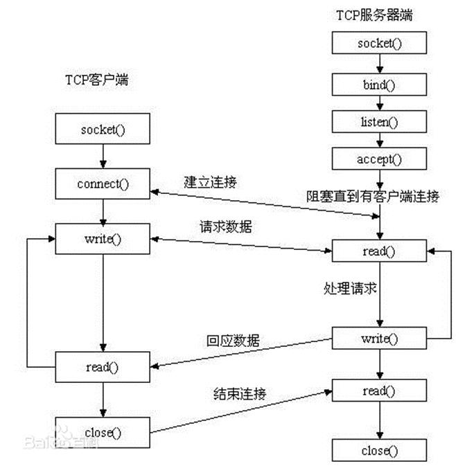
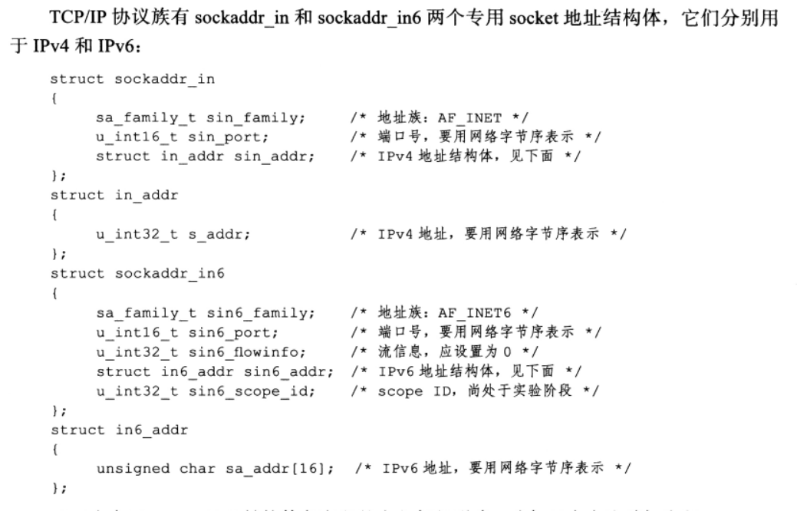
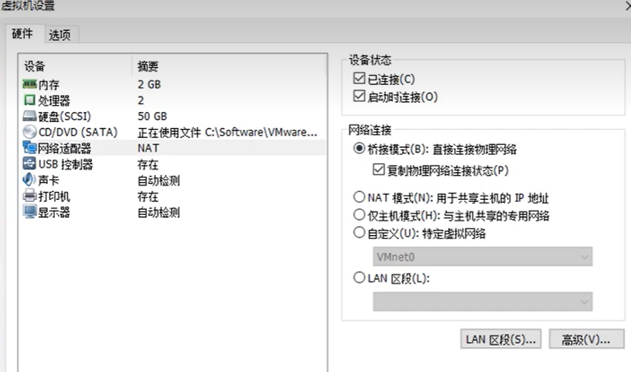
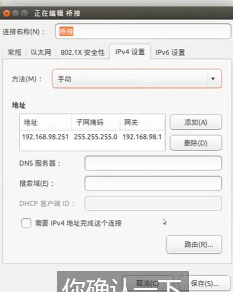
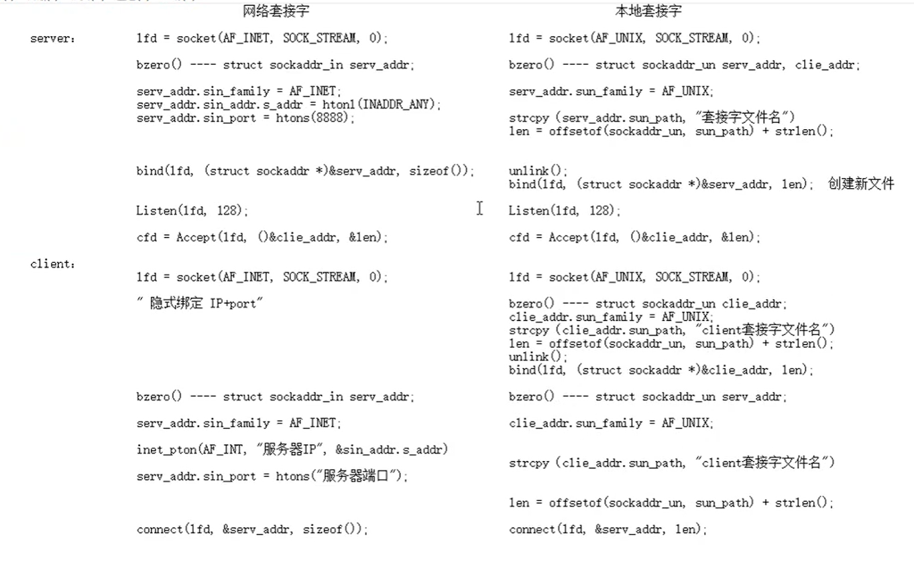

## 网络字节序

网络字节序：

  小端法：（pc本地存储）  高位存高地址。地位存低地址。  int a = 0x12345678

  大端法：（网络存储） 高位存低地址。低位存高地址 

  htonl --> 本地--》网络 （IP）     192.168.1.11 --> string --> atoi --> int --> htonl --> 网络字节序

  htons --> 本地--》网络 (port)

  ntohl --> 网络--》 本地（IP）

  ntohs --> 网络--》 本地（Port）

ntohl函数用于字节顺序转换，将32位整数从网络字节顺序转换为主机字节顺序，对应于网络编程中的网络字节顺序的转换。它接收一个32位整数（网络字节顺序是大端法因为是tcp，早期大型机采用的是大端字节序，而大部分网络协议设计也遵循了这个约定）并返回主机字节顺序(一般是小端法)的整数。

## IP地址转换函数

IP地址转换函数：

 

  `int inet_pton(int af, const char *src, void *dst);`   本地字节序（string IP） ---> 网络字节序

​    af：AF_INET、AF_INET6

​    src：传入，IP地址（点分十进制）

​    dst：传出，转换后的 网络字节序的 IP地址。 

​    返回值：

​      成功： 1

​      异常： 0， 说明src指向的不是一个有效的ip地址。

​      失败：-1

  

​    `const char *inet_ntop(int af, const void *src, char *dst, socklen_t size);` 网络字节序 ---> 本地字节序（string IP）

​    af：AF_INET、AF_INET6

​    src: 网络字节序IP地址

​    dst：本地字节序（string IP）

​    size： dst 的大小。

​    返回值： 成功：dst。   

​      失败：NULL

inet_ntop函数用于将IP地址从二进制格式转换为可打印的字符串格式。它接收一个指向存储IP地址的结构体（如struct in_addr或struct in6_addr）以及地址族（AF_INET或AF_INET6），将二进制格式的IP地址转换为点分十进制的字符串表示形式。

## sockaddr地址结构





sockaddr地址结构：  IP + port --> 在网络环境中唯一标识一个进程。

  struct sockaddr_in addr;

  addr.sin_family = AF_INET/AF_INET6      man 7 ip

  addr.sin_port = htons(9527);

​    `int dst;`

​    `inet_pton(AF_INET, "192.157.22.45", (void *)&dst);`

  `addr.sin_addr.s_addr = dst;`相当于addr.sin_addr.s_addr = htonl(INADDR_ANY);一般用后者简单

 

  `【*】addr.sin_addr.s_addr = htonl(INADDR_ANY);`    取出系统中有效的任意IP地址。二进制类型。

 

  `bind(fd, (struct sockaddr *)&addr, size);`





### socket和bind

```
socket函数：

	#include <sys/socket.h>

	int socket(int domain, int type, int protocol);		创建一个 套接字

		domain：AF_INET、AF_INET6、AF_UNIX

		type：SOCK_STREAM（传输层使用tcp协议）、SOCK_DGRAM（传输层使用udp协议）

		protocol: 0 
		protocol参数是在前两个参数构成的协议集合下，再选择一个具体的协议。不过这个值通常都是唯一的（前两个参数已经完全决定了它的值)。几乎在所有情况下，我们都应该把它设置为0，表示使用默认协议。

		返回值：
	
			成功： 新套接字所对应文件描述符

			失败: -1 errno


值得指出的是，自Linux内核版本2.6.17起，type参数可以接受上述服务类型与下面两个重要的标志相与的值:SOCK_NONBLOCK和SOCK_CLOEXEC。它们分别表示将新创建的socket 设为非阻塞的，以及用fork调用创建子进程时在子进程中关闭该socket。在内核版本2.6.17之前的Linux中，文件描述符的这两个属性都需要使用额外的系统调用（比如fcntl）来设置。


#include <arpa/inet.h>

	 int bind(int sockfd, const struct sockaddr *addr, socklen_t addrlen);		给socket绑定一个 地址结构 (IP+port)

		sockfd: socket 函数返回值

			struct sockaddr_in addr;

			addr.sin_family = AF_INET;

			addr.sin_port = htons(8888);

			addr.sin_addr.s_addr = htonl(INADDR_ANY);

		addr: 传入参数(struct sockaddr *)&addr

		addrlen: sizeof(addr) 地址结构的大小。

		返回值：

			成功：0

			失败：-1 errno

```

### listen和accept

```
int listen(int sockfd, int backlog);		设置同时与服务器建立连接的上限数。（同时进行3次握手的客户端数量）

		sockfd: socket 函数返回值

		backlog：上限数值。最大值 128.


		返回值：

			成功：0

			失败：-1 errno	


int accept(int sockfd, struct sockaddr *addr, socklen_t *addrlen);	阻塞等待客户端建立连接，成功的话，返回一个与客户端成功连接的socket文件描述符。

		sockfd: socket 函数返回值

		addr：传出参数。成功与服务器建立连接的那个客户端的地址结构（IP+port）

			socklen_t clit_addr_len = sizeof(addr);

		addrlen：传入传出。 &clit_addr_len

			 入：addr的大小。 出：客户端addr实际大小。

		返回值：

			成功：能与客户端进行数据通信的 socket 对应的文件描述。

			失败： -1 ， errno
		
```

### connect

```
int connect(int sockfd, const struct sockaddr *addr, socklen_t addrlen);	  使用现有的 socket 与服务器建立连接

		sockfd： socket 函数返回值

			struct sockaddr_in srv_addr;		// 服务器地址结构

			srv_addr.sin_family = AF_INET;

			srv_addr.sin_port = 9527 	跟服务器bind时设定的 port 完全一致。

			inet_pton(AF_INET, "服务器的IP地址"，&srv_adrr.sin_addr.s_addr);

		addr：传入参数。服务器的地址结构

			
		addrlen：服务器的地址结构的大小

		返回值：

			成功：0

			失败：-1 errno

		如果不使用bind绑定客户端地址结构, 采用"隐式绑定".

```

## CS模型的TCP通信分析

TCP通信流程分析:

server:
	1. socket()	创建socket

2. bind()	绑定服务器地址结构

3. listen()	设置监听上限

4. accept()	阻塞监听客户端连接

5. read(fd)	读socket获取客户端数据

6. 小--大写	toupper()

7. write(fd)

8. close();

client:

1. socket()	创建socket

2. connect();	与服务器建立连接

3. write()	写数据到 socket

4. read()	读转换后的数据。

5. 显示读取结果

6. close()

## server的实现

```
#include<stdio.h>
#include <ctype.h>  
#include <sys/socket.h>  
#include <arpa/inet.h>  
#include <stdlib.h>  
#include <string.h>  
#include <unistd.h>  
#include <errno.h>  
#include <pthread.h>  
#define SERV_PORT 9527  

void sys_err(const char *str)  
{  
        perror(str);  
        exit(1);  
}  

int main(int argc, char *argv[])  
{  
        int lfd = 0, cfd = 0;  
        int ret, i;  
        char buf[BUFSIZ], client_IP[1024]; //[+d查看系统定义的BUFSIZ的大小 

        struct sockaddr_in serv_addr, clit_addr;  // 定义服务器地址结构 和 客户端地址结构  
        socklen_t clit_addr_len;                  // 客户端地址结构大小  

        serv_addr.sin_family = AF_INET;             // IPv4  
        serv_addr.sin_port = htons(SERV_PORT);      // 转为网络字节序的 端口号  
        serv_addr.sin_addr.s_addr = htonl(INADDR_ANY);  // 获取本机任意有效IP  

        lfd = socket(AF_INET, SOCK_STREAM, 0);      //创建一个 socket  
        if (lfd == -1) {  
                sys_err("socket error");  
        }  

        bind(lfd, (struct sockaddr *)&serv_addr, sizeof(serv_addr));//给服务器socket绑定地址结构（IP+port)  

        listen(lfd, 128);                   //  设置监听上限  

        clit_addr_len = sizeof(clit_addr);  //  获取客户端地址结构大小  

        cfd = accept(lfd, (struct sockaddr *)&clit_addr, &clit_addr_len);   // 阻塞等待客户端连接请求  
        if (cfd == -1)  
                sys_err("accept error");  

        printf("client ip:%s port:%d\n",   
                        inet_ntop(AF_INET, &clit_addr.sin_addr.s_addr, client_IP, sizeof(client_IP)),                        ntohs(clit_addr.sin_port));         // 根据accept传出参数，获取客户端 ip 和 port  

        while (1) {  
                ret = read(cfd, buf, sizeof(buf));      // 读客户端数据 ssize_t read(int fd, void *buf, size_t count); 
                //read函数的返回值是读取到的字节数，将其赋给ret变量。
                write(STDOUT_FILENO, buf, ret);         // 写到屏幕查看  ssize_t write(int fd, const void *buf, size_t count);

                for (i = 0; i < ret; i++)                // 小写 -- 大写  
                        buf[i] = toupper(buf[i]);  

                write(cfd, buf, ret);                   // 将大写，写回给客户端。  
        }  

        close(lfd);  
        close(cfd);  

        return 0;  
}  
```

### 获取客户端地址结构

```
cfd = accept(lfd, (struct sockaddr *)&clit_addr, &clit_addr_len);
accept函数中的clit_addr传出的就是客户端地址结构，IP+port

于是，在代码中增加此段代码，可获取客户端信息：
printf("client ip:%s port:%d\n", 
            inet_ntop(AF_INET,&clit_addr.sin_addr.s_addr, client_IP, sizeof(client_IP)), 
            ntohs(clit_addr.sin_port));

```

## client的实现

```
#include <stdio.h>  
#include <sys/socket.h>  
#include <arpa/inet.h>  
#include <stdlib.h>  
#include <string.h>  
#include <unistd.h>  
#include <errno.h>  
#include <pthread.h>  

#define SERV_PORT 9527  

void sys_err(const char* str)  
{  
    perror(str);  
    exit(1);  
}  

int main(int argc, char* argv[])  
{  
    int cfd;  
    int conter = 10;  
    char buf[BUFSIZ];  
    
    struct sockaddr_in serv_addr;          //服务器地址结构  

    serv_addr.sin_family = AF_INET;  
    serv_addr.sin_port = htons(SERV_PORT);  
    //inet_pton(AF_INET, "127.0.0.1", &serv_addr.sin_addr.s_addr);  
    inet_pton(AF_INET, "127.0.0.1", &serv_addr.sin_addr);  

    cfd = socket(AF_INET, SOCK_STREAM, 0);  
    if (cfd == -1)  
        sys_err("socket error");  

    int ret = connect(cfd, (struct sockaddr*)&serv_addr, sizeof(serv_addr));  
    if (ret != 0)  
        sys_err("connect err");  

    while (--conter) {  
        write(cfd, "hello\n", 6);  
        ret = read(cfd, buf, sizeof(buf));  
        write(STDOUT_FILENO, buf, ret);  
        sleep(1);  
    }  

    close(cfd);  

    return 0;  
}
```

这里遇到过一个问题，如果之前运行server，用Ctrl+z终止进程，ps aux列表里会有服务器进程残留，这个会影响当前服务器。解决方法是kill掉这些服务器进程。不然端口被占用，当前运行的服务器进程接收不到东西，没有回显。

## 错误处理函数的封装思路

wrap.h文件如下，就是包裹函数的声明

```
#ifndef __WRAP_H_  
#define __WRAP_H_  
#include <stdlib.h>
#include <stdio.h>
#include <unistd.h>
#include <errno.h>
#include <sys/socket.h>

void perr_exit(const char* s);
int Accept(int fd, struct sockaddr* sa, socklen_t* salenptr);
int Bind(int fd, const struct sockaddr* sa, socklen_t salen);
int Connect(int fd, const struct sockaddr* sa, socklen_t salen);
int Listen(int fd, int backlog);
int Socket(int family, int type, int protocol);
ssize_t Read(int fd, void* ptr, size_t nbytes);
ssize_t Write(int fd, const void* ptr, size_t nbytes);
int Close(int fd);
ssize_t Readn(int fd, void* vptr, size_t n);
ssize_t Writen(int fd, const void* vptr, size_t n);
ssize_t my_read(int fd, char* ptr);
ssize_t Readline(int fd, void* vptr, size_t maxlen);

#endif

```

wrap.c随便取一部分，如下，就是包裹函数的代码：

```
#include "wrap.h"

void perr_exit(const char *s)
{
	perror(s);
	exit(1);
}
int Accept(int fd, struct sockaddr *sa, socklen_t *salenptr)
{
	int n;
	again:
	if ( (n = accept(fd, sa, salenptr)) < 0) {
		if ((errno == ECONNABORTED) || (errno == EINTR))
			goto again;
		else
			perr_exit("accept error");
	}
	return n;
}
int Bind(int fd, const struct sockaddr *sa, socklen_t salen)
{
	int n;
	if ((n = bind(fd, sa, salen)) < 0)
		perr_exit("bind error");
	return n;
}
int Connect(int fd, const struct sockaddr *sa, socklen_t salen)
{
	int n;
	if ((n = connect(fd, sa, salen)) < 0)
		perr_exit("connect error");
	return n;
}
int Listen(int fd, int backlog)
{
	int n;
	if ((n = listen(fd, backlog)) < 0)
		perr_exit("listen error");
	return n;
}
int Socket(int family, int type, int protocol)
{
	int n;
	if ( (n = socket(family, type, protocol)) < 0)
		perr_exit("socket error");
	return n;
}
ssize_t Read(int fd, void *ptr, size_t nbytes)
{
	ssize_t n;
again:
	if ( (n = read(fd, ptr, nbytes)) == -1) {
		if (errno == EINTR)
			goto again;
		else
			return -1;
	}
	return n;
}
ssize_t Write(int fd, const void *ptr, size_t nbytes)
{
	ssize_t n;
again:
	if ( (n = write(fd, ptr, nbytes)) == -1) {
		if (errno == EINTR)
			goto again;
		else
			return -1;
	}
	return n;
}
int Close(int fd)
{
	int n;
	if ((n = close(fd)) == -1)
		perr_exit("close error");
	return n;
}
ssize_t Readn(int fd, void *vptr, size_t n)
{
	size_t nleft;
	ssize_t nread;
	char *ptr;

	ptr = vptr;
	nleft = n;

	while (nleft > 0) {
		if ( (nread = read(fd, ptr, nleft)) < 0) {
			if (errno == EINTR)
				nread = 0;
			else
				return -1;
		} else if (nread == 0)
			break;
		nleft -= nread;
		ptr += nread;
	}
	return n - nleft;
}

ssize_t Writen(int fd, const void *vptr, size_t n)
{
	size_t nleft;
	ssize_t nwritten;
	const char *ptr;

	ptr = vptr;
	nleft = n;

	while (nleft > 0) {
		if ( (nwritten = write(fd, ptr, nleft)) <= 0) {
			if (nwritten < 0 && errno == EINTR)
				nwritten = 0;
			else
				return -1;
		}
		nleft -= nwritten;
		ptr += nwritten;
	}
	return n;
}

ssize_t my_read(int fd, char *ptr)
{
	static int read_cnt;
	static char *read_ptr;
	static char read_buf[100];

	if (read_cnt <= 0) {
again:
		if ((read_cnt = read(fd, read_buf, sizeof(read_buf))) < 0) {
			if (errno == EINTR)
				goto again;
			return -1;	
		} else if (read_cnt == 0)
			return 0;
		read_ptr = read_buf;
	}
	read_cnt--;
	*ptr = *read_ptr++;
	return 1;
}

ssize_t Readline(int fd, void *vptr, size_t maxlen)
{
	ssize_t n, rc;
	char c, *ptr;
	ptr = vptr;

	for (n = 1; n < maxlen; n++) {
		if ( (rc = my_read(fd, &c)) == 1) {
			*ptr++ = c;
			if (c == '\n')
				break;
		} else if (rc == 0) {
			*ptr = 0;
			return n - 1;
		} else
			return -1;
	}
	*ptr = 0;
	return n;
}

```

这里原函数和包裹函数的函数名差异只有首字母大写，这是因为man page对字母大小写不敏感，同名的包裹函数一样可以跳转至man page

------

错误处理函数： 

  封装目的：

​    在 server.c 编程过程中突出逻辑，将出错处理与逻辑分开，可以直接跳转man手册。

  【wrap.c】             【wrap.h】

  存放网络通信相关常用 自定义函数         存放 网络通信相关常用 自定义函数原型(声明)。

  命名方式：系统调用函数首字符大写, 方便查看man手册

​     如：Listen()、Accept();

  函数功能：调用系统调用函数，处理出错场景。

  在 server.c 和 client.c 中调用 自定义函数 

  联合编译 server.c 和 wrap.c 生成 server

​     			client.c 和 wrap.c 生成 client 

readn：

  读 N 个字节 

readline：

  读一行

## TCP和UDP通信优缺点

TCP通信和UDP通信各自的优缺点：

  TCP： 面向连接的，可靠数据包传输。对于不稳定的网络层，采取完全弥补的通信方式。 丢包重传。

​    优点：

​      稳定。   

​       数据流量稳定、速度稳定、顺序

​    缺点：

​      传输速度慢。相率低。开销大。

 

​    使用场景：数据的完整型要求较高，不追求效率。

 

​       大数据传输、文件传输。

 

 

  UDP： 无连接的，不可靠的数据报传递。对于不稳定的网络层，采取完全不弥补的通信方式。 默认还原网络状况

​    优点：

​      传输速度块。相率高。开销小。

​    缺点：

​      不稳定。

​       数据流量。速度。顺序。


​    使用场景：对时效性要求较高场合。稳定性其次。

 

​       游戏、视频会议、视频电话。    腾讯、华为、阿里 --- 应用层数据校验协议，弥补udp的不足。

## UDP通信server和client流程

```
UDP实现的 C/S 模型：直接就支持多路IO

	recv()/send() 只能用于 TCP 通信。 替代 read、write

	accpet(); ---- Connect(); ---被舍弃

	server：

		lfd = socket(AF_INET, STREAM, 0);	SOCK_DGRAM --- 报式协议。

		bind();

		listen();  --- 可有可无

		while（1）{

			read(cfd, buf, sizeof) --- 被替换 --- recvfrom（） --- 涵盖accept传出地址结构。
小-- 大
				
			write();--- 被替换 --- sendto（）---- connect
		}
		close();

client：

		connfd = socket(AF_INET, SOCK_DGRAM, 0);

		sendto（‘服务器的地址结构’， 地址结构大小）

		recvfrom（）

		写到屏幕

		close();

```

### recvfrom和sendto函数

```
ssize_t recvfrom(int sockfd, void *buf, size_t len, int flags,struct sockaddr *src_addr, socklen_t *addrlen);

					sockfd： 套接字

					buf：缓冲区地址

					len：缓冲区大小

					flags： 0

					src_addr：（struct sockaddr *）&addr 传出。 对端地址结构

					addrlen：传入传出。

				返回值： 成功接收数据字节数。 失败：-1 errn。 0： 对端关闭。


ssize_t sendto(int sockfd, const void *buf, size_t len, int flags,const struct sockaddr *dest_addr, socklen_t addrlen);

					sockfd： 套接字

					buf：存储数据的缓冲区

					len：数据长度

					flags： 0

					src_addr：（struct sockaddr *）&addr 传入。 目标地址结构

					addrlen：地址结构长度。

				返回值：成功写出数据字节数。 失败 -1， errno		

```

### UDP实现的并发服务器和客户端

服务器：

```
#include <string.h>  
#include <stdio.h>  
#include <unistd.h>  
#include <arpa/inet.h>  
#include <ctype.h>  
  
#define SERV_PORT 8000  
  
int main(void)  
{  
    struct sockaddr_in serv_addr, clie_addr;  
    socklen_t clie_addr_len;  
    int sockfd;  
    char buf[BUFSIZ];  
    char str[INET_ADDRSTRLEN];  
    int i, n;  
  
    sockfd = socket(AF_INET, SOCK_DGRAM, 0);  
  
    bzero(&serv_addr, sizeof(serv_addr));  
    serv_addr.sin_family = AF_INET;  
    serv_addr.sin_addr.s_addr = htonl(INADDR_ANY);  
    serv_addr.sin_port = htons(SERV_PORT);  
  
    bind(sockfd, (struct sockaddr *)&serv_addr, sizeof(serv_addr));  
  
    printf("Accepting connections ...\n");  
    while (1) {  
        clie_addr_len = sizeof(clie_addr);  
        n = recvfrom(sockfd, buf, BUFSIZ,0, (struct sockaddr *)&clie_addr, &clie_addr_len);  
        if (n == -1)  
            perror("recvfrom error");  
  
        printf("received from %s at PORT %d\n",  
                inet_ntop(AF_INET, &clie_addr.sin_addr, str, sizeof(str)),  
                ntohs(clie_addr.sin_port));  
  
        for (i = 0; i < n; i++)  
            buf[i] = toupper(buf[i]);  
  
        n = sendto(sockfd, buf, n, 0, (struct sockaddr *)&clie_addr, sizeof(clie_addr));  
        if (n == -1)  
            perror("sendto error");  
    }  
  
    close(sockfd);  
  
    return 0;  
}  

```

客户端：

```
#include <stdio.h>  
#include <string.h>  
#include <unistd.h>  
#include <arpa/inet.h>  
#include <ctype.h>  
  
#define SERV_PORT 8000  
  
int main(int argc, char *argv[])  
{  
    struct sockaddr_in servaddr;  
    int sockfd, n;  
    char buf[BUFSIZ];  
  
    sockfd = socket(AF_INET, SOCK_DGRAM, 0);  
  
    bzero(&servaddr, sizeof(servaddr));  
    servaddr.sin_family = AF_INET;  
    inet_pton(AF_INET, "127.0.0.1", &servaddr.sin_addr);  
    servaddr.sin_port = htons(SERV_PORT);  
  
    bind(sockfd, (struct sockaddr *)&servaddr, sizeof(servaddr));  
  
    while (fgets(buf, BUFSIZ, stdin) != NULL) {  
        n = sendto(sockfd, buf, strlen(buf), 0, (struct sockaddr *)&servaddr, sizeof(servaddr));  
        if (n == -1)  
            perror("sendto error");  
  
        n = recvfrom(sockfd, buf, BUFSIZ, 0, NULL, 0);         //NULL:不关心对端信息  
        if (n == -1)  
            perror("recvfrom error");  
  
        write(STDOUT_FILENO, buf, n);  
    }  
  
    close(sockfd);  
  
    return 0;  
}  

```

## 多进程并发服务器思路分析

```
多线程并发服务器： server.c 

	1. Socket();		创建 监听套接字 lfd

	2. Bind()		绑定地址结构 Strcut scokaddr_in addr;

	3. Listen();		

	4. while (1) {		

		cfd = Accept(lfd, );

		pthread_create(&tid, NULL, tfn, (void *)cfd);

		pthread_detach(tid);  				// pthead_join(tid, void **);  新线程---专用于回收子线程。
	  }

	5. 子线程：

		void *tfn(void *arg) 
		{
			// close(lfd)			不能关闭。 主线程要使用lfd

			read(cfd)

			小--大

			write(cfd)

			pthread_exit（(void *)10）;	
		}

```

### 多进程并发服务器实现

```
#include <stdio.h>  
#include <ctype.h>  
#include <stdlib.h>  
#include <sys/wait.h>  
#include <string.h>  
#include <strings.h>  
#include <unistd.h>  
#include <errno.h>  
#include <signal.h>  
#include <sys/socket.h>  
#include <arpa/inet.h>  
#include <pthread.h>  

#include "wrap.h"  

#define SRV_PORT 9999  

void catch_child(int signum)  //当子进程退出时，父进程收到信号，就会去回收子进程了，不会出现僵尸进程
{  
    while ((waitpid(0, NULL, WNOHANG)) > 0);  
    return;  
}  
  
int main(int argc, char *argv[])  
{
    int lfd, cfd;  
    pid_t pid;  
    struct sockaddr_in srv_addr, clt_addr;  
    socklen_t clt_addr_len;   
    char buf[BUFSIZ];  
    int ret, i;  
    
    //memset(&srv_addr, 0, sizeof(srv_addr));                 // 将地址结构清零  
    bzero(&srv_addr, sizeof(srv_addr));  
    
    srv_addr.sin_family = AF_INET;  
    srv_addr.sin_port = htons(SRV_PORT);  
    srv_addr.sin_addr.s_addr = htonl(INADDR_ANY);  
    
    lfd = Socket(AF_INET, SOCK_STREAM, 0);  
    
    Bind(lfd, (struct sockaddr *)&srv_addr, sizeof(srv_addr));  
    
    Listen(lfd, 128);  
    
    clt_addr_len = sizeof(clt_addr);  
    
    while (1) {  
    
        cfd = Accept(lfd, (struct sockaddr *)&clt_addr, &clt_addr_len);  
    
        pid = fork();  
        if (pid < 0) {  
            perr_exit("fork error");  
        } else if (pid == 0) {  
            close(lfd);  
            break;          
        } else {  
            struct sigaction act;  
    
            act.sa_handler = catch_child;  
            sigemptyset(&act.sa_mask);  
            act.sa_flags = 0;  
    
            ret = sigaction(SIGCHLD, &act, NULL);  
            if (ret != 0) {  
               perr_exit("sigaction error");  
            }  
            close(cfd);   
            continue;  
        }  
    }  
    
    if (pid == 0) {  
        for (;;) {  
            ret = Read(cfd, buf, sizeof(buf));  
            if (ret == 0) {  
                close(cfd);  
                exit(1);  
            }   
    
            for (i = 0; i < ret; i++)  
                buf[i] = toupper(buf[i]);  
    
            write(cfd, buf, ret);  
            write(STDOUT_FILENO, buf, ret);  
        }  
    }  
    
    return 0；
  }
```

使用桥接模式，让自己主机和其他人主机处于同一个网段









然后再断开再桥接连一下，这个是你自己取的名字。

### 服务器程序上传外网服务器并访问

scp -r 命令，将本地文件拷贝至远程服务器上目标位置

scp -r 源地址 目标地址

## 多线程服务器代码review

```
#include <stdio.h>
#include <string.h>
#include <arpa/inet.h>
#include <pthread.h>
#include <ctype.h>
#include <unistd.h>
#include <fcntl.h>

#include "wrap.h"

#define MAXLINE 8192
#define SERV_PORT 8000

struct s_info {											//定义一个结构体, 将地址结构跟cfd捆绑
    struct sockaddr_in cliaddr;
    int connfd;
};

void *do_work(void *arg)
{
    int n, i;
    struct s_info *ts = (struct s_info *) arg;
    char buf[MAXLINE];
    char str[INET_ADDRSTRLEN];				//#define INET_ADDRSTRLEN 16  可用"[+d"查看

    while (1) {
        n = Read(ts->connfd, buf, MAXLINE);	//读客户端
        if (n == 0) {
            printf("the client %d closed...\n", ts->connfd);
            break;							//跳出循环,关闭cfd 
        }
        printf("received from %s at PORT %d\n",
               inet_ntop(AF_INET, &(*ts).cliaddr.sin_addr, str, sizeof(str)),
               ntohs((*ts).cliaddr.sin_port));			//打印客户端信息(IP/PORT)

        for (i = 0; i < n; i++)
            buf[i] = toupper(buf[i]);					  //小写-->大写  

        Write(STDOUT_FILENO, buf, n);					//写出至屏幕  
        Write(ts->connfd, buf, n);						  //回写给客户端 
    }
    Close(ts->connfd);

    return (void *) 0;
}

int main(void)
{
    struct sockaddr_in servaddr, cliaddr;
    socklen_t cliaddr_len;
    int listenfd, connfd;
    pthread_t tid;

    struct s_info ts[256];								 //创建结构体数组
    int i = 0;
	
    listenfd = Socket(AF_INET, SOCK_STREAM, 0);			//创建一个socket, 得到lfd  

    bzero(&servaddr, sizeof(servaddr));					//地址结构清零	
    servaddr.sin_family = AF_INET;
    servaddr.sin_addr.s_addr = htonl(INADDR_ANY);					//指定本地任意IP  
    servaddr.sin_port = htons(SERV_PORT);				    //指定端口号   

    Bind(listenfd, (struct sockaddr *) &servaddr, sizeof(servaddr)); //绑定  	

    Listen(listenfd, 128);		     //设置同一时刻链接服务器上限数  

    printf("Accepting client connect ...\n");

    while (1) {
        cliaddr_len = sizeof(cliaddr);
        connfd = Accept(listenfd, (struct sockaddr *) &cliaddr, &cliaddr_len); //阻塞监听客户端链接请求  
        ts[i].cliaddr = cliaddr;
        ts[i].connfd = connfd;

        pthread_create(&tid, NULL, do_work, (void *) &ts[i]);//这里可以传地址是因为不会改变
        pthread_detach(tid);			  //子线程分离,防止僵线程产生.  
        i++;
    }

    return 0;
}
```

​	

## C语言C++中assert的用法

`void assert(int expression);`

assert宏的原型定义在<assert.h>中，其作用是先计算表达式expression的值为假(即为0),那么它就先向stderr打印一条出错信息，然后通过条用abort来终止程序；

使用assert的缺点是，频繁的调用会极大的影响程序的性能，增加额外的开销。

在调试结束后，可以通过在包含#include 的语句之前插入 #define NDEBUG 来禁用assert调用，示例代码如下：

```text
1 #include 
2 #define NDEBUG 
3 #include
```

根据提示我们很快就能定位到错误点，就在assert(i++)处；既然assert这么便于定位出错点，在工程中使用它就显得很有必要；但其也有一定的使用规则；

断言语句不会永远被执行，可以屏蔽也可以启用，这就要求assert不管是在屏蔽还是启用状态下都不能对我们本身代码有所影响，这样刚才我们在代码中使用的`assert(i++)`就不行，因为如果禁用了`assert`,那i++就不能执行；正确的做法应该是：`assert(i);i++;`

## 本地套接字和网络套接字比较

```
本地套接字：

	IPC： pipe、fifo、mmap、信号、本地套（domain）--- CS模型


	对比网络编程 TCP C/S模型， 注意以下几点：

	1. int socket(int domain, int type, int protocol); 参数 domain：AF_INET --> AF_UNIX/AF_LOCAL 
	
							     type: SOCK_STREAM/SOCK_DGRAM  都可以。	
	2. 地址结构：  sockaddr_in --> sockaddr_un

		struct sockaddr_in srv_addr; --> struct sockaddr_un srv_adrr;

		srv_addr.sin_family = AF_INET;  --> srv_addr.sun_family = AF_UNIX;
·
		srv_addr.sin_port = htons(8888);    strcpy(srv_addr.sun_path, "srv.socket")

		srv_addr.sin_addr.s_addr = htonl(INADDR_ANY);			len = offsetof(struct sockaddr_un, sun_path) + strlen("srv.socket");//offsetof用于求结构体成员较首地址偏移，第一个是AF_UNIX，第二个是sun_path
	
		bind(fd, (struct sockaddr *)&srv_addr, sizeof(srv_addr));  --> 	bind(fd, (struct sockaddr *)&srv_addr, len); 


	3. bind()函数调用成功，会创建一个 socket。因此为保证bind成功，通常我们在 bind之前， 可以使用 unlink("srv.socket");


	4. 客户端不能依赖 “隐式绑定”。并且应该在通信建立过程中，创建且初始化2个地址结构：

		1） client_addr --> bind()

		2)  server_addr --> connect();

```

### 本地套接字通信

服务器：

```
#include <stdio.h>  
#include <unistd.h>  
#include <sys/socket.h>  
#include <strings.h>  
#include <string.h>  
#include <ctype.h>  
#include <arpa/inet.h>  
#include <sys/un.h>  
#include <stddef.h>  
  
#include "wrap.h"  
  
#define SERV_ADDR  "serv.socket"  //没有了IP和port，改成伪文件，实际是没有大小的
  
int main(void)  
{  
    int lfd, cfd, len, size, i;  
    struct sockaddr_un servaddr, cliaddr;  
    char buf[4096];  
  
    lfd = Socket(AF_UNIX, SOCK_STREAM, 0);  
  
    bzero(&servaddr, sizeof(servaddr));  
    servaddr.sun_family = AF_UNIX;  
    strcpy(servaddr.sun_path, SERV_ADDR);  
  
    len = offsetof(struct sockaddr_un, sun_path) + strlen(servaddr.sun_path);     /* servaddr total len */  
  
    unlink(SERV_ADDR);                              /* 确保bind之前serv.sock文件不存在,bind会创建该文件 */  
    Bind(lfd, (struct sockaddr *)&servaddr, len);           /* 参3不能是sizeof(servaddr) */  
  
    Listen(lfd, 20);  
  
    printf("Accept ...\n");  
    while (1) {  
        len = sizeof(cliaddr);  //AF_UNIX大小+108B  
  
        cfd = Accept(lfd, (struct sockaddr *)&cliaddr, (socklen_t *)&len);  
  
        len -= offsetof(struct sockaddr_un, sun_path);      /* 得到文件名的长度 */  
        cliaddr.sun_path[len] = '\0';                       /* 确保打印时,没有乱码出现 */  
  
        printf("client bind filename %s\n", cliaddr.sun_path);  
  
        while ((size = read(cfd, buf, sizeof(buf))) > 0) {  
            for (i = 0; i < size; i++)  
                buf[i] = toupper(buf[i]);  
            write(cfd, buf, size);  
        }  
        close(cfd);  
    }  
    close(lfd);  
  
    return 0;  
}  

```

客户端:

```
#include <stdio.h>  
#include <unistd.h>  
#include <sys/types.h>           
#include <sys/socket.h>  
#include <strings.h>  
#include <string.h>  
#include <ctype.h>  
#include <arpa/inet.h>  
#include <sys/un.h>  
#include <stddef.h>  
  
#include "wrap.h"  
  
#define SERV_ADDR "serv.socket"  
#define CLIE_ADDR "clie.socket"  
  
int main(void)  
{  
    int  cfd, len;  
    struct sockaddr_un servaddr, cliaddr;  
    char buf[4096];  
  
    cfd = Socket(AF_UNIX, SOCK_STREAM, 0);  
  
    bzero(&cliaddr, sizeof(cliaddr));  
    cliaddr.sun_family = AF_UNIX;  
    strcpy(cliaddr.sun_path,CLIE_ADDR);  
  
    len = offsetof(struct sockaddr_un, sun_path) + strlen(cliaddr.sun_path);     /* 计算客户端地址结构有效长度 */  
  
    unlink(CLIE_ADDR);  
    Bind(cfd, (struct sockaddr *)&cliaddr, len);                                 /* 客户端也需要bind, 不能依赖自动绑定*/  
  
      
    bzero(&servaddr, sizeof(servaddr));                                          /* 构造server 地址 */  
    servaddr.sun_family = AF_UNIX;  
    strcpy(servaddr.sun_path, SERV_ADDR);  
  
    len = offsetof(struct sockaddr_un, sun_path) + strlen(servaddr.sun_path);   /* 计算服务器端地址结构有效长度 */  
  
    Connect(cfd, (struct sockaddr *)&servaddr, len);  
  
    while (fgets(buf, sizeof(buf), stdin) != NULL) {  
        write(cfd, buf, strlen(buf));  
        len = read(cfd, buf, sizeof(buf));  
        write(STDOUT_FILENO, buf, len);  
    }  
  
    close(cfd);  
  
    return 0;  
}  

```

### 对比本地套接字和网络套接字




