## 信号的概念和机制

信号共性：
	简单、不能携带大量信息、满足条件才发送。
信号的特质：
	信号是软件层面上的“中断”。一旦信号产生，无论程序执行到什么位置，必须立即停止运行，处理信号，处理结束，再继续执行后续指令。
	所有信号的产生及处理全部都是由【内核】完成的。

## 与信号相关的概念

信号相关的概念：
产生信号：
1. 按键产生
2. 系统调用产生
3. 软件条件产生
4. 硬件异常产生
5. 命令产生

概念：
	未决：产生与递达之间状态。 
	递达：产生并且送达到进程。直接被内核处理掉。
	信号处理方式： 执行默认处理动作、忽略、捕捉（自定义）
	阻塞信号集（信号屏蔽字）： 本质：位图。用来记录信号的屏蔽状态。一旦被屏蔽的信号，在解除屏蔽前，一直处于未决态。
	未决信号集：本质：位图。用来记录信号的处理状态。该信号集中的信号，表示，已经产生，但尚未被处理。

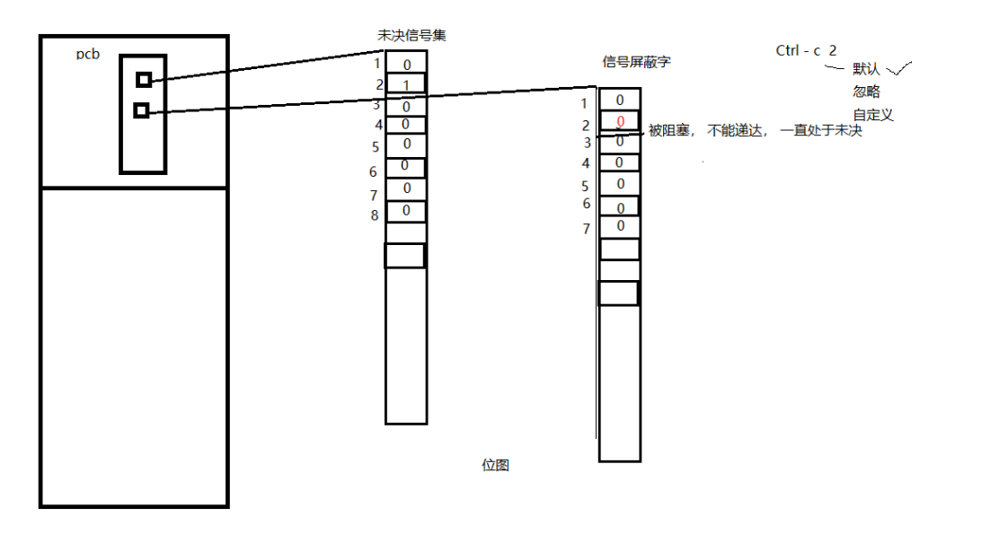



默认2号为0.一旦有信号要2，则2处于未决变为1，如果信号屏蔽字为1一直处于未决态，未阻塞状态默认为0，则0变1会阻塞，默认下没阻塞这个过程很快。

## 信号四要素和常规信号一览

变量三要素：变量类型，变量名，变量值

kill -l 	查看当前系统中常规信号 

信号 4 要素： 信号使用之前，应先确定其 4 要素，而后再用！！！ 

​						编号、名称、对应事件、默认处理动作。

## kill 函数和 kill 命令

kill 命令 和 kill 函数：
	`int kill（pid_t pid, int signum）`
	参数：
	pid: > 0:发送信号给指定进程
			= 0：发送信号给跟调用 kill 函数的那个进程处于同一进程组的进程。
			< -1: 取绝对值，发送信号给该绝对值所对应的进程组的所有组员。
			= -1：发送信号给，有权限发送的所有进程。
	signum：待发送的信号
返回值：
		成功： 0
		失败： -1 errno

子进程发送信号 kill 父进程

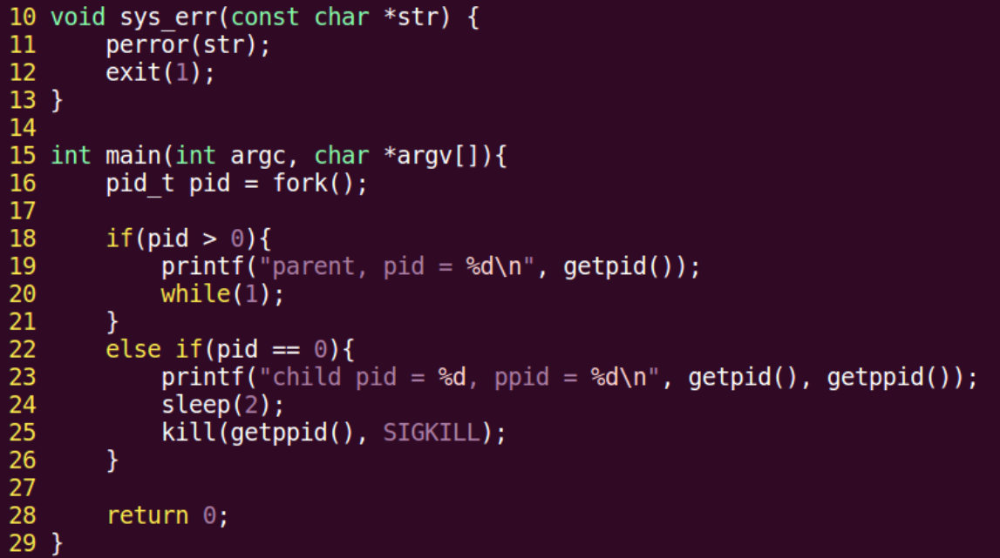



这里子进程不发送 kill 信号，发其他信号也行，比如段错误什么的。 

`kill -9 -groupname` 杀一个进程组

## alarm 函数

alarm 函数：使用自然计时法。
		定时发送 SIGALRM 给当前进程。
		`unsigned int alarm(unsigned int seconds);`
			seconds：定时秒数
			返回值：上次定时剩余时间。
						无错误现象。
			`alarm（0）；` 取消闹钟。
		time 命令 ： 查看程序执行时间。 实际时间 = 用户时间 + 内核时间 + 等待时间。 --》	优化瓶颈 IO（写入文件比在终端输出效率更高）

## setitimer 函数

```
setitimer 函数：
	int setitimer(int which, const struct itimerval *new_value, struct itimerval *old_value);
	参数：
		which： ITIMER_REAL： 采用自然计时。 ——> SIGALRM
			ITIMER_VIRTUAL: 采用用户空间计时 ---> SIGVTALRM
			ITIMER_PROF: 采用内核+用户空间计时 ---> SIGPROF
		new_value：定时秒数
 			类型：struct itimerval {
 						struct timeval {
 							time_t tv_sec; /* seconds */
 							suseconds_t tv_usec; /* microseconds */
 						}it_interval;---> 周期定时秒数
 						struct timeval {
 							time_t tv_sec; 
 							suseconds_t tv_usec; 
 						}it_value; ---> 第一次定时秒数 
 			};
old_value：传出参数，上次定时剩余时间。
e.g.
    struct itimerval new_t;
    struct itimerval old_t;
    new_t.it_interval.tv_sec = 0;
    new_t.it_interval.tv_usec = 0;
    new_t.it_value.tv_sec = 1;
    new_t.it_value.tv_usec = 0;
    int ret = setitimer(&new_t, &old_t); 定时 1 秒
返回值：
	成功： 0
	失败： -1 errno

```

使用 setitimer 定时，向屏幕打印信息：

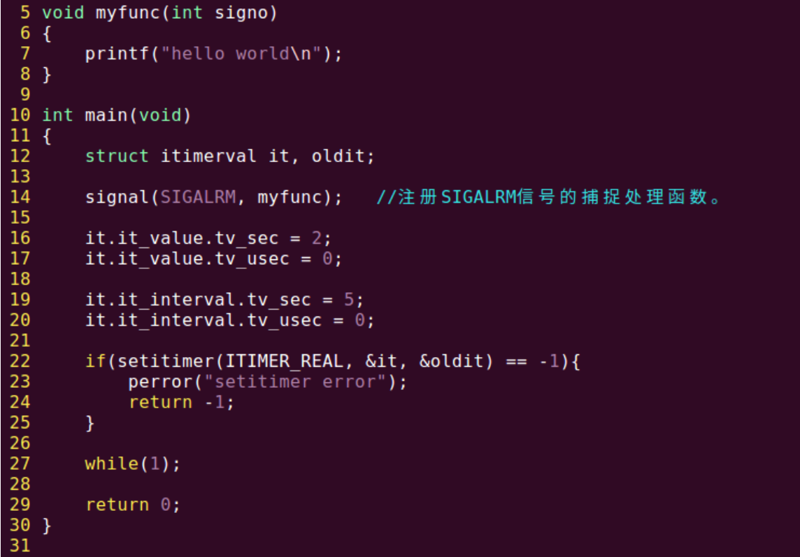



第一次信息打印是两秒间隔，之后都是 5 秒间隔打印一次。可以理解为第一次是有个定时器，什么时候触发打印，之后就是间隔时间。

## 信号集操作函数

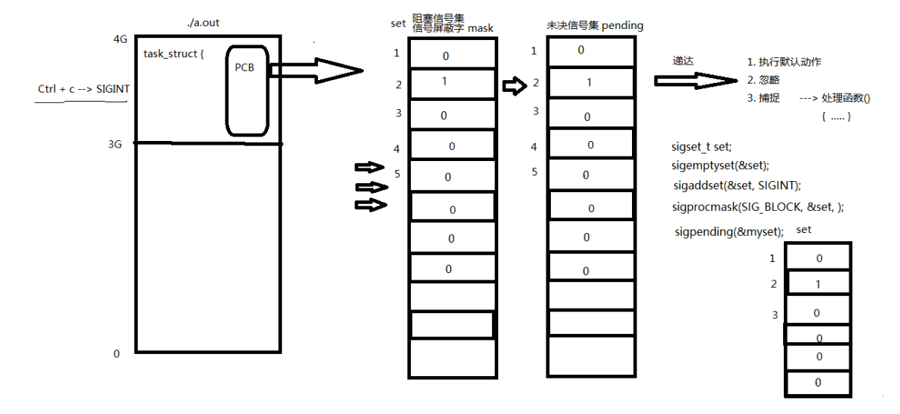



```
信号集操作函数：
    sigset_t set; 自定义信号集。
    sigemptyset(sigset_t *set); 清空信号集
    sigfillset(sigset_t *set); 全部置 1
    sigaddset(sigset_t *set, int signum); 将一个信号添加到集合中
    sigdelset(sigset_t *set, int signum); 将一个信号从集合中移除
    sigismember（const sigset_t *set，int signum); 判断一个信号是否在集合中。 在--》1，不在--》0
设置信号屏蔽字和解除屏蔽：
    int sigprocmask(int how, const sigset_t *set, sigset_t *oldset);
    how: SIG_BLOCK: 设置阻塞
        SIG_UNBLOCK: 取消阻塞
        SIG_SETMASK: 用自定义 set 替换 mask。
    set： 自定义 set
    oldset：旧有的 mask。
查看未决信号集：
    int sigpending(sigset_t *set);
    set： 传出的 未决信号集。

```

## 信号集操作函数练习

信号列表：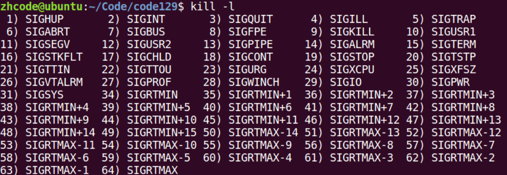



其中 9 号和 19 号信号比较特殊，只能执行默认动作，不能忽略捕捉，不能设置阻塞。

下面这个小例子，利用自定义集合，来设置信号阻塞，我们输入被设置阻塞的信号，可以看到未决信号集发生变化：

```
1. #include <stdio.h>
2. #include <signal.h>
3. #include <stdlib.h>
4. #include <string.h>
5. #include <unistd.h>
6. #include <errno.h>
7. #include <pthread.h>
8.
9. void sys_err(const char *str)
10. {
11. perror(str);
12. exit(1);
13. }
14.
15. void print_set(sigset_t *set)
16. {
17. int i;
18. for (i = 1; i<32; i++) {
19. if (sigismember(set, i))
20. putchar('1');
21. else
22. putchar('0');
23. }
24. printf("\n");
25. }
26. int main(int argc, char *argv[])
27. {
28. sigset_t set, oldset, pedset;
29. int ret = 0;
30.
31. sigemptyset(&set);
32. sigaddset(&set, SIGINT);
33. sigaddset(&set, SIGQUIT);
34. sigaddset(&set, SIGBUS);
35. sigaddset(&set, SIGKILL);
36.
37. ret = sigprocmask(SIG_BLOCK, &set, &oldset);
38. if (ret == -1)
39. sys_err("sigprocmask error");
40.
41. while (1) {
42. ret = sigpending(&pedset);
43. print_set(&pedset);
44. sleep(1);
45. }
46.
47. return 0;
48. }
```

编译运行，如下图所示：

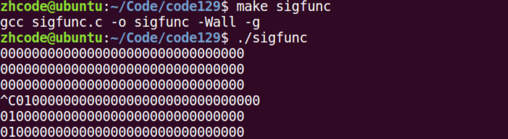



可以看到，在输入 Ctrl+C 之后，进程捕捉到信号，但由于设置阻塞，没有处理，未决信号集对应位 置变为 1.

## signal 实现信号捕捉

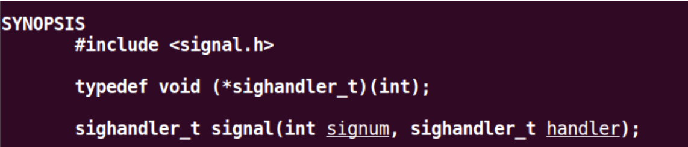



参数： 

​	signum ：待捕捉信号 

​	handler：捕捉信号后的操纵函数

返回值：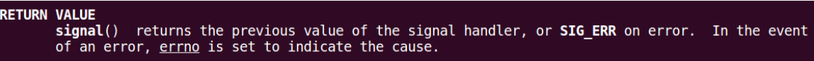



信号捕捉特性：
1. 捕捉函数执行期间，信号屏蔽字 由 mask --> sa_mask , 捕捉函数执行结束。 恢复回 mask
2. 捕捉函数执行期间，本信号自动被屏蔽(sa_flgs = 0).
3. 捕捉函数执行期间，被屏蔽信号多次发送，解除屏蔽后只处理一次！

一个信号捕捉的小例子：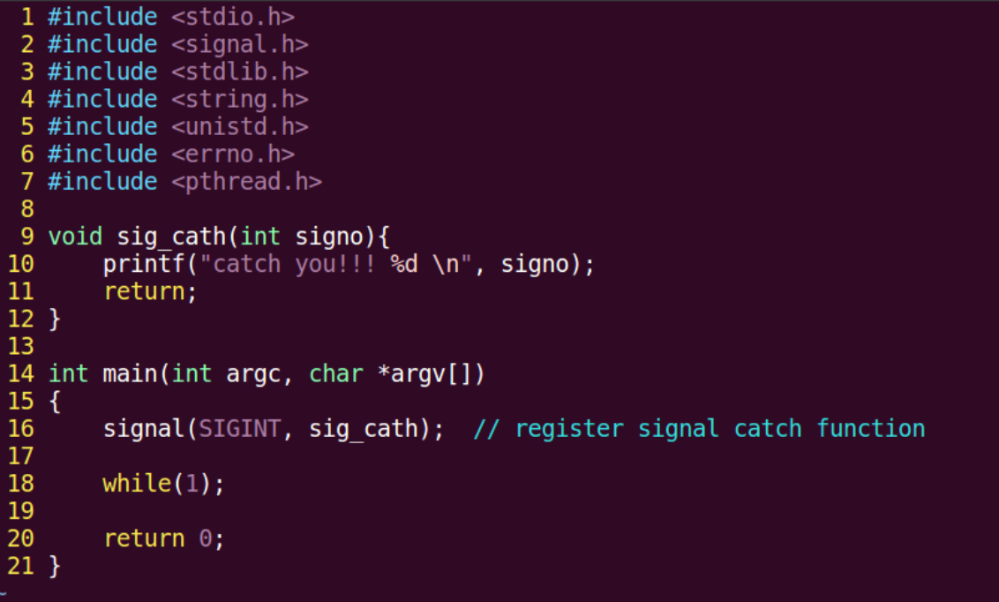



在上述代码中，函数`sig_cath`是一个信号处理函数，它被注册为了`SIGINT`信号的处理器。当程序接收到`SIGINT`信号（通常由终端按下Ctrl+C触发）时，该处理函数会被调用。在此处，参数`signo`代表接收到的信号编号，因此在函数定义中声明了参数`int signo`。

在`main`函数中，通过调用`signal(SIGINT, sig_cath)`将`sig_cath`函数注册为`SIGINT`信号（终端中断信号）的处理函数。这样，当程序接收到`SIGINT`信号时，就会调用`sig_cath`函数进行相关处理。

总结起来，参数`signo`是由系统自动传递给信号处理函数的，在这段代码中并不需要手动传入。

## sigaction 实现信号捕捉

sigaction 也是注册一个信号捕捉函数

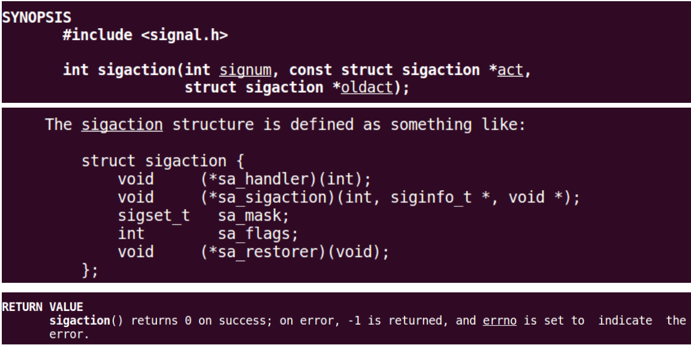



下面的小例子，使用 sigaction 捕捉两个信号：

```
1. #include <stdio.h>
2. #include <signal.h>
3. #include <stdlib.h>
4. #include <string.h>
5. #include <unistd.h>
6. #include <errno.h>
7. #include <pthread.h>
8.
9. void sys_err(const char *str)
10. {
11. perror(str);
12. exit(1);
13. }
14.
15. void sig_catch(int signo) // 回调函数
16. {
17. if (signo == SIGINT) {
18. printf("catch you!! %d\n", signo);
19. sleep(10);
20. }
21.
22. else if (signo == SIGQUIT)
23. printf("-----------catch you!! %d\n", signo);
24.
25. return ;
26. }
27.
28. int main(int argc, char *argv[])
29. {
30. struct sigaction act, oldact;
31.
32. act.sa_handler = sig_catch; // set callback function name 设置回调函数
33. sigemptyset(&(act.sa_mask)); // set mask when sig_catch working. 清空 sa_mask 屏蔽字, 只在sig_catch 工作时有效
34. //sigaddset(&act.sa_mask, SIGQUIT);
35. act.sa_flags = 0; // usually use. 默认值
36.
37. int ret = sigaction(SIGINT, &act, &oldact); //注册信号捕捉函数
38. if (ret == -1)
39. sys_err("sigaction error");
40. ret = sigaction(SIGQUIT, &act, &oldact); //注册信号捕捉函数
41.
42. while (1);
43.
44. return 0;
45. }
```

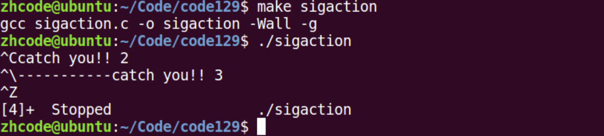



## 信号捕捉的特性 

信号捕捉特性：
1. 捕捉函数执行期间，信号屏蔽字 由 mask --> sa_mask , 捕捉函数执行结束。 恢复回 mask
2. 捕捉函数执行期间，本信号自动被屏蔽(sa_flgs = 0).
3. 捕捉函数执行期间，被屏蔽信号多次发送，解除屏蔽后只处理一次！

## 内核实现信号捕捉简析

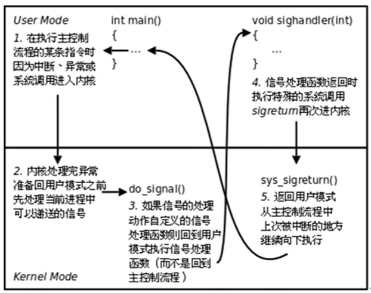



## 借助信号捕捉回收子进程

SIGCHLD 的产生条件： 

​	子进程终止时 

​	子进程接收到 SIGSTOP 

​	子进程处于停止态，接收到 SIGCONT 后唤醒时

下面是一个例子，创建子进程，并使用信号回收：

```
1. #include <stdio.h>
2. #include <stdlib.h>
3. #include <string.h>
4. #include <unistd.h>
5. #include <signal.h>
6. #include <sys/wait.h>
7. #include <errno.h>
8. #include <pthread.h>
9.
10. void sys_err(const char *str)
11. {
12. perror(str);
13. exit(1);
14. }
15.
16. void catch_child(int signo)// 有子进程终止，发送 SGCHLD 信号时，该函数会被内核回调
17. {
18. pid_t wpid;
19.
20. wpid = wait(NULL);
21. printf("-----------catch child id %d\n", wpid);
22.
23. return ;
24. }
25.
26. int main(int argc, char *argv[])
27. {
28. pid_t pid;
29. //阻塞,和解除阻塞一起用可以避免出现还未注册信号捕捉函数，子进程就直接接受信号默认过程，参考信号集操作函数
	sigset_t set;
	sigemptyset(&set);
	sigaddset(&set, SIGCHLD);
	sigprocmask(SIG_BLOCK, &set, NULL);
30. int i;
31. for (i = 0; i < 5; i++)
32. if ((pid = fork()) == 0) // 创建多个子进程
33. break;
34.
35. if (5 == i) {
36. struct sigaction act;
37.
38. act.sa_handler = catch_child; // 设置回调函数
39. sigemptyset(&act.sa_mask); // 设置捕捉函数执行期间屏蔽字
40. act.sa_flags = 0; // 设置默认属性, 本信号自动屏蔽
41.
42. sigaction(SIGCHLD, &act, NULL); // 注册信号捕捉函数
43. //解除阻塞
44.sigprocmask(SIG_UNBLOCK, &set, NULL);
45. printf("I'm parent, pid = %d\n", getpid());
46.
47. while (1);
48.
49. } else {
50. printf("I'm child pid = %d\n", getpid());
51. return i;
52. }
53.
54. return 0;
55. }
```

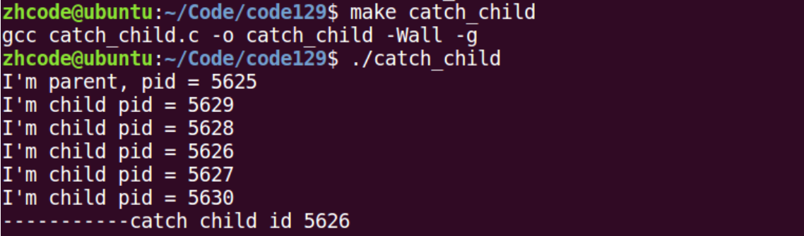



如图，只回收到 1 个子进程，多次执行，会发现回收到的子进程数量不是固定的。 原因分析： 问题出在，一次回调只回收一个子进程这里。同时出现多个子进程死亡时，其中一个子进程死亡 信号被捕捉，父进程去处理这个信号，此时其他子进程死亡信号发送过来，由于相同信号的不排队原 则，就只会回收累积信号中的一个子进程。

修改代码，回调函数中添加循环，一次回调可以回收多个子进程：

```
void catch_child(int signo)// 有子进程终止，发送 SGCHLD 信号时，该函数会被内核回调
{
 	pid_t wpid;
 	int status;
 	//while((wpid = wait(NULL)) != -1){
 	while((wpid = waitpid(-1, &status, 0)) != -1) {// 循环回收,防止僵尸进程出现.
 		if (WIFEXITED(status))
 			printf("-----------catch child id %d, ret=%d\n", wpid, WEXITSTATUS(status));
 	}
 	return ;
}
```

这下就是回收了所有子进程，很强势。 

还有一个问题需要注意，这里有可能父进程还没注册完捕捉函数，子进程就死亡了，解决这个问 题的方法，首先是让子进程 sleep，但这个不太科学。在 fork 之前注册也行，但这个也不是很科学。 最科学的方法是在 int i 之前设置屏蔽，等父进程注册完捕捉函数再解除屏蔽。这样即使子进程先死亡了，信号也因为被屏蔽而无法到达父进程。解除屏蔽过后，父进程就能处理累积起来的信号了。

## 中断系统调用

系统调用可分为两类:慢速系统调用和其他系统调用。
1.慢速系统调用:可能会使进程永远阻塞的一类。如果在阻塞期间收到一个信号，该系统调用就被中断,不再继续执行(早期);也可以设定系统调用是否重启。如，read、 write、pause 、 wait...
2.其他系统调用:getpid、getppid、fork...
结合pause，回顾慢速系统调用:
	慢速系统调用被中断的相关行为，实际上就是pause的行为:如，read

- 想中断pause，信号不能被屏蔽。
- 信号的处理方式必须是捕捉(默认、忽略都不可以)
- 中断后返回-1，设置errno为EINTR(表“被信号中断”)

可修改sa_flags参数来设置被信号中断后系统调用是否重启。SA_INTERRURT不重启。SA_RESTART重启。

sa_flags 还有很多可选参数，适用于不同情况。如:捕捉到信号后，在执行捕捉函数期间，不希望自动阻塞该信号，可将sa_flags设置为SA_NODEFER，除非sa_mask中包含该信号。

## 会话

会话：多个进程组的集合
创建会话的 6 点注意事项：
1. 调用进程不能是进程组组长，该进程变成新会话首进程
2. 该进程成为一个新进程组的组长进程
3. 需要 root 权限（ubuntu 不需要）
4. 新会话丢弃原有的控制终端，该会话没有控制终端
5. 该调用进程是组长进程，则出错返回
6. 建立新会话时，先调用 fork，父进程终止，子进程调用 setsid

getsid 函数：
`pid_t getsid(pid_t pid)` 获取当前进程的会话 id
成功返回调用进程会话 ID，失败返回-1，设置 error
setsid 函数：
`pid_t setsid(void)` 创建一个会话，并以自己的 ID 设置进程组 ID，同时也是新会话的 ID
成功返回调用进程的会话 ID，失败返回-1，设置 error

## 守护进程创建步骤分析 

守护进程：
daemon 进程。通常运行于操作系统后台，脱离控制终端。一般不与用户直接交互。周期性的等待某个事件发生或周期性执行某一动作。
不受用户登录注销影响。通常采用以 d 结尾的命名方式。

创建守护进程，最关键的一步是调用 setsid 函数创建一个新的 Session，并成为 Session Leader

守护进程创建步骤：

1. fork 子进程，让父进程终止。
2. 子进程调用 setsid() 创建新会话
3. 通常根据需要，改变工作目录位置 chdir()， 防止目录被卸载。比如目录是在U盘上，卸载就会出问题。
4. 通常根据需要，重设 umask 文件权限掩码，影响新文件的创建权限。 022 -- 755 0345 --- 432 r---wx-w- 422,x权限默认不给，创建目录是432，创建文件没有x就是422.（可能是**出于安全的考虑，linux系统新建文件默认没有执行权限**，其最大权限为rw-rw-rw-（666），新建目录的最大权限为rwx-rwx-rwx（777）。）
5. 通常根据需要，关闭/重定向 文件描述符
6. 守护进程 业务逻辑。while（）

下面这个例子，创建一个守护进程：

```
1. #include <stdio.h>
2. #include <sys/stat.h>
3. #include <fcntl.h>
4. #include <stdlib.h>
5. #include <string.h>
6. #include <unistd.h>
7. #include <errno.h>
8. #include <pthread.h>
9.
10. void sys_err(const char *str)
11. {
12. perror(str);
13. exit(1);
14. }
15.
16. int main(int argc, char *argv[])
17. {
18. pid_t pid;
19. int ret, fd;
20.
21. pid = fork();
22. if (pid > 0) // 父进程终止
23. exit(0);
24.
25. pid = setsid(); //创建新会话
26. if (pid == -1)
27. sys_err("setsid error");
28.
29. ret = chdir("/home/zhcode/Code/code146"); // 改变工作目录位置
30. if (ret == -1)
31. sys_err("chdir error");
32.
33. umask(0022); // 改变文件访问权限掩码
34.
35. close(STDIN_FILENO); // 关闭文件描述符 0
36.
37. fd = open("/dev/null", O_RDWR); // fd --> 0**文件描述符fd默认会给最小的，如果0，1，2关闭，则会给0**
38. if (fd == -1)
39. sys_err("open error");
40.
41. dup2(fd, STDOUT_FILENO); // 重定向 stdout 和 stderr,因为不需要与用户交互，/dev/null这是一个空洞文件
42. dup2(fd, STDERR_FILENO);
43.
44. while (1); // 模拟 守护进程业务.
45.
46. return 0;
47. }
```

不会受到用户登录注销影响，会话不会结束，只有kill才行。

