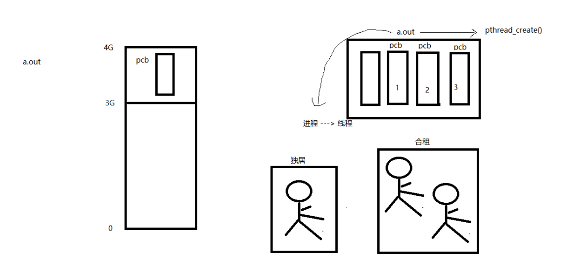
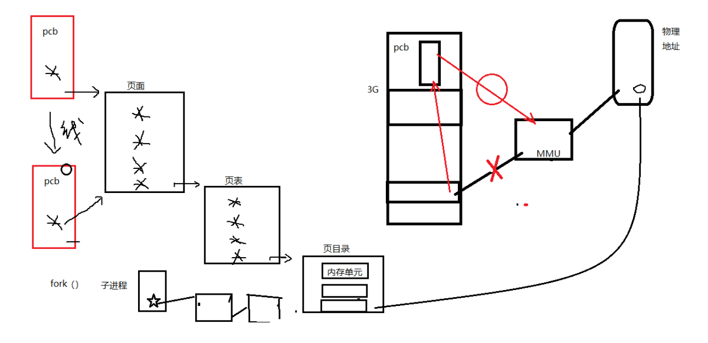

## 线程概念

线程概念：
进程：有独立的 进程地址空间。有独立的 pcb。 分配资源的最小单位。
线程：有独立的 pcb。没有独立的进程地址空间。 最小单位的执行。
ps -Lf 进程 id ---> 线程号。LWP --》cpu 执行的最小单位（线程）。

ps -Lf 进程号 查看进程的线程





一个进程的线程越多，争取cpu的概率越大，但是会有峰值，然后降低

## 三级映射

### Linux内核线程实现原理

类Unix系统中，早期是没有“线程”概念的，80年代才引入，借助进程机制实现出了线程的概念。因此在这类系统中，进程和线程关系密切。

1.轻量级进程(light-weight process)，也有 PCB，创建线程使用的底层函数和进程一样，都是clone

2.从内核里看进程和线程是一样的，都有各自不同的PCB，但是PCB 中指向内存资源的三级页表是相同的

3.进程可以蜕变成线程。

4.线程可看做寄存器和栈的集合（寄存器在cpu上用来计算，栈帧开辟在栈上，目的是执行函数和存放局部变量，临时值和形参）

5.在 linux 下，线程是最小的执行单位;进程是最小的分配资源单位。

查看Lwp号:`ps -lf pid`查看指定线程的 lwp号。

### 进程控制块PCB.

我们知道,每个进程在内核中都有一个进程控制块(PCB)来维护进程相关的信息，Linux内核的进程控制块是task_struct结构体。

`/usr/src/linux-headers-3.16.0-30/include/linux/sched.h`.文件中可以查看struct task_struct结构体定义。其内部成员有很多，我们重点掌握以下部分即可:

- 进程id。系统中每个进程有唯一的id，在c语言中用pid_t类型表示，其实就是一个非负整数。
- 进程的状态，有就绪、运行、挂起、停止等状态。
- 进程切换时需要保存和恢复的一些cPu寄存器。
- 描述虚拟地址空间的信息
- 描述控制终端的信息。
- 当前工作目录(Current Working Directory)。
- umask掩码。
- 文件描述符表，包含很多指向file结构体的指针。
- 和信号相关的信息。
- 用户id和组id。
- 会话(Session）和进程组。
- 进程可以使用的资源上限（Resource Limit) 。





如果是fork则另外一个进程，指向的就不一样。我们之前讲没有pcb，其实映射是需要经过pcb的。

## 线程共享和非共享

线程共享资源

- 1.文件描述符表
- 2.每种信号的处理方式
- 3.当前工作目录
- 4.用户ID和组ID
- 5.内存地址空间(.text/.data/.bss/heap/共享库)，就是没有**栈**（栈执行函数和存放局部变量，临时值和形参）

线程非共享资源

- 1.线程id
- 2.处理器现场（寄存器计算的数据在处理器保存）和**栈**指针(内核栈)
- 3.独立的栈空间(用户空间栈)
- 4.errno变量
- 5.信号屏蔽字
- 6.调度优先级

线程优、缺点：
优点:1.提高程序并发性	2.开销小 	3.数据通信、共享数据方便。（可以共享全局变量，不像父子进程，读时共享、写时复制）
缺点:1.库函数，不稳定	2.调试、编写困难、gdb不支持	3.对信号支持不好。

优点相对突出，缺点均不是硬伤。Linux下由于实现方法导致进程、线程差别不是很大。一般能使用线程就使用线程。

## 创建线程

```
pthread_t *tid是传出参数
C++ 中的参数，既可以当做传入参数，也可以当做传出参数，具体要看参数的数据类型。

非指针，非引用类型：一定是当做传入参数；
指针，引用类型：既可以当做传入参数；也可以当做传出参数；甚至可以同时是传入参数，也是传出参数。
其次要看对参数进行的操作：

如果是只有读取，没有修改的，那就是传入参数，这时可以加上 const 限定符，以防不小心修改了参数。
如果只有对参数进行写入，没有读取的，那就是当做传出参数的。
如果对参数先进行了读取操作，然后又进行了写入操作，那么就是既当传入参数也当传出参数了。
```

`pthread_t pthread_self(void)`; 获取线程 id。 线程 id 是在进程地址空间内部，用来标识线程身份的 id 号。
	返回值：本线程 id
检查出错返回： 线程中。
	fprintf(stderr, "xxx error: %s\n", strerror(ret));
`int pthread_create(pthread_t *tid, const pthread_attr_t *attr, void *(*start_rountn)(void *), void *arg);` 创建子线程。
	参 1：传出参数，表新创建的子线程 id
	参 2：线程属性。传 NULL 表使用默认属性。
	参 3：子线程回调函数。创建成功，ptherad_create 函数返回时，该函数会被自动调用。
	参 4：参 3 的参数。没有的话，传 NULL
	返回值：成功：0
		失败：errno

下面这个例子，创建一个子线程去执行其他任务：

```
1. #include <stdio.h>
2. #include <stdlib.h>
3. #include <string.h>
4. #include <unistd.h>
5. #include <errno.h>
6. #include <pthread.h>
7.
8. void sys_err(const char *str){
9. perror(str);
10. exit(1);
11. }
12.
13. void *tfn(void *arg){
14. printf("thread: pid = %d, tid = %lu\n", getpid(), pthread_self());
15.
16. return NULL;
17. }
18.
19. int main(int argc, char *argv[]){
20. pthread_t tid;
21.
22. printf("main: pid = %d, tid = %lu\n", getpid(), pthread_self());
23.
24. int ret = pthread_create(&tid, NULL, tfn, NULL);
25. if (ret != 0) {
26. perror("pthread_create error");
27. }
28.
29. return 0;
30. }
```

可以看到，子线程的打印信息并未出现。原因在于，主线程执行完之后，就销毁了整个进程的地址空间，于是子线程就无法打印。简单粗暴的方法就是让主线程睡 1 秒，等子线程执行。

## 循环创建多个子线程

```
1. #include <stdio.h>
2. #include <stdlib.h>
3. #include <string.h>
4. #include <unistd.h>
5. #include <errno.h>
6. #include <pthread.h>
7.
8. void sys_err(const char *str){
9. perror(str);
10. exit(1);
11. }
12.
13. void *tfn(void *arg){
14. int i = (int)arg;//int i = *((int *)arg)和(void *)&i，子线程如果用地址传递 i，会去读取主线程里的 i 值，而主线程里的 i 是动态变化的，不固定。所以，应该采用值传递，不用指针传递。

15. sleep(i);
16. printf("--I'm %dth thread: pid = %d, tid = %lu\n",i+1, getpid(), pthread_self());
17.
18. return NULL;
19. }
20.
21. int main(int argc, char *argv[]){
22. int i;
23. int ret;
24. pthread_t tid;
25.
26. for(i=0;i<5;i++){
27. ret = pthread_create(&tid, NULL, tfn, (void *)i);//(void *)&i
28. if (ret != 0) {
29. sys_err("pthread_create error");
30. }
31. }
32. sleep(i);
33. printf("I'm main, pid = %d, tid = %lu\n", getpid(), pthread_self());
34.
35. return 0;
36. }
```

## pthread_exit 退出

```
void pthread_exit(void *retval); 退出当前线程。
    retval：退出值。 无退出值时，NULL
    exit(); 退出当前进程。
    return: 返回到调用者那里去。
    pthread_exit(): 退出当前线程。
如果在回调函数里加一段代码：
if(i == 2)
	exit(0);
看起来好像是退出了第三个子线程，然而运行时，发现后续的 4,5 也没了。这是因为，exit 是退出进程。
一、修改一下，换成：
if(i == 2)
	return NULL;
这样运行一下，发现后续线程不会凉凉，说明 return 是可以达到退出线程的目的。然而真正意义上，return 是返回到函数调用者那里去，线程并没有退出。
二、再修改一下，再定义一个函数 func，直接返回那种
void *func(void){
	return NULL;
}
if(i == 2)
	func();
运行，发现 1,2,3,4,5 线程都还在，说明没有达到退出目的。
三、再次修改：
void *func(void){
	pthread_exit(NULL);
	return NULL;
}
if(i == 2)
	func();
编译运行，发现 3 没了，看起来很科学的样子。pthread_exit 表示将当前线程退出。放在函数里，还是直接调用，都可以。
回到之前说的一个问题，由于主线程可能先于子线程结束，所以子线程的输出可能不会打印出来，当时是用主线程 sleep 等待子线程结束来解决的。现在就可以使用 pthread_exit 来解决了。方法就是将 return 0 替换为 pthread_exit，只退出当前线程，不会对其他线程造成影响。
void pthread_exit(void *retval); 退出当前线程。
    retval：退出值。 无退出值时，NULL
    exit(); 退出当前进程。
    return: 返回到调用者那里去。
    pthread_exit(): 退出当前线程。

```

## pthread_join

```
int pthread_join(pthread_t thread, void **retval); 阻塞 回收线程。
	thread: 待回收的线程 id
	retval：传出参数。 回收的那个线程的退出值。return
线程异常解除，值为 -1。成功被 pthread_cancel() 杀死的线程，返回 -1.使用 pthead_join 回收。
	返回值：成功：0
	失败：errno
```

下面这个是回收线程并获取子线程返回值的小例子：

```
1. #include <stdio.h>
2. #include <stdlib.h>
3. #include <string.h>
4. #include <unistd.h>
5. #include <errno.h>
6. #include <pthread.h>
7.
8. struct thrd {
9. int var;
10. char str[256];
11. };
12.
13. void sys_err(const char *str)
14. {
15. perror(str);
16. exit(1);
17. }
18.
19. void *tfn(void *arg)
20. {
21. struct thrd *tval;
22.
23. tval = malloc(sizeof(tval));
24. tval->var = 100;
25. strcpy(tval->str, "hello thread");
26.
27. return (void *)tval;
28. }
29.
30. int main(int argc, char *argv[])
31. {
32. pthread_t tid;
33.
34. struct thrd *retval;
35.
36. int ret = pthread_create(&tid, NULL, tfn, NULL);
37. if (ret != 0)
38. sys_err("pthread_create error");
39.
40. //int pthread_join(pthread_t thread, void **retval);//void **retval同样是传出参数
41. ret = pthread_join(tid, (void **)&retval);
42. if (ret != 0)
43. sys_err("pthread_join error");
44.
45. printf("child thread exit with var= %d, str= %s\n", retval->var, retval->str);
46.
47. pthread_exit(NULL);//由于主线程可能先于子线程结束，所以子线程的输出可能不会打印出来，当时是用主线程 sleep 等待子线程结束来解决的。现在就可以使用 pthread_exit 来解决了。方法就是将 return 0 替换为 pthread_exit，只退出当前线程，不会对其他线程造成影响。
48.
49. }
```

还可以改为

```
void *tfn(void *arg)
{
    struct thrd *tval = (struct thrd *)arg;
    tval->var = 100;
    strcpy(tval->str,"hello thread");
    return (void *)tvai;//返回的是arg地址所以可以用
}

int main(int argc,char *argv[])
{

    pthread_t tid;
    struct thrd arg;
    struct thrd *retval;
    int ret = pthread_create(&tid，NULL, tfn，(void *)&arg);
    if (ret != 0)
        sys_err( "pthread_create error");
    //int pthread_join(pthread_t thread, void **retval);
    ret = pthread_join(tid,(void **)&retval);
    if (ret != 0)
        sys_err( "pthread_join error");
    printf( " child thread exit with var= %d，str= %s\n",retval->var,retval->str);
    pthreadexit(NULL);
}

```

## pthread_cancel 函数 

`int pthread_cancel(pthread_t thread);` 杀死一个线程。 需要到达取消点（保存点），即需要调动系统内核
	thread: 待杀死的线程 id
	返回值：成功：0
	失败：errno
如果，子线程没有到达取消点， 那么 pthread_cancel 无效。
我们可以在程序中，手动添加一个取消点。使用 pthread_testcancel();
成功被 pthread_cancel() 杀死的线程，返回 -1.使用 pthead_join 回收。

小例子，主线程调用 pthread_cancel 杀死子线程

```
1. #include <stdio.h>
2. #include <stdlib.h>
3. #include <string.h>
4. #include <unistd.h>
5. #include <errno.h>
6. #include <pthread.h>
7.
8.
9. void *tfn(void *arg){
10. while (1) {
11. printf("thread: pid = %d, tid = %lu\n", getpid(), pthread_self());
12. sleep(1);
13. }
14.
15. return NULL;
16. }
17.
18. int main(int argc, char *argv[]){
19. pthread_t tid;
20.
21. int ret = pthread_create(&tid, NULL, tfn, NULL);
22. if (ret != 0) {
23. fprintf(stderr, "pthread_create error:%s\n", strerror(ret));
24. exit(1);
25. }
26.
27. printf("main: pid = %d, tid = %lu\n", getpid(), pthread_self());
28.
29. sleep(5);
30.
31. ret = pthread_cancel(tid); // 终止线程
32. if (ret != 0) {
33. fprintf(stderr, "pthread_cancel error:%s\n", strerror(ret));
34. exit(1);
35. }
36.
37. while (1);
38.
39. pthread_exit((void *)0);//由于主线程可能先于子线程结束，所以子线程的输出可能不会打印出来，当时是用主线程 sleep 等待子线程结束来解决的。现在就可以使用 pthread_exit 来解决了。方法就是将 return 0 替换为 pthread_exit，只退出当前线程，不会对其他线程造成影响。
40. }
```

这里要注意一点，pthread_cancel 工作的必要条件是进入内核，如果 tfn 真的奇葩到没有进入内核， 则 pthread_cancel 不能杀死线程，此时需要手动设置取消点，就是 pthread_testcancel()

## 检查出错返回

int pthread_detach(pthread_t thread); 设置线程分离
	thread: 待分离的线程 id
	返回值：成功：0
	失败：errno

下面这个例子，使用 detach 分离线程，照理来说，分离后的线程会自动回收：

```
1. #include <stdio.h>
2. #include <stdlib.h>
3. #include <string.h>
4. #include <unistd.h>
5. #include <errno.h>
6. #include <pthread.h>
7.
8.
9. void *tfn(void *arg)
10. {
11. printf("thread: pid = %d, tid = %lu\n", getpid(), pthread_self());
12.
13. return NULL;
14. }
15.
16. int main(int argc, char *argv[])
17. {
18. pthread_t tid;
19.
20. int ret = pthread_create(&tid, NULL, tfn, NULL);
21. if (ret != 0) {
22. perror("pthread_create error");
23. }
24. ret = pthread_detach(tid); // 设置线程分离` 线程终止,会自动清理 pcb,无需回收
25. if (ret != 0) {
26. perror("pthread_detach error");
27. }
28.
29. sleep(1);
30.
31. ret = pthread_join(tid, NULL);
32. printf("join ret = %d\n", ret);
33. if (ret != 0) {
34. perror("pthread_join error");
35. }
36.
37. printf("main: pid = %d, tid = %lu\n", getpid(), pthread_self());
38.
39. pthread_exit((void *)0);
40. }
```

这里，问题出现了，join 出错了，但是没打印错误原因。之前的 perror 方法检查线程错误是有 问题的。应该使用 strerror，修改代码如下，因为perror方法是底层的一个全局变量，线程不能用

```
20. int ret = pthread_create(&tid, NULL, tfn, NULL);
21. if (ret != 0) {
22. fprintf(stderr, "pthread_create error: %s\n", strerror(ret));//stderr,直接输出到终端
23. exit(1);
24. }
```

出错，是因为线程分离后，系统会自动回收资源，用 pthread_join 去回收已经被系统 回收的线程，那个线程号就是无效参数。

`pthread_join()`和`pthread_detach()`是用于管理线程资源的两种方式，但它们的作用是不同的。

- `pthread_join(thread, status)`函数会将主线程阻塞，直到指定的线程 `thread` 终止。一旦目标线程终止，调用线程将从阻塞状态返回，并可以获取目标线程的退出状态信息。通过这种方式，`pthread_join()`可以实现对子线程的资源回收和同步等待操作。
- `pthread_detach(thread)`函数则是将指定的线程 `thread` 设置为分离状态，从而使得线程结束后自动释放其相关资源，包括线程栈空间和线程描述符等。相当于告诉系统不需要进行显式的资源回收操作，由系统自动回收资源。

所以，虽然`pthread_join()`和`pthread_detach()`都能起到资源回收的作用，它们的使用场景和效果略有差异。`pthread_join()`适用于需要等待线程执行完毕并获取其返回状态的情况，而`pthread_detach()`适用于不关心线程返回状态，只希望在线程结束后自动回收资源的情况

## 进程和线程控制原语对比

线程控制原语 			进程控制原语
pthread_create() 		fork();
pthread_self() 			getpid();
pthread_exit() 			exit(); 	/ return //exit实际是退出进程，无论在哪个线程都会将整个进程都退出，return是退回到上一次调用的地方，所有只有都在主函数调用的时候效果一样。
pthread_join() 			wait()/waitpid()
pthread_cancel() 		kill()
pthread_detach()

## 线程属性设置分离线程

线程属性：
设置分离属性。

```
pthread_attr_t attr 创建一个线程属性结构体变量
pthread_attr_init(&attr); 初始化线程属性
pthread_attr_setdetachstate(&attr, PTHREAD_CREATE_DETACHED); 设置线程属性为分离态
pthread_create(&tid, &attr, tfn, NULL); 借助修改后的 设置线程属性 创建为分离态的新线程
pthread_attr_destroy(&attr); 销毁线程属性
```

调整线程状态，使线程创建出来就是分离态，代码如下：

```
1. #include <stdio.h>
2. #include <stdlib.h>
3. #include <string.h>
4. #include <unistd.h>
5. #include <errno.h>
6. #include <pthread.h>
7.
8.
9. void *tfn(void *arg)
10. {
11. printf("thread: pid = %d, tid = %lu\n", getpid(), pthread_self());
12.
13. return NULL;
14. }
15.
16. int main(int argc, char *argv[])
17. {
18. pthread_t tid;
19.
20. pthread_attr_t attr;
21.
22. int ret = pthread_attr_init(&attr);
23. if (ret != 0) {
24. fprintf(stderr, "attr_init error:%s\n", strerror(ret));
25. exit(1);
26. }
27.
28. ret = pthread_attr_setdetachstate(&attr, PTHREAD_CREATE_DETACHED); // 设置线程属性为 分离属性
29. if (ret != 0) {
30. fprintf(stderr, "attr_setdetachstate error:%s\n", strerror(ret));
31. exit(1);
32. }
33.
34. ret = pthread_create(&tid, &attr, tfn, NULL);
35. if (ret != 0) {
36. perror("pthread_create error");
37. }
38.
39. ret = pthread_attr_destroy(&attr);
40. if (ret != 0) {
41. fprintf(stderr, "attr_destroy error:%s\n", strerror(ret));
42. exit(1);
43. }
44.
45. ret = pthread_join(tid, NULL);
46. if (ret != 0) {
47. fprintf(stderr, "pthread_join error:%s\n", strerror(ret));
48. exit(1);
49. }
50.
51. printf("main: pid = %d, tid = %lu\n", getpid(), pthread_self());
52.
53. pthread_exit((void *)0);
54. }
```

pthread_join 报错，说明线程已经自动回收，设置分离成功

## 线程使用注意事项

```
1.主线程退出其他线程不退出，主线程应调用`pthread_exit`
2.避免僵尸线程。
`pthread_joine`
`pthread_detach`
`pthread_create`	指定分离属性
join线程可能在join函数返回前就释放完自己的所有内存资源，所以不应当返回被回收线程楼中的值;
3. malloc和mmap申请的内存可以被其他线程释放
4.应避免在多线程模型中调用fork，除非马上exec，子进程中只有调用fork 的线程存在，其他线程在子进程中均pthread_exit
5.信号的复杂语义很难和多线程共存，应避免在多线程引入信号机制,因为信号处理是同概率的，每一个的mask是不同的，但是未决信号集是一样的，所有才能在信号来时都会主动处理。
```

