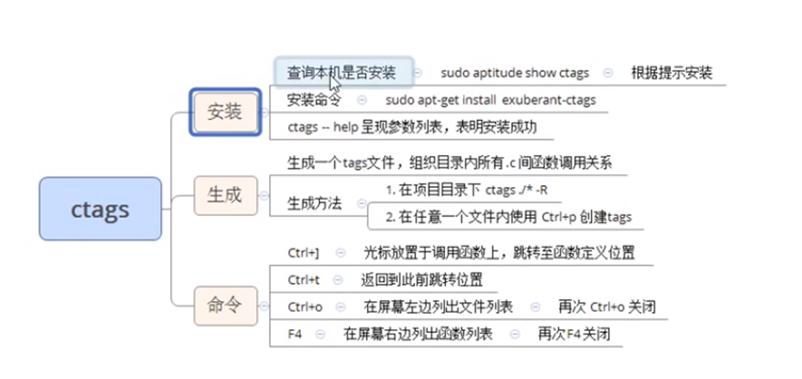
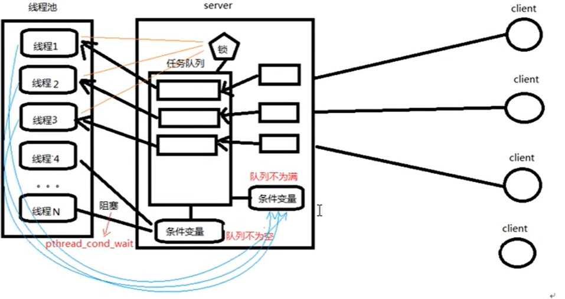

# ctags使用





```
在使用 ctags 时，它本身并没有提供直接在屏幕左侧列出文件列表的功能。但你可以使用其他工具结合 ctags 来实现类似的效果。

一种常见的方法是使用类似于 NERDTree 插件的文件浏览器插件。NERDTree 是 Vim 编辑器中一个流行的插件，可以在 Vim 的侧边栏中显示和导航文件列表。你可以按照以下步骤在 Vim 中使用 NERDTree 插件：

确保你已经安装了 pathogen 或者 vim-plug 这样的 Vim 插件管理器。
根据你所选择的插件管理器，在你的 Vim 配置文件（通常是 ~/.vimrc）中添加相应的配置。
安装 NERDTree 插件。对于 pathogen，可以将插件克隆到 ~/.vim/bundle/ 目录下。对于 vim-plug，可以在 ~/.vimrc 中添加插件的配置，并执行 :PlugInstall 命令进行安装。
重启 Vim，并执行 :NERDTreeToggle 命令来打开或关闭 NERDTree 窗口。你可以将其映射为方便的快捷键。
当你生成了 ctags 标签文件后，通过打开 NERDTree 窗口，你就可以在屏幕的左侧列出文件列表了。

请注意，这只是一个示例插件，并且适用于 Vim 编辑器。对于其他编辑器或 IDE，你可能需要找到相应的文件浏览器插件或特定的功能来实现类似的效果。

要在屏幕右边列出函数列表，你可以使用类似于 Tagbar 插件的工具。Tagbar 是一个常用的 Vim 插件，用于显示当前文件中定义的函数、类、变量等符号列表，并且可以将其放置在编辑窗口的侧边栏。

以下是在 Vim 中使用 Tagbar 插件的简要步骤：

确保你已经安装了 Vim 插件管理器，如 pathogen 或 vim-plug。
根据你选择的插件管理器，在你的 Vim 配置文件（一般是 ~/.vimrc）中添加相应的配置。
安装 Tagbar 插件。对于 pathogen，可以将插件克隆到 ~/.vim/bundle/ 目录下。对于 vim-plug，可以在 ~/.vimrc 中添加插件的配置，并执行 :PlugInstall 命令进行安装。
重新启动 Vim，并执行 :TagbarToggle 命令来打开或关闭 Tagbar 窗口。你也可以将其映射为方便的快捷键。
当你打开 Tagbar 窗口时，它将会在屏幕的右侧列出当前文件中的函数列表。

请注意，这只是一个示例插件，适用于 Vim 编辑器。对于其他编辑器或 IDE，你可以搜索类似的插件或查看相关的功能来实现类似的效果。
```

# 线程池模型原理分析





```
struct threadpool_t {

    pthread_mutex_t lock;               /* 用于锁住本结构体 */    
    pthread_mutex_t thread_counter;     /* 记录忙状态线程个数de琐 -- busy_thr_num */

    pthread_cond_t queue_not_full;      /* 当任务队列满时，添加任务的线程阻塞，等待此条件变量 */
    pthread_cond_t queue_not_empty;     /* 任务队列里不为空时，通知等待任务的线程 */

    pthread_t *threads;                 /* 存放线程池中每个线程的tid。数组 */
    pthread_t adjust_tid;               /* 存管理线程tid */
    threadpool_task_t *task_queue;      /* 任务队列(数组首地址) */

    int min_thr_num;                    /* 线程池最小线程数 */
    int max_thr_num;                    /* 线程池最大线程数 */
    int live_thr_num;                   /* 当前存活线程个数 */
    int busy_thr_num;                   /* 忙状态线程个数 */
    int wait_exit_thr_num;              /* 要销毁的线程个数 */

    int queue_front;                    /* task_queue队头下标 */
    int queue_rear;                     /* task_queue队尾下标 */
    int queue_size;                     /* task_queue队中实际任务数 */
    int queue_max_size;                 /* task_queue队列可容纳任务数上限 */

    int shutdown;                       /* 标志位，线程池使用状态，true或false */
};


typedef struct {

    void *(*function)(void *);          /* 函数指针，回调函数 */
	void *arg;                          /* 上面函数的参数 */
}

```

## 线程池main架构

1. main();  

 

​    创建线程池。

 

​    向线程池中添加任务。 借助回调处理任务。

 

​    销毁线程池。

## 线程池-pthreadpool_create

2. pthreadpool_create();

 

​    创建线程池结构体 指针。

 

​    初始化线程池结构体 { N 个成员变量 }

 

​    创建 N 个任务线程。

 

​    创建 1 个管理者线程。

 

​    失败时，销毁开辟的所有空间。（释放）

## 子线程回调函数

3. threadpool_thread（）

 

​    进入子线程回调函数。

 

​    接收参数 void *arg --》 pool 结构体

 

​    加锁 --》lock --》 整个结构体锁

 

​    判断条件变量 --》 wait

## 管理者线程

4. adjust_thread（）

 

​    循环 10 s 执行一次。

 

​    进入管理者线程回调函数

 

​    接收参数 void *arg --》 pool 结构体

 

​    加锁 --》lock --》 整个结构体锁

 

​    获取管理线程池要用的到 变量。  task_num, live_num, busy_num

 

​    根据既定算法，使用上述3变量，判断是否应该 创建、销毁线程池中 指定步长的线程。

## threadpool_add函数

5. threadpool_add ()

 

​    总功能：

 

​      模拟产生任务。  num[20]

 

​      设置回调函数， 处理任务。 sleep（1） 代表处理完成。

 

​    内部实现：

  

​      加锁

 

​      初始化 任务队列结构体成员。  回调函数 function， arg

 

​      利用环形队列机制，实现添加任务。 借助队尾指针挪移 % 实现。

 

​      唤醒阻塞在 条件变量上的线程。

  

​      解锁

## 条件满足，子线程wait被唤醒后处理任务

6. 从 3. 中的wait之后继续执行，处理任务。

 

​    加锁

​    

​    获取 任务处理回调函数，及参数

 

​    利用环形队列机制，实现处理任务。 借助队头指针挪移 % 实现。

 

​    唤醒阻塞在 条件变量 上的 server。

 

​    解锁

 

​    加锁

 

​    改忙线程数++

 

​    解锁

 

​    执行处理任务的线程

 

​    加锁

 

​    改忙线程数——

 

​    解锁

## 线程池扩容和销毁

7. 创建 销毁线程

 

​    管理者线程根据 task_num, live_num, busy_num 

 

​    根据既定算法，使用上述3变量，判断是否应该 创建、销毁线程池中 指定步长的线程。

 

​    如果满足 创建条件

 

​      pthread_create();  回调 任务线程函数。    live_num++

 

​    如果满足 销毁条件

 

​      wait_exit_thr_num = 10; 

 

​      signal 给 阻塞在条件变量上的线程 发送 假条件满足信号  

 

​      跳转至 --170 wait阻塞线程会被 假信号 唤醒。判断： wait_exit_thr_num > 0 pthread_exit();

