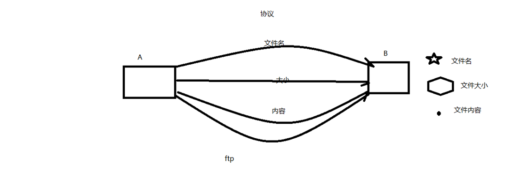
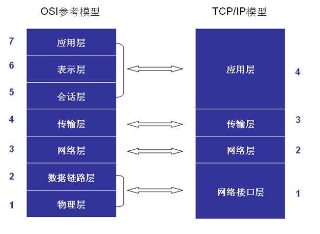
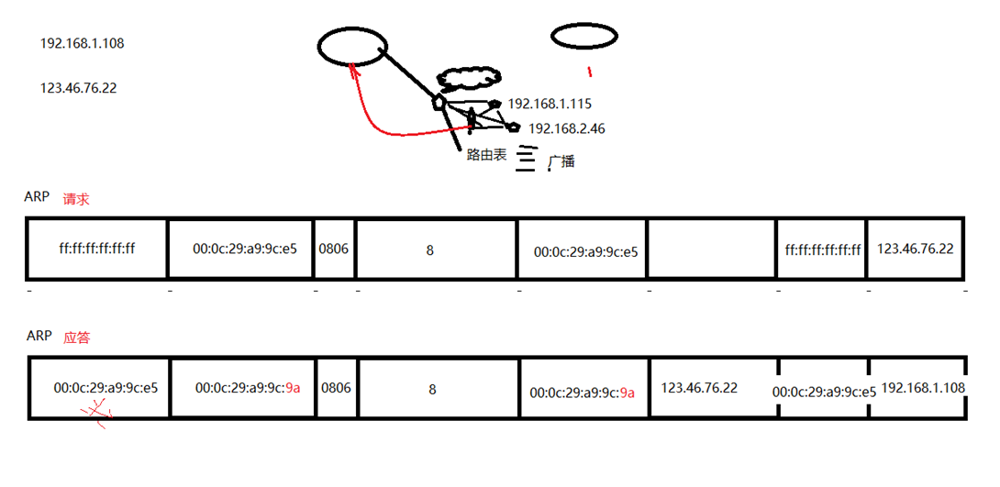
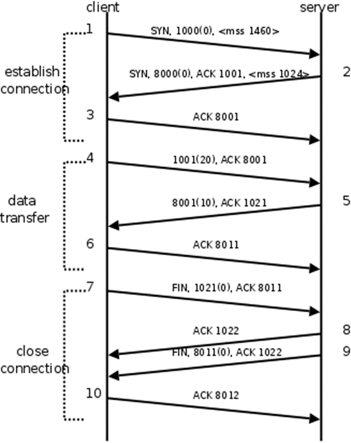
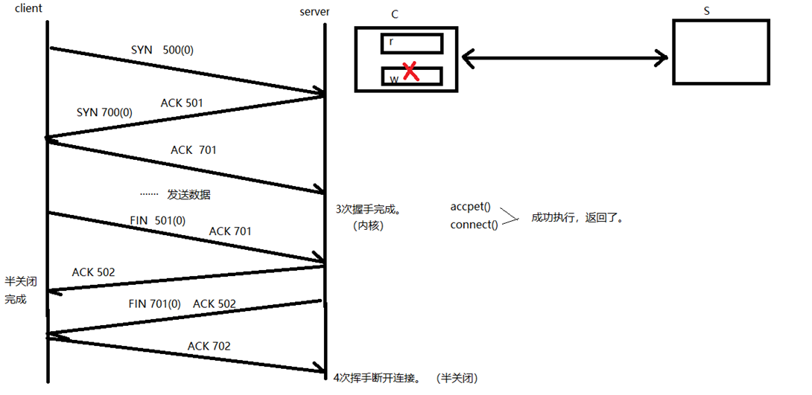
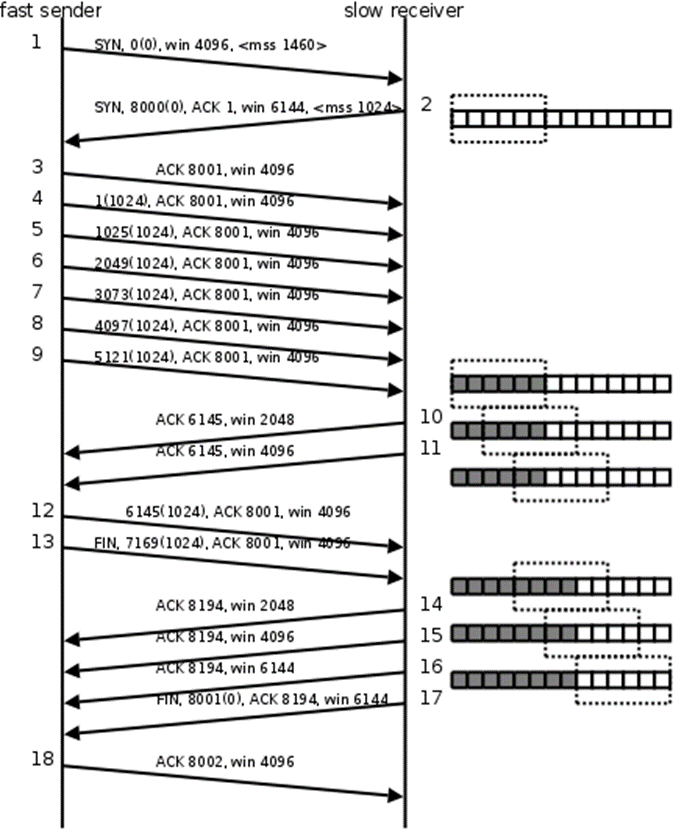
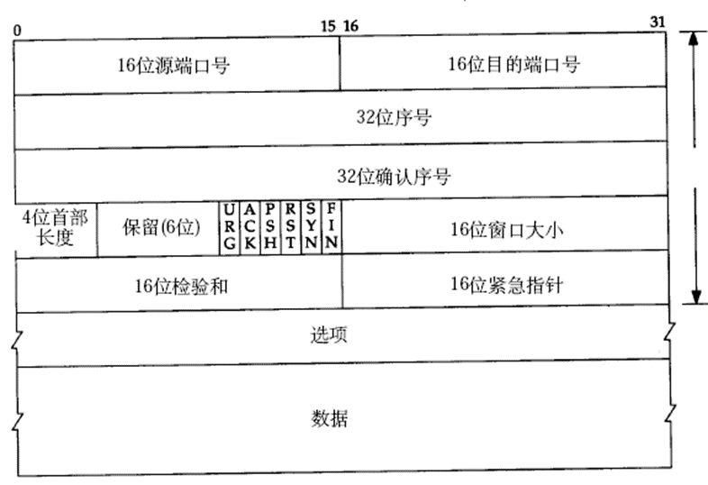
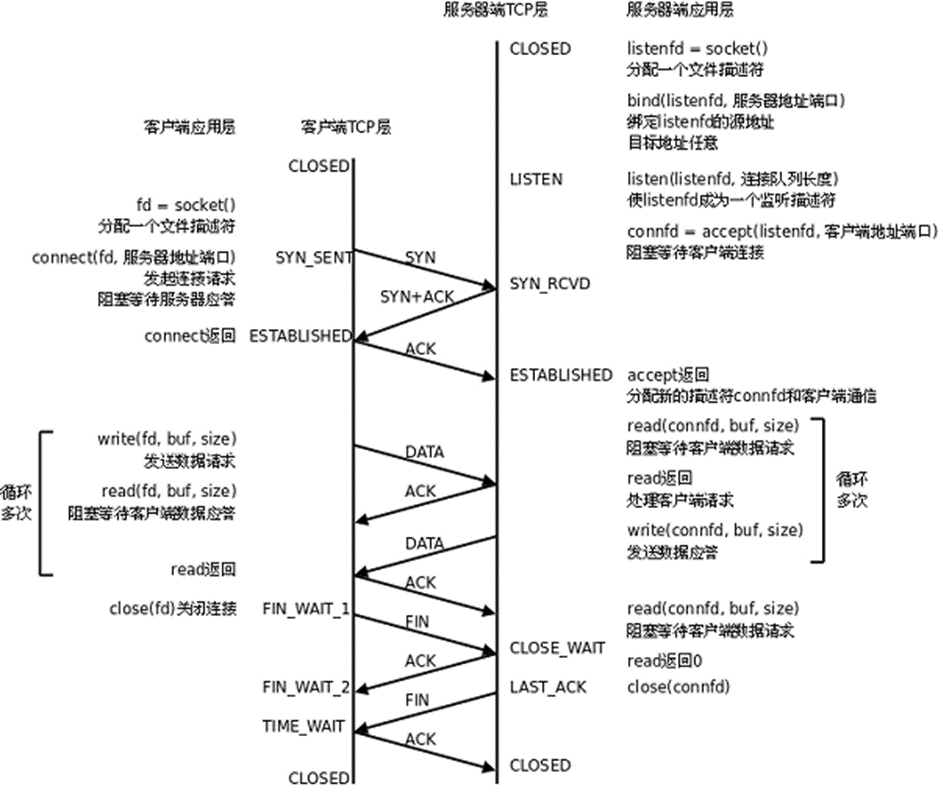
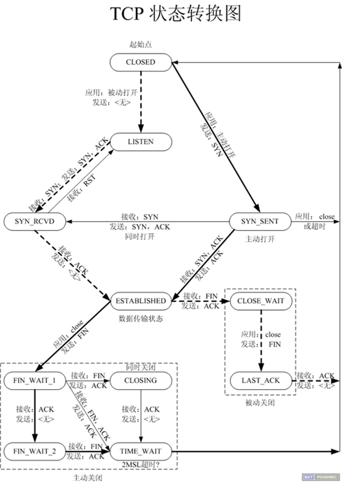
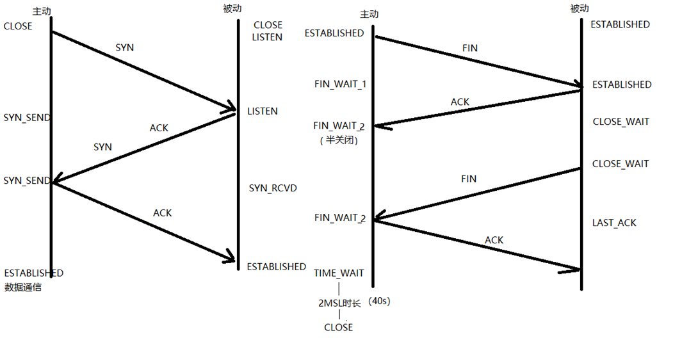

## 什么是协议

从应用的角度出发，协议可理解为“规则”，是数据传输和数据的解释的规则。

假设，A、B双方欲传输文件。规定：

第一次，传输文件名，接收方接收到文件名，应答OK给传输方；

第二次，发送文件的尺寸，接收方接收到该数据再次应答一个OK；

第三次，传输文件内容。同样，接收方接收数据完成后应答OK表示文件内容接收成功。

由此，无论A、B之间传递何种文件，都是通过三次数据传输来完成。A、B之间形成了一个最简单的数据传输规则。双方都按此规则发送、接收数据。A、B之间达成的这个相互遵守的规则即为协议。

这种仅在A、B之间被遵守的协议称之为**原始协议**。当此协议被更多的人采用，不断的增加、改进、维护、完善。最终形成一个稳定的、完整的文件传输协议，被广泛应用于各种文件传输过程中。该协议就成为一个**标准协议**。最早的ftp协议就是由此衍生而来。

TCP协议注重数据的传输。http协议着重于数据的解释。





## 7层模型和4层模型及代表协议

分层模型结构： 

  OSI七层模型： 物、数、网、传、会、表、应

  TCP/IP 4层模型：网（链路层/网络接口层）、网、传、应

​    应用层：http、ftp、nfs、ssh、telnet。。。

​    传输层：TCP、UDP

​    网络层：IP、ICMP、IGMP

​    链路层：以太网帧协议、ARP





网络传输流程： 

  数据没有封装之前，是不能在网络中传递。

  数据-》应用层-》传输层-》网络层-》链路层 --- 网络环境

## 以太网帧和ARP请求





以太网帧协议：

  ARP协议：根据 Ip 地址获取 mac 地址。

  以太网帧协议：根据mac地址，完成数据包传输。

## IP协议

IP协议：  

  版本： IPv4、IPv6 -- 4位

  TTL： time to live 。 设置数据包在路由节点中的跳转上限。每经过一个路由节点，该值-1， 减为0的路由，有义务将该数据包丢弃

  源IP： 32位。--- 4字节   192.168.1.108 --- 点分十进制 IP地址（string） --- 二进制 

  目的IP：32位。--- 4字节

## 端口号和UDP协议

UDP：

  16位：源端口号。 2^16 = 65536 

  16位：目的端口号。

IP地址：可以在网络环境中，唯一标识一台主机。

端口号：可以网络的一台主机上，唯一标识一个进程。

ip地址+端口号：可以在网络环境中，唯一标识一个进程。

## TCP协议

TCP协议：

  16位：源端口号。 2^16 = 65536 

  16位：目的端口号。

  32序号;

  32确认序号。 

  6个标志位。

  16位窗口大小。  2^16 = 65536

## BS和CS模型对比

c/s模型： 

  client-server 

b/s模型： 

  browser-server 

​      C/S        																																				B/S

  优点： 缓存大量数据、协议选择灵活、速度快、迭代快（只需要发布再client就行）    				 安全性、跨平台、开发工作量较小

  缺点： 安全性、跨平台、开发工作量较大    						 																不能缓存大量数据、严格遵守 http

## 套接字

网络套接字： socket

  一个文件描述符指向一个套接字（该套接字内部由内核借助两个缓冲区实现。）

  在通信过程中， 套接字一定是成对出现的。

## 三次握手建立连接









## 数据通信




并不是一次发送，一次应答。也可以批量应答

## 四次挥手关闭连接




完成两次挥手后，不是说两端的连接断开了，主动端关闭了写缓冲区，不能再向对端发送数据，被动端关闭了读缓冲区，不能再从对端读取数据。然而主动端还是能够读取对端发来的数据。

## 滑动窗口和TCP数据包格式





滑动窗口： 

  发送给连接对端，本端的缓冲区大小（实时），保证数据不会丢失。

也就是这里win4096,注意几个阶段win可能含义不同。





## 通信时序与代码对应关系





三次握手：

  主动发起连接请求端，发送 SYN 标志位，请求建立连接。 携带序号号、数据字节数(0)、滑动窗口大小。

  被动接受连接请求端，发送 ACK 标志位，同时携带 SYN 请求标志位。携带序号、确认序号、数据字节数(0)、滑动窗口大小。

  主动发起连接请求端，发送 ACK 标志位，应答服务器连接请求。携带确认序号。

 

四次挥手：

  主动关闭连接请求端， 发送 FIN 标志位。 

  被动关闭连接请求端， 应答 ACK 标志位。      ----- 半关闭完成。

  被动关闭连接请求端， 发送 FIN 标志位。

  主动关闭连接请求端， 应答 ACK 标志位。   ----- 连接全部关闭

  

滑动窗口：

  发送给连接对端，本端的缓冲区大小（实时），保证数据不会丢失。

## TCP状态





实线是主动发起连接和关闭连接请求的一端，虚线是被动发起和关闭连接请求的一端。

`netstat -apn | grep client`  查看客户端网络连接状态

`netstat -apn | grep port`   查看端口的网络连接状态





```
TCP状态时序图：

	结合三次握手、四次挥手 理解记忆。


	1. 主动发起连接请求端：	CLOSE -- 发送SYN -- SEND_SYN -- 接收 ACK、SYN -- SEND_SYN -- 发送 ACK -- ESTABLISHED（数据通信态）

	2. 主动关闭连接请求端： ESTABLISHED（数据通信态） -- 发送 FIN -- FIN_WAIT_1 -- 接收ACK -- FIN_WAIT_2（半关闭）

				-- 接收对端发送 FIN -- FIN_WAIT_2（半关闭）-- 回发ACK -- TIME_WAIT（只有主动关闭连接方，会经历该状态）

				-- 等 2MSL时长 -- CLOSE 

	3. 被动接收连接请求端： CLOSE -- LISTEN -- 接收 SYN -- LISTEN -- 发送 ACK、SYN -- SYN_RCVD -- 接收ACK -- ESTABLISHED（数据通信态）

	4. 被动关闭连接请求端： ESTABLISHED（数据通信态） -- 接收 FIN -- ESTABLISHED（数据通信态） -- 发送ACK 

				-- CLOSE_WAIT (说明对端【主动关闭连接端】处于半关闭状态) -- 发送FIN -- LAST_ACK -- 接收ACK -- CLOSE


	重点记忆： ESTABLISHED、FIN_WAIT_2 <--> CLOSE_WAIT、TIME_WAIT（2MSL）

	netstat -apn | grep  端口号

2MSL时长：

	一定出现在【主动关闭连接请求端】。 --- 对应 TIME_WAIT 状态。

	保证，最后一个 ACK 能成功被对端接收。（等待期间，对端没收到我发的ACK，对端会再次发送FIN请求。）


```

## 端口复用函数

```
端口复用:

	int opt = 1;		// 设置端口复用。

	setsockopt(lfd, SOL_SOCKET, SO_REUSEADDR, (void *)&opt, sizeof(opt))

```

可以直接套的模板，复用的意思是这个端口是TIME_WAIT（一定出现在【主动关闭连接请求端】），即服务端close，防止等待时间太长，可以连续用这个端口。

## 半关闭及shutdown函数

```
半关闭：

	通信双方中，只有一端关闭通信。  --- FIN_WAIT_2

	close（cfd）;

	shutdown(int fd, int how);	

		how: 	SHUT_RD	关读端

			SHUT_WR	关写端

			SHUT_RDWR 关读写

	shutdown在关闭多个文件描述符应用的文件时，采用全关闭方法。close，只关闭一个。即dup2多个文件描述符指向同一个时，shutdown关闭一个会将指向同一个的都关闭。

```

