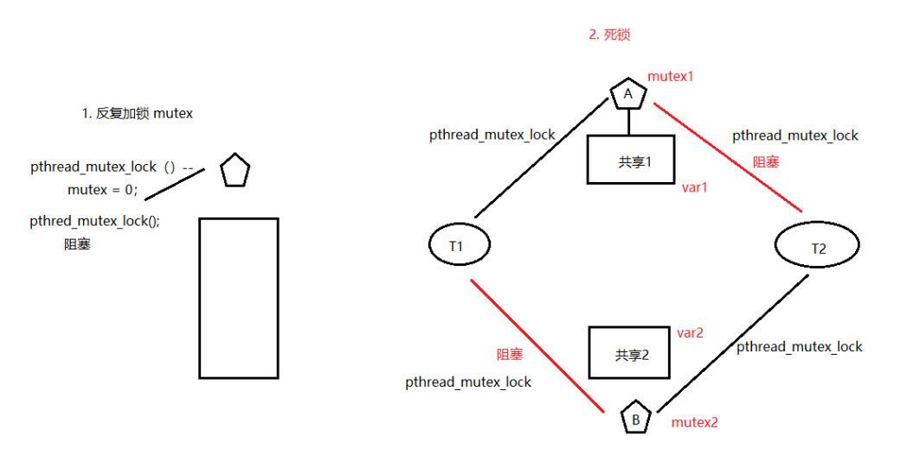
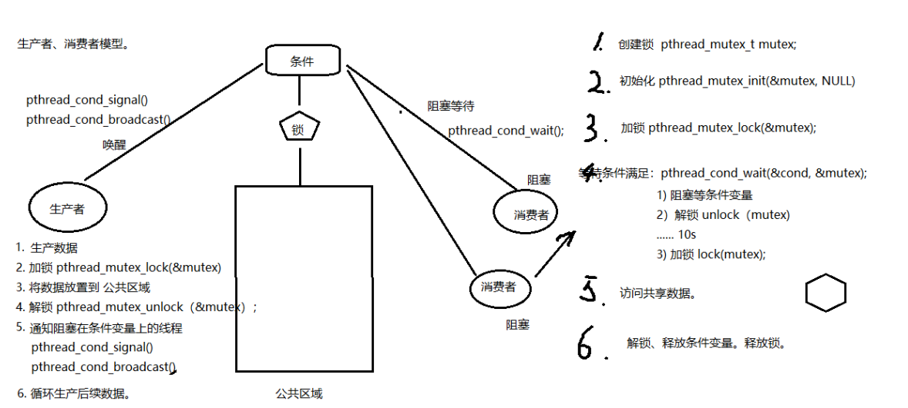
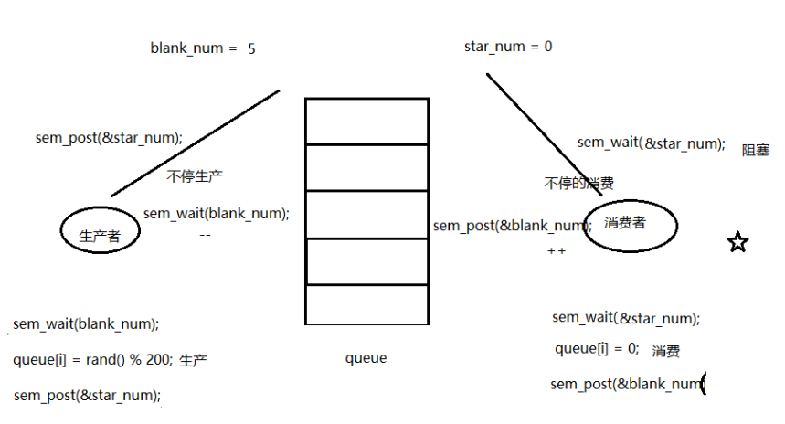

## 线程同步概念

线程同步： 协同步调，对公共区域数据按序访问。防止数据混乱，产生与时间有关的错误。

数据混乱的原因：
1. 资源共享(独享资源则不会)
2. 调度随机(意味着数据访问会出现竞争)
3. 线程间缺乏必要同步机制

## 锁使用的注意事项

锁的使用： 建议锁！对公共数据进行保护。所有线程【应该】在访问公共数据前先拿锁再访问。但，锁本身 不具备强制性。

## 借助互斥锁管理共享数据实现同步 

```
主要应用函数：
pthread_mutex_init 函数
pthread_mutex_destory 函数
pthread_mutex_lock 函数
pthread_mutex_trylock 函数
pthread_mutex_unlock 函数
以上 5 个函数的返回值都是：成功返回 0，失败返回错误号
pthread_mutex_t 类型，其本质是一个结构体。为简化理解，应用时可忽略其实现细节，简单当成整数看待
pthread_mutex_t mutex；变量 mutex 只有两种取值：0,1

```

```
使用 mutex(互斥量、互斥锁)一般步骤：
pthread_mutex_t 类型。
1. pthread_mutex_t lock; 创建锁
2 pthread_mutex_init; 初始化 1
3. pthread_mutex_lock;加锁 1-- --> 0
4. 访问共享数据（stdout)
5. pthrad_mutext_unlock();解锁 0++ --> 1
6. pthead_mutex_destroy；销毁锁

int pthread_mutex_init(pthread_mutex_t *restrict mutex, const pthread_mutexattr_t *restrict attr)
这里的 restrict 关键字，表示指针指向的内容只能通过这个指针进行修改
restrict 关键字：用来限定指针变量。被该关键字限定的指针变量所指向的内存操作，必须由本指针完成。
初始化互斥量：
pthread_mutex_t mutex;
1. pthread_mutex_init(&mutex, NULL); 动态初始化。
2. pthread_mutex_t mutex = PTHREAD_MUTEX_INITIALIZER; 静态初始化。
```

使用锁实现互斥访问共享区：

```
1. #include <stdio.h>
2. #include <string.h>
3. #include <pthread.h>
4. #include <stdlib.h>
5. #include <unistd.h>
6.
7. pthread_mutex_t mutex; // 定义一把互斥锁
8.
9. void *tfn(void *arg)
10. {
11. srand(time(NULL));
12.
13. while (1) {
14. pthread_mutex_lock(&mutex); // 加锁
15. printf("hello ");
16. sleep(rand() % 3); // 模拟长时间操作共享资源，导致 cpu 易主，产生与时间有关的错误
17. printf("world\n");
18. pthread_mutex_unlock(&mutex); // 解锁
19. sleep(rand() % 3);
20. }
21.
22. return NULL;
23. }
24.
25. int main(void)
26. {
27. pthread_t tid;
28. srand(time(NULL));
29. int ret = pthread_mutex_init(&mutex, NULL); // 初始化互斥锁
30. if(ret != 0){
31. fprintf(stderr, "mutex init error:%s\n", strerror(ret));
32. exit(1);
33. }
34.
35. pthread_create(&tid, NULL, tfn, NULL);
36. while (1) {
37. pthread_mutex_lock(&mutex); // 加锁
38. printf("HELLO ");
39. sleep(rand() % 3);
40. printf("WORLD\n");
41. pthread_mutex_unlock(&mutex); // 解锁
42. sleep(rand() % 3);
43. }
44. pthread_join(tid, NULL);
45.
46. pthread_mutex_destory(&mutex); // 销毁互斥锁
47.
48. return 0;
49. }
```

### 互斥锁使用技巧

注意事项：
尽量保证锁的粒度， 越小越好。（访问共享数据前，加锁。访问结束【立即】解锁。）
互斥锁，本质是结构体。 我们可以看成整数。 初值为 1。（pthread_mutex_init() 函数调用成功。）

加锁： --操作， 阻塞线程。
解锁： ++操作， 唤醒阻塞在锁上的线程。
try 锁：尝试加锁，成功--，加锁失败直接返回错误号(如 EBUSY)，不阻塞

## 读写锁操作函数原型

读写锁：
锁只有一把。以读方式给数据加锁——读锁。以写方式给数据加锁——写锁。
读共享，写独占。
写锁优先级高。

```
相较于互斥量而言，当读线程多的时候，提高访问效率
pthread_rwlock_t rwlock;
pthread_rwlock_init(&rwlock, NULL);
pthread_rwlock_rdlock(&rwlock);//有对应的try版本
pthread_rwlock_wrlock(&rwlock);//有对应的try版本
pthread_rwlock_unlock(&rwlock);
pthread_rwlock_destroy(&rwlock);
以上函数都是成功返回 0，失败返回错误号。
pthread_rwlock_t 类型 用于定义一个读写锁变量
pthread_rwlock_t rwlock

```

读写锁也叫共享-独占锁。当读写锁以读模式锁住时，它是以共享模式锁住的，当它以写模式锁住时，它是以独占模式锁住的。写独占、读共享。
读写锁非常适合于**对数据结构读的次数**远大于写的情况。相较于互斥量来说，可以提高多线程的访问效率。

### rwlock

一个读写锁的例子，核心还是 读共享，写独占。 写锁优先级高。

```
1. /* 3 个线程不定时 "写" 全局资源，5 个线程不定时 "读" 同一全局资源 */
2.
3. #include <stdio.h>
4. #include <unistd.h>
5. #include <pthread.h>
6.
7. int counter; //全局资源
8. pthread_rwlock_t rwlock;
9.
10. void *th_write(void *arg)
11. {
12. int t;
13. int i = (int)arg;
14.
15. while (1) {
16. t = counter; // 保存写之前的值
17. usleep(1000);
18.
19. pthread_rwlock_wrlock(&rwlock);
20. printf("=======write %d: %lu: counter=%d ++counter=%d\n", i, pthread_self(), t, ++counter)
;
21. pthread_rwlock_unlock(&rwlock);
22.
23. usleep(9000); // 给 r 锁提供机会
24. }
25. return NULL;
26. }
27.
28. void *th_read(void *arg)
29. {
30. int i = (int)arg;
31.
32. while (1) {
33. pthread_rwlock_rdlock(&rwlock);
34. printf("----------------------------read %d: %lu: %d\n", i, pthread_self(), counter);
35. pthread_rwlock_unlock(&rwlock);
36.
37. usleep(2000); // 给写锁提供机会
38. }
39. return NULL;
40. }
41.
42. int main(void)
43. {
44. int i;
45. pthread_t tid[8];
46.
47. pthread_rwlock_init(&rwlock, NULL);
48.
49. for (i = 0; i < 3; i++)
50. pthread_create(&tid[i], NULL, th_write, (void *)i);
51.
52. for (i = 0; i < 5; i++)
53. pthread_create(&tid[i+3], NULL, th_read, (void *)i);
54.
55. for (i = 0; i < 8; i++)
56. pthread_join(tid[i], NULL);
57.
58. pthread_rwlock_destroy(&rwlock); //释放读写琐
59.
60. return 0;
61. }
```


## 两种死锁

【死锁】： 是使用锁不恰当导致的现象： 1. 对一个锁反复 lock。 2. 两个线程，各自持有一把锁，请求另一把。





## 静态初始化条件变量和互斥量

条件变量： 本身不是锁！ 但是通常结合锁来使用。 mutex 主要应用函数：

```
pthread_cond_init函数。
pthread_cond_destroy函数,
pthread_cond_wait函数。
pthread_cond_timedwait函数。
pthread_cond_signal函数。
pthread_cond_broadcast函数。
以上6个函数的返回值都是:成功返回o，失败直接返回错误号。
pthread_cond_t类型用于定义条件变量
pthread_cond_ t cond;
初始化条件变量：
1. pthread_cond_init(&cond, NULL); 动态初始化。
2. pthread_cond_t cond = PTHREAD_COND_INITIALIZER; 静态初始化。

```

## 条件变量和相关函数 wait

```
阻塞等待条件：
pthread_cond_wait(&cond, &mutex);
作用：
1） 阻塞等待条件变量满足
2） 解锁已经加锁成功的信号量 （相当于pthread_mutex_unlock(&mutex)），12 两步为一个原子操作
3) 当条件满足，函数返回时，解除阻塞并重新申请获取互斥锁。重新加锁信号量 （相当于， pthread_mutex_lock(&mutex);）

```

## 条件变量的生产者消费者模型分析





## 条件变量生产者消费者代码预览

```
#include<stdio.h>
#include<stdlib.h>
#include<string.h>
#include<unistd.h>
#include<errno.h>
#include<pthread.h>

void err_thread(int ret,char *str)
{
        if(ret!=0){
                fprintf(stderr,"%s:%s\n",str,strerror(ret));
                pthread_exit(NULL);
        }
}
/*链表作为公享数据,需被互斥量保护*/
struct msg{
        int num;
        struct msg *next;
};
struct msg *head;
. /* 静态初始化 一个条件变量 和 一个互斥量*/
pthread_mutex_t mutex=PTHREAD_MUTEX_INITIALIZER;

pthread_cond_t has_data=PTHREAD_COND_INITIALIZER;


void *produser(void *arg)
{
        while(1){
                struct msg *mp=malloc(sizeof(struct msg));
                mp->num =rand()%1000 + 1;//模拟生产一个产品
                printf("--produce %d\n",mp->num);
                pthread_mutex_lock(&mutex);
                mp->next = head;
                head =mp;
                pthread_mutex_unlock(&mutex);
                pthread_cond_signal(&has_data);//将等待在该条件变量上的一个线程唤醒
                sleep(rand() % 3);
        }
        return NULL;

}

void *consumer(void *arg)
{
        while(1){
                struct msg *mp;
                pthread_mutex_lock(&mutex);
                while(head == NULL){//头指针为空,说明没有节点,多个消费者用while循环可以先判断条件是否成立
                        pthread_cond_wait(&has_data,&mutex);// 解锁，并阻塞等待，pthread_cond_wait返回时，重新加锁mutex
                }
                mp =head;
                head=mp->next;//模拟消费掉一个产品

                pthread_mutex_unlock(&mutex);//解锁互斥量
                printf("------consumer:%d\n",mp->num);
                free(mp);
                sleep(rand()%3);


        }
        return NULL;
}


int main(int argc,char *argv[])
{
        int ret;
        pthread_t pid,cid;
        srand(time(NULL));
        ret=pthread_create(&pid,NULL,produser,NULL);

        if(ret!=0)
                err_thread(ret,"pthread_create produser error");

        ret=pthread_create(&cid,NULL,consumer,NULL);
        if(ret!=0)
                err_thread(ret,"pthread_create consumer error");
        pthread_join(pid,NULL);

        pthread_join(cid,NULL);


}
```

```
由于是Linux新手，所以现在才开始接触线程编程，照着GUN/Linux编程指南中的一个例子输入编译，结果出现如下错误：
undefined reference to 'pthread_create'
undefined reference to 'pthread_join'

问题原因：
   pthread 库不是 Linux 系统默认的库，连接时需要使用静态库 libpthread.a，所以在使用pthread_create()创建线程，以及调用 pthread_atfork()函数建立fork处理程序时，需要链接该库。

问题解决：
    在编译中要加 -lpthread参数
    gcc thread.c -o thread -lpthread
    thread.c为你些的源文件，不要忘了加上头文件#include<pthread.h>
```

多个消费者使用 while 做 

```
int main(int argc, char *argv[])
{
 int ret;
 pthread_t pid, cid;

 srand(time(NULL));

 ret = pthread_create(&pid, NULL, produser, NULL); // 生产者
 if (ret != 0)
 err_thread(ret, "pthread_create produser error");

 ret = pthread_create(&cid, NULL, consumer, NULL); // 消费者
 if (ret != 0)
 err_thread(ret, "pthread_create consuer error");

 ret = pthread_create(&cid, NULL, consumer, NULL); // 消费者
 if (ret != 0)
 err_thread(ret, "pthread_create consuer error");

 ret = pthread_create(&cid, NULL, consumer, NULL); // 消费者
 if (ret != 0)
 err_thread(ret, "pthread_create consuer error");

 pthread_join(pid, NULL);
 pthread_join(cid, NULL);

 return 0;
 }
```

### 条件变量 signal 注意事项

`pthread_cond_signal()`: 唤醒阻塞在条件变量上的 (至少)一个线程。 `pthread_cond_broadcast()`： 唤醒阻塞在条件变量上的 所有线程。

## 信号量概念及其相关操作函数 

```
信号量：
应用于线程、进程间同步。
相当于 初始化值为 N 的互斥量。 N 值，表示可以同时访问共享数据区的线程数。
函数：
sem_t sem; 定义类型。
int sem_init(sem_t *sem, int pshared, unsigned int value);
参数：
sem： 信号量
pshared： 0： 用于线程间同步
			1： 用于进程间同步
value：N 值。（指定同时访问的线程数）
sem_destroy();
sem_wait(); 一次调用，做一次-- 操作，当信号量的值为 0 时，再次 -- 就会阻塞。（对比 pthread_mutex_lock）
sem_post(); 一次调用，做一次++ 操作. 当信号量的值为 N 时, 再次 ++ 就会阻塞。（对比 pthread_mutex_unlock）

```

## 信号量实现的生产者消费者





```
1. /*信号量实现 生产者 消费者问题*/
2.
3. #include <stdlib.h>
4. #include <unistd.h>
5. #include <pthread.h>
6. #include <stdio.h>
7. #include <semaphore.h>
8.
9. #define NUM 5
10.
11. int queue[NUM]; //全局数组实现环形队列
12. sem_t blank_number, product_number; //空格子信号量, 产品信号量
13.
14. void *producer(void *arg)
15. {
16. int i = 0;
17.
18. while (1) {
19. sem_wait(&blank_number); //生产者将空格子数--,为 0 则阻塞等待
20. queue[i] = rand() % 1000 + 1; //生产一个产品
21. printf("----Produce---%d\n", queue[i]);
22. sem_post(&product_number); //将产品数++
23.
24. i = (i+1) % NUM; //借助下标实现环形
25. sleep(rand()%1);
26. }
27. }
28.
29. void *consumer(void *arg)
30. {
31. int i = 0;
32.
33. while (1) {
34. sem_wait(&product_number); //消费者将产品数--,为 0 则阻塞等待
35. printf("-Consume---%d\n", queue[i]);
36. queue[i] = 0; //消费一个产品
37. sem_post(&blank_number); //消费掉以后,将空格子数++
38.
39. i = (i+1) % NUM;
40. sleep(rand()%3);
41. }
42. }
43.
44. int main(int argc, char *argv[])
45. {
46. pthread_t pid, cid;
47.
48. sem_init(&blank_number, 0, NUM); //初始化空格子信号量为 5, 线程间共享 -- 0
49. sem_init(&product_number, 0, 0); //产品数为 0
50.
51. pthread_create(&pid, NULL, producer, NULL);
52. pthread_create(&cid, NULL, consumer, NULL);
53.
54. pthread_join(pid, NULL);
55. pthread_join(cid, NULL);
56.
57. sem_destroy(&blank_number);
58. sem_destroy(&product_number);
59.
60. return 0;
61. }
```

