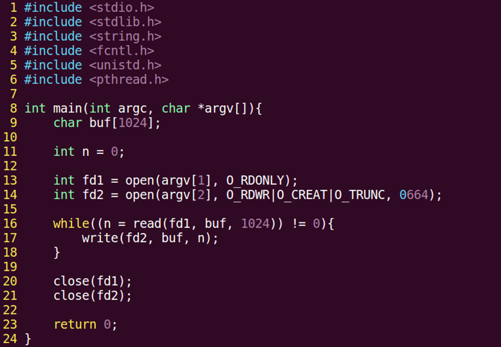
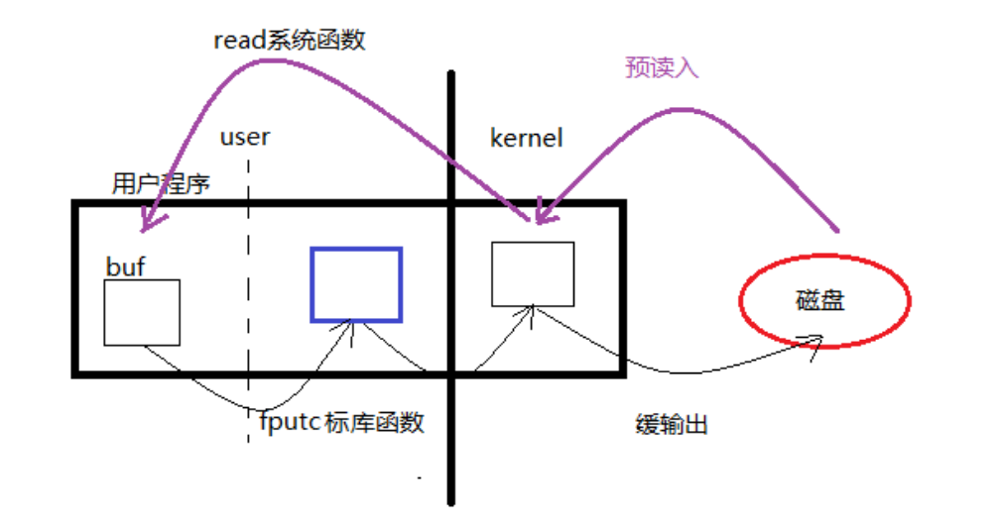
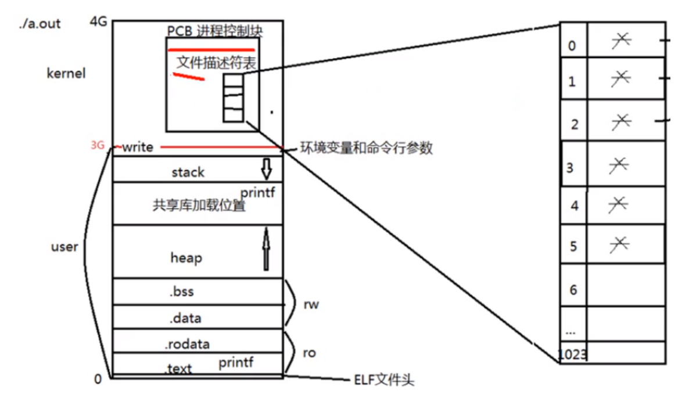
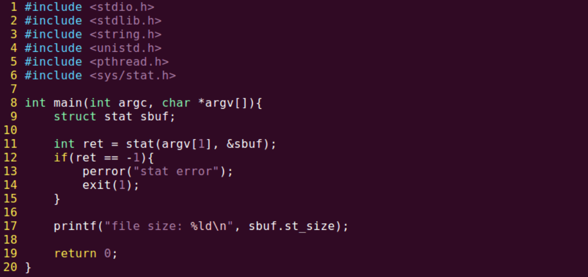
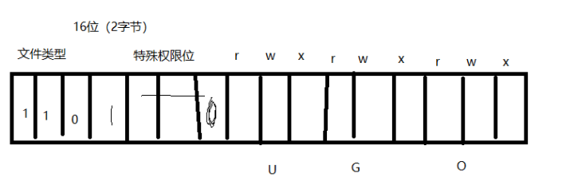
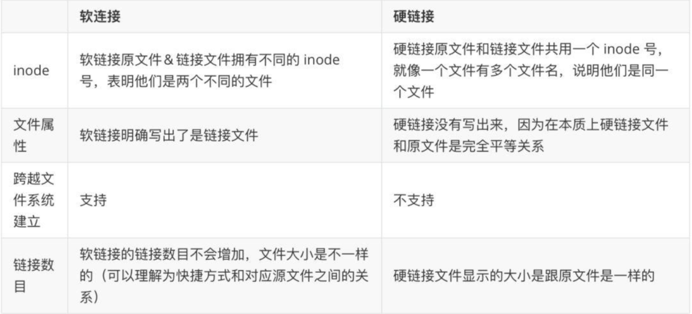
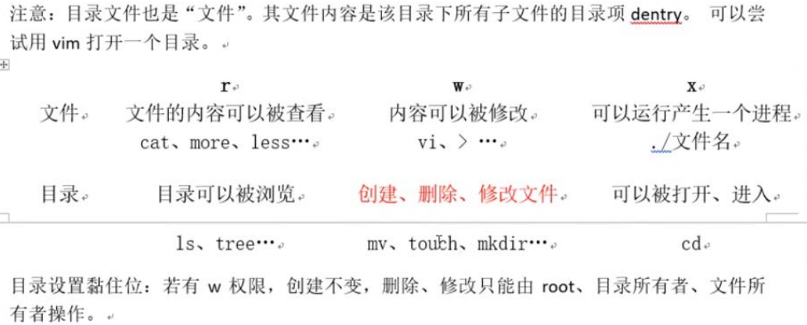
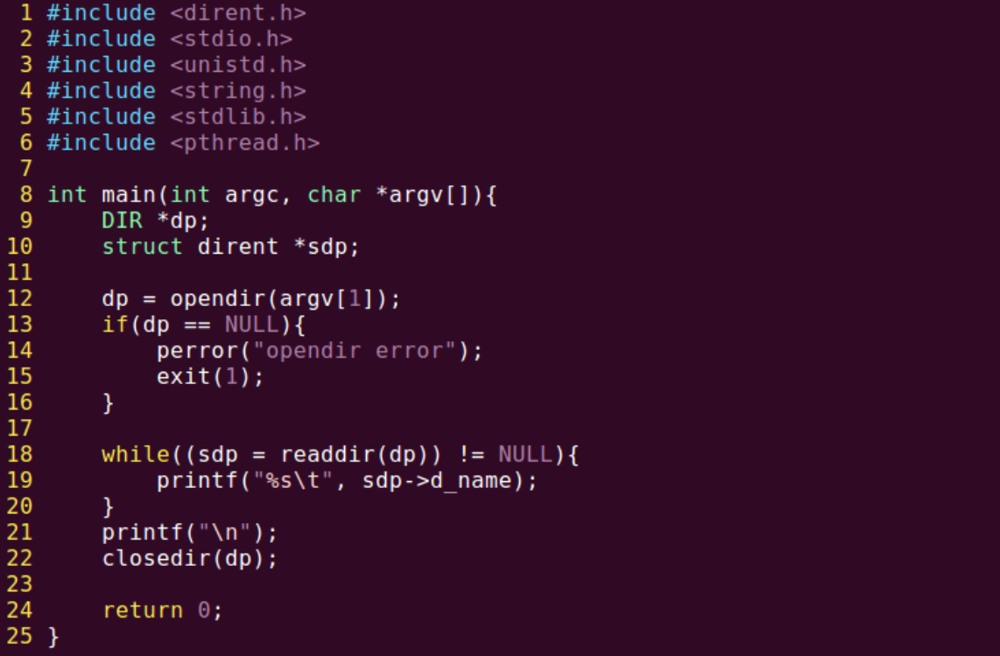
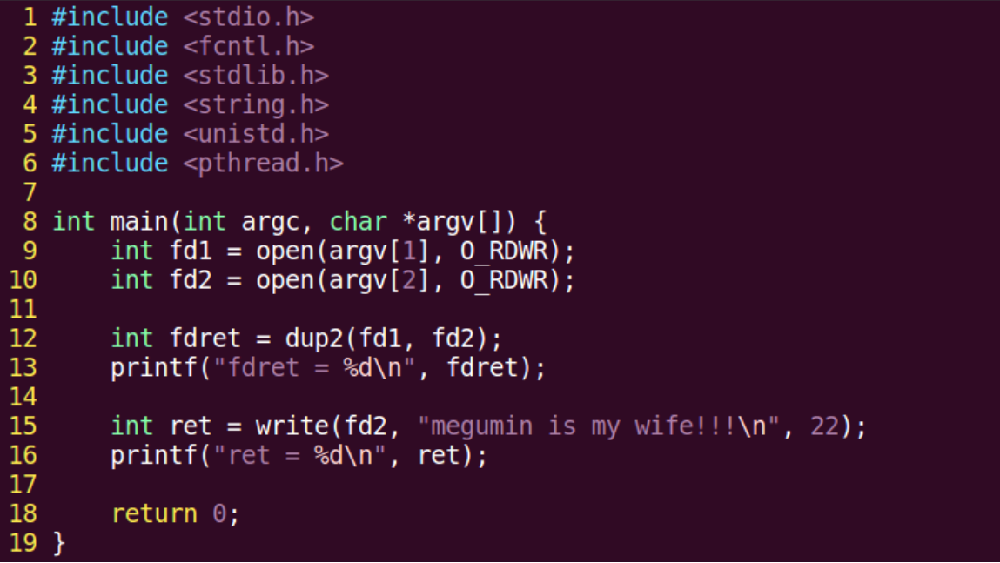
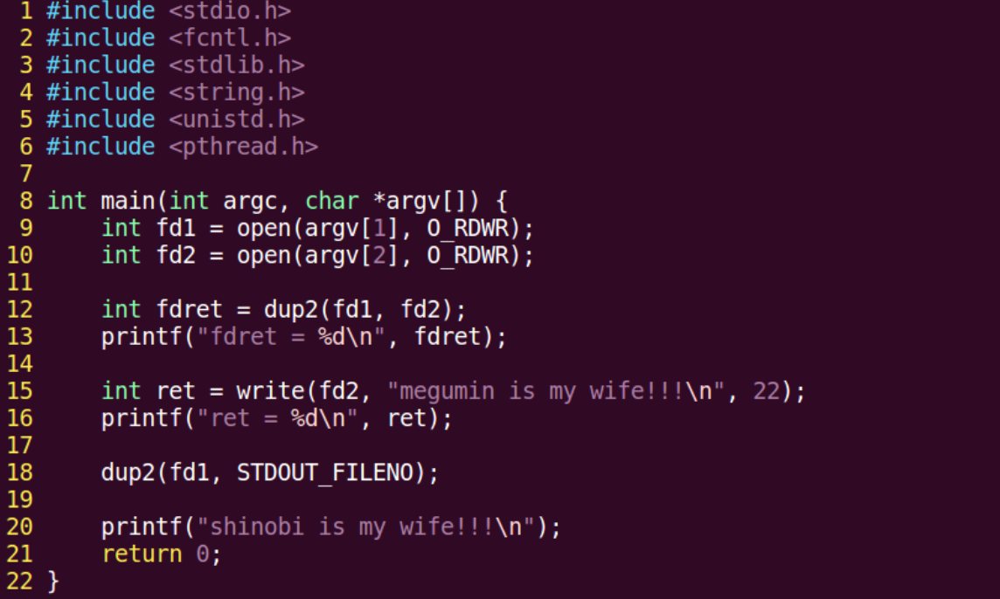

系统调用 内核提供的函数 

库调用 程序库中的函数

## open 函数

open 函数： `int open(char *pathname, int flags)  	#include  <unistd.h>` 

参数： pathname: 欲打开的文件路径名 	flags：文件打开方式： `#include  <unistd.h> O_RDONLY|O_WRONLY|O_RDWR|O_CREAT|O_APPEND|O_TRUNC|O_EXCL|O_NONBLOCK ....` 

返回值： 成功： 打开文件所得到对应的 文件描述符（整数） 

失败： -1， 设置 errno 

`int open(char *pathname, int flags， mode_t mode) 	123 775` 

参数： pathname: 欲打开的文件路径名 

flags：文件打开方式O_RDONLY|O_WRONLY|O_RDWR|O_CREAT|O_APPEND|O_TRUNC|O_EXCL|O_NONBLOCK .... 

mode: 参数 3 使用的前提， 参 2 指定了 O_CREAT。 取值 8 进制数，用来描述文件的 访问权限。

 rwx 0664 创建文件最终权限 = mode & ~umask (umask是系统默认0002取反775)

返回值： 成功： 打开文件所得到对应的 文件描述符（整数） 

失败： -1， 设置 errno 

close 函数： `int close(int fd);`

## read和write实现cp

read函数：

  `ssize_t read(int fd, void *buf, size_t count);`

  参数：

​    fd：文件描述符

​    buf：存数据的缓冲区

​    count：缓冲区大小

  返回值：

​    0：读到文件末尾。

​    成功； > 0 读到的字节数。

​    失败： -1， 设置 errno

​    -1： 并且 errno = EAGIN 或 EWOULDBLOCK, 说明不是read失败，而是read在以非阻塞方式读一个设备文件（网络文件），并且文件无数据。

write函数：

  `ssize_t write(int fd, const void *buf, size_t count);`

  参数：

​    fd：文件描述符

​    buf：待写出数据的缓冲区

​    count：数据大小

  返回值：

​    成功； 写入的字节数。

​    失败： -1， 设置 errno





可以在复制函数里加入错误检测：

```
if(fd1 == -1){

  perror(“open argv[1] error”);

  exit(1);

}
```

错误处理函数：    与 errno 相关。

```
printf("xxx error: %d\n", errno);

char *strerror(int errnum);

printf("xxx error: %s\n", strerror(errno));

void perror(const char *s);

  perror("open error");
```

## 系统调用和库函数比较—预读入缓输出

所以系统函数并不是一定比库函数牛逼，能使用库函数的地方就使用库函数。 标准 IO 函数（如fputc/fgetc）自带用户缓冲区（一般是4096，即4kb再向内核写入），系统调用（read/write 这块，每次写一个字节，自己定义buf为1，会疯狂进行内核态和用户态的切换，所以非常耗时）无用户级缓冲。系统缓冲区是都有的。





## 文件描述符





文件描述符是指向一个文件结构体的指针 

PCB 进程控制块：本质 结构体。

 成员：文件描述符表。 

文件描述符：0/1/2/3/4。。。。/1023 表中可用的最小的。 

0 - STDIN_FILENO 

1 - STDOUT_FILENO 

2 - STDERR_FILENO

## 阻塞和非阻塞  

阻塞、非阻塞： 是**设备文件、网络文件**的属性。普通创建的文件没有。

产生阻塞的场景。 读设备文件。读网络文件。（读常规文件无阻塞概念。） /dev/tty -- 终端文件。 

open("/dev/tty", O_RDWR|O_NONBLOCK)	 --- 设置 /dev/tty (当前终端)非阻塞状态。(默认为阻塞状态)

## fcntl 改文件属性 

fcntl 用来改变一个【已经打开】的文件的 访问控制属性 

重点掌握两个参数的使用， F_GETFL，F_SETFL 

fcntl： 

​	int (int fd, int cmd, ...) 

fd 文件描述符 cmd 命令，决定了后续参数个数 

int flgs = fcntl(fd, F_GETFL);

flgs |= O_NONBLOCK 

fcntl(fd, F_SETFL, flgs); 

获取文件状态： F_GETFL 

设置文件状态： F_SETFL

终端文件默认是阻塞读的，这里用 fcntl 将其更改为非阻塞读

```
1. #include <unistd.h>
2. #include <fcntl.h>
3. #include <errno.h>
4. #include <stdio.h>
5. #include <stdlib.h>
6. #include <string.h>
7.
8. #define MSG_TRY "try again\n"
9.
10. int main(void)
11. {
12. char buf[10];
13. int flags, n;
14.
15. flags = fcntl(STDIN_FILENO, F_GETFL); //获取 stdin 属性信息
16. if(flags == -1){
17. perror("fcntl error");
18. exit(1);
19. }
20. flags |= O_NONBLOCK;
21. int ret = fcntl(STDIN_FILENO, F_SETFL, flags);
22. if(ret == -1){
23. perror("fcntl error");
24. exit(1);
25. }
26.
27. tryagain:
28. n = read(STDIN_FILENO, buf, 10);
29. if(n < 0){
30. if(errno != EAGAIN){
31. perror("read /dev/tty");
32. exit(1);
33. }
34. sleep(3);
35. write(STDOUT_FILENO, MSG_TRY, strlen(MSG_TRY));
36. goto tryagain;
37. }
38. write(STDOUT_FILENO, buf, n);
39.
40. return 0;
41. }
```

## lseek 函数  

lseek 函数： `off_t lseek(int fd, off_t offset, int whence);`

 参数： fd：文件描述符 		offset： 偏移量，就是将读写指针从 whence 指定位置向后偏移 offset 个单位 		whence：起始偏移位置：开始，读到，结尾 SEEK_SET/SEEK_CUR/SEEK_END 

返回值： 成功：较起始位置偏移量 失败：-1 errno 

应用场景： 

1. 文件的“读”、“写”使用同一偏移位置。 2. 使用 lseek 获取文件大小 3. 使用 lseek 拓展文件大小：要想使文件大小真正拓展，必须引起 IO 操作。

   ```
   int lenth = lseek ( fd,101，SEEK_END);
   printf( "file size: %d\n" , lenth) ;
   write(fd,"$"，1);
   ```

   ​			 使用 truncate 函数，直接拓展文件。 `int ret = truncate("dict.cp", 250);`//dict.cp是必须存在的

lseek 示例，写一个句子到空白文件，完事调整光标位置，读取刚才写那个文件。 这个示例中，如果不调整光标位置，是读取不到内容的，因为读写指针在内容的末尾 代码如下：

```
1. #include <stdio.h>
2. #include <stdlib.h>
3. #include <unistd.h>
4. #include <string.h>
5. #include <fcntl.h>
6.
7. int main(void)
8. {
9. int fd, n;
10. char msg[] = "It's a test for lseek\n";
11. char ch;
12.
13. fd = open("lseek.txt", O_RDWR|O_CREAT, 0644);
14. if(fd < 0){
15. perror("open lseek.txt error");
16. exit(1);
17. }
18.
19. write(fd, msg, strlen(msg)); //使用 fd 对打开的文件进行写操作，问价读写位置位于文件结尾处。
20.
21. lseek(fd, 0, SEEK_SET); //修改文件读写指针位置，位于文件开头。 注释该行会怎样呢？
22.
23. while((n = read(fd, &ch, 1))){
24. if(n < 0){
25. perror("read error");
26. exit(1);
27. }
28. write(STDOUT_FILENO, &ch, n); //将文件内容按字节读出，写出到屏幕
29. }
30.
31. close(fd);
32.
33. return 0;
34. }
```

下面这个代码用 lseek 的偏移来读取文件大小

```
int lenth = lseek(fd,0,SEEK_END);
printf ( "file size: %d\n" , lenth) ;
```

对于写文件再读取那个例子，由于文件写完之后未关闭，读写指针在文件末尾，所以不调节指针，直 接读取不到内容。

 lseek 读取的文件大小总是相对文件头部而言。 

用 lseek 读取文件大小实际用的是读写指针初末位置的偏移差，一个新开文件，读写指针初位置都在 文件开头。如果用这个来扩展文件大小，必须引起 IO 才行，于是就至少要写入一个字符。上面代码 出现 lseek 返回 799，ls 查看为 800 的原因是，lseek 读取到偏移差的时候，还没有写入最后的‘$’ 符号. 末尾那一大堆^@，是文件空洞，如果自己写进去的也想保持队形，就写入“\0”。 

拓展文件直接使用 truncate，简单粗暴： 使用 truncate 函数，直接拓展文件。 int ret = truncate("dict.cp", 250);

## 传入传出参数  

传入参数： 1. 指针作为函数参数。 2. 同常有 const 关键字修饰。 3. 指针指向有效区域， 在函数内部做读操作。

 传出参数： 1. 指针作为函数参数。 2. 在函数调用之前，指针指向的空间可以无意义，但必须有效。 3. 在函数内部，做写操作。 4。函数调用结束后，充当函数返回值。 

传入传出参数： 1. 指针作为函数参数。 2. 在函数调用之前，指针指向的空间有实际意义。 3. 在函数内部，先做读操作，后做写操作。 4. 函数调用结束后，充当函数返回值

## 目录项和 inode

一个文件主要由两部分组成，dentry(目录项)和 inode 

inode 本质是结构体，存储文件的属性信息，如：权限、类型、大小、时间、用户、盘快位置… 也叫做文件属性管理结构，大多数的 inode 都存储在磁盘上。 

少量常用、近期使用的 inode 会被缓存到内存中。 

所谓的删除文件，就是删除 inode，但是数据其实还是在硬盘上，以后会覆盖掉。

## stat 函数

获取文件属性，（从 inode 结构体中获取） 

stat/lstat 函数： `int stat(const char *path, struct stat *buf);` 

参数： 

​	path： 文件路径 

​	buf：（传出参数） 存放文件属性，inode 结构体指针。 

返回值： 

​	成功： 0 

​	失败： -1 errno 

获取文件大小： buf.st_size 

获取文件类型： buf.st_mode 

获取文件权限： buf.st_mode 

符号穿透：stat 会。lstat 不会。

下面这个例子是获取文件大小的正规军解法，用 stat：





```
man 2 stat
进入之后G
一般比较大的函数或者是难度大的有example
```

stat 会拿到符号链接指向那个文件或目录的属性。 不想穿透符号就用 lstat（两个除了穿透符号这个性质以外就一样）





```
用sb.st_mode & SIFMT前4位就是SIFMT与上文件得出的mode
switch (sb.st_mode & S_IFMT) {
           case S_IFBLK:  printf("block device\n");            br
eak;
           case S_IFCHR:  printf("character device\n");        br
eak;
           case S_IFDIR:  printf("directory\n");               br
eak;
           case S_IFIFO:  printf("FIFO/pipe\n");               br
eak;
           case S_IFLNK:  printf("symlink\n");                 br
eak;
           case S_IFREG:  printf("regular file\n");            br
eak;
           case S_IFSOCK: printf("socket\n");                  br
eak;
           default:       printf("unknown?\n");                br
eak;
           }
```

## link 和 Unlink 隐式回收  

硬链接数就是 dentry 数目 

link 就是用来创建硬链接的 （硬链接的作用是允许一个文件拥有多个有效路径名，这样用户就可以建立硬链接到重要文件,以防止“误删”的功能假设我们删除了原始的`foo.txt`文件：

```bash
➜  rm -f foo.txt 
➜  cat bar.txt 
LeetCode
```

此时文件的内容依然存在，所以只删除一个连接并不影响索引节点本身和其它的连接，只有当最后一个链接被删除后，文件的数据块及目录的连接才会被释放，也就是说，文件才会被真正删除）

（软连接可以是任意文件或目录，可以链接不同文件系统的文件，在对符号文件进行读或写操作的时候，系统会自动把该操作转换为对源文件的操作，但删除链接文件时，系统仅仅删除链接文件，而不删除源文件本身，这一点类似于 Windows 操作系统下的快捷方式。）





link 可以用来实现 mv 命令 

函数原型： `int link(const char *oldpath, const char *newpath)` 用这个来实现 mv，用 oldpath 来创建 newpath，完事儿删除 oldpath 就行。 

删除一个链接 `int unlink(const char *pathname)` 

unlink 是删除一个文件的目录项 dentry，使硬链接数-1 

unlink 函数的特征：清除文件时，如果文件的硬链接数到 0 了，没有 dentry 对应，但该文件仍不会 马上被释放，要等到所有打开文件的进程关闭该文件，系统才会挑时间将该文件释放掉。

在程序中加入段错误成分，段错误在 unlink 之前，由于发生段错误，程序后续删除 temp.txt 的 dentry 部分就不会再执行，temp.txt 就保留了下来，这是不科学的。 

在编程中以下几类做法容易导致段错误,基本上是**错误地使用指针引起的**。 所谓的段错误就是指访问的内存超出了系统所给这个程序的内存空间，段错误应该就是访问了不可访问的内存，这个内存区要么是不存在的，要么是受到系统保护的。

解决办法是检测 fd 有效性后，立即释放 temp.txt，由于进程未结束，虽然 temp.txt 的硬链接数已 经为 0，但还不会立即释放，仍然存在，要等到程序执行完才会释放。这样就能避免程序出错导致临 时文件保留下来。

因为文件创建后，硬链接数立马减为 0，即使程序异常退出，这个文件也会被清理掉。这时候的内容 是写在内核空间的缓冲区。

```

1. /*
2. *unlink 函数是删除一个 dentry
3. */
4. #include <unistd.h>
5. #include <fcntl.h>
6. #include <stdlib.h>
7. #include <string.h>
8. #include <stdio.h>
9.
10.
11. int main(void)
12. {
13. int fd, ret;
14. char *p = "test of unlink\n";
15. char *p2 = "after write something.\n";
16.
17. fd = open("temp.txt", O_RDWR|O_CREAT|O_TRUNC, 0644);
18. if(fd < 0){
19. perror("open temp error");
20. exit(1);
21. }
22.
23. ret = unlink("temp.txt"); //具备了被释放的条件
24. if(ret < 0){
25. perror("unlink error");
26. exit(1);
27. }
28.
29. ret = write(fd, p, strlen(p));
30. if (ret == -1) {
31. perror("-----write error");
32. }
33.
34. printf("hi! I'm printf\n");
35. ret = write(fd, p2, strlen(p2));
36. if (ret == -1) {
37. perror("-----write error");
38. }
39.
40. printf("Enter anykey continue\n");
41. getchar();//在调用getchar()函数时，编译器会依次读取用户键入缓存区的一个字符(注意这里只读取一个字符，如果缓存区有多个字符，那么将会读取上一次被读取字符的下一个字符),是阻塞状态，在这里可以方便查看文件
42.
43. close(fd);
44.
45. return 0;
46. }
```

**隐式回收**： 

​		当进程结束运行时，所有进程打开的文件会被关闭，申请的内存空间会被释放。系统的这一特性 称之为隐式回收系统资源。 

​		比如上面那个程序，要是没有在程序中关闭文件描述符，没有隐式回收的话，这个文件描述符会保留， 多次出现这种情况会导致系统文件描述符耗尽。所以隐式回收会在程序结束时收回它打开的文件使用 的文件描述符。

**文件描述符**（file descriptor）就是内核为了高效管理这些已经被打开的文件所创建的索引，其是一个非负整数（通常是小整数），用于指代被打开的文件，所有执行I/O操作的系统调用都通过文件描述符来实现。同时还规定系统刚刚启动的时候，0是标准输入，1是标准输出，2是标准错误。这意味着如果此时去打开一个新的文件，它的文件描述符会是3，再打开一个文件文件描述符就是4......

## 文件目录 rwx 权限差异  

vi 目录 会得到目录项的列表





## 目录操作函数  

目录操作函数： `DIR * opendir(char *name);` 

`int closedir(DIR *dp);`

`struct dirent *readdir(DIR * dp);` 

`struct dirent { `

`inode `

`char dname[256]; }`

 没有写目录操作，因为目录写操作就是创建文件。可以用 touch

下面用目录操作函数实现一个 ls 操作：





要隐藏这个.和..的话，在输出文件名的时候判定一下，只输出不是.和..的就行了

## 应用程序的系统调用过程 

应用程序->标库函数->系统调用->驱动->硬件

## 递归遍历目录实现

```
先写个简易版的，可以判定文件，读取文件大小：
1. #include <stdio.h>
2. #include <stdlib.h>
3. #include <string.h>
4. #include <unistd.h>
5. #include <pthread.h>
6. #include <sys/stat.h>
7.
8. void isFile(char *name){
9. int ret = 0;
10. struct stat sb;
11.
12. ret = stat(name, &sb);
13. if(ret == -1){
14. perror("stat error");
15. return;
16. }
17.
18. if(S_ISDIR(sb.st_mode)){
19.
20. }
21. printf("%s\t%ld\n", name, sb.st_size);
22.
23. return;
24. }
25. int main(int argc, char *argv[]){
26. if(argc == 1) {
27. isFile(".");
28. }
29. else {
30. isFile(argv[1]);
31. }
32.
33. return 0;
34. }
```

下面完善功能，把对目录的递归处理补全，如下：

```
1. #include <stdio.h>
2. #include <stdlib.h>
3. #include <string.h>
4. #include <unistd.h>
5. #include <sys/stat.h>
6. #include <dirent.h>
7. #include <pthread.h>
8.
9. void isFile(char *name);
10.
11. // 打开目录读取,处理目录
12. void read_dir(char *dir, void (*func)(char *))
13. {
14. char path[256];
15. DIR *dp;
16. struct dirent *sdp;
17.
18. dp = opendir(dir);
19. if (dp == NULL) {
20. perror("opendir error");
21. return;
22. }
23. // 读取目录项
24. while((sdp = readdir(dp)) != NULL) {
25. if (strcmp(sdp->d_name, ".") == 0 || strcmp(sdp->d_name, "..") == 0) {
26. continue;
27. }
28. //fprintf();发送格式化输出到流 stream 中简单一点：把数据写入文件（但是文件流不只是文件，c++可以定义文件流,比如stderr)
29. // 目录项本身不可访问, 拼接. 目录/目录项
30. sprintf(path, "%s/%s", dir, sdp->d_name);//sprintf的作用是将一个格式化的字符串输出到一个目的字符串中
31.
32. // 判断文件类型,目录递归进入,文件显示名字/大小
33. //isFile(path);
34. (*func)(path);
35. }
36.
37. closedir(dp);
38.
39. return ;
40. }
41.
42. void isFile(char *name)
43. {
44. int ret = 0;
45. struct stat sb;
46.
47. // 获取文件属性, 判断文件类型
48. ret = stat(name, &sb);
49. if (ret == -1) {
50. perror("stat error");
51. return ;
52. }
53. // 是目录文件
54. if (S_ISDIR(sb.st_mode)) {
55. read_dir(name, isFile);
56. }
57. // 是普通文件, 显示名字/大小
58. printf("%10s\t\t%ld\n", name, sb.st_size);
59.
60. return;
61. }
62.
63.
64. int main(int argc, char *argv[])
65. {
66. // 判断命令行参数
67. if (argc == 1) {
68. isFile(".");
69. } else {
70. isFile(argv[1]);
71. }
72.
73. return 0;
74. }
```

## dup 和 dup2

用来做重定向，本质就是复制文件描述符：
dup 和 dup2：
`int dup(int oldfd);` 文件描述符复制。
oldfd: 已有文件描述符
返回：新文件描述符，这个描述符和 oldfd 指向相同内容。
`int dup2(int oldfd, int newfd);` 文件描述符复制，oldfd 拷贝给 newfd。返回 newfd

下面讲 dup2（dupto）： 下面这个例子，将一个已有文件描述符 fd1 复制给另一个文件描述符 fd2，**然后用 fd2 修改 fd1** 指向 的文件：





上面那个例子，fd1 是打开 hello.c 的文件描述符，fd2 是打开 hello2.c 的文件描述符 用 dup2 将 fd1 复制给了 fd2，于是在对 fd2 指向的文件进行写操作时，实际上就是对 fd1 指向的 hello.c 进行写操作。 这里需要注意一个问题，由于 hello.c 和 hello2.c 都是空文件，所以直接写进去没关系。但如果 hello.c 是非空的，写进去的内容默认从文件头部开始写，会覆盖原有内容。

dup2 也可以用于标准输入输出的重定向。 下面这个例子，将输出到 STDOUT 的内容重定向到文件里：





这个程序，将 fd1 的内容复制给了 fd2，使得原来指向 hello2.c 的 fd2 也指向了 hello.c 并通过 fd2 向 hello.c 里写入了...。完事儿将标准输出重定向至 fd1，就是将要显示在标准输出的内容，写入了 fd1 指向的文件，就是 hello.c 中 这里有一点和上面程序不同，就是 hello.c 是处于打开状态的，连续写入两段话，写入... 的时候，读写指针在这句话末尾，就不会覆盖前面这句话。 这里再强调一下，打开一个文件，读写指针默认在文件头，如果文件本身有内容，直接写入会覆盖有内容。

## fcntl 实现 dup 描述符 

```
fcntl 函数实现 dup：
	int fcntl(int fd, int cmd, ....)
	cmd: F_DUPFD
	参 3: 被占用的，返回最小可用的。
			未被占用的， 返回=该值的文件描述符。
```

对于 fcntl 中的参数 0，这个表示 0 被占用，fcntl 使用文件描述符表中的最小文件描述符返回 假设传入 0，传一个 7，且 7 未被占用，则会返回 7 所以这个参数可以这样理解，你传入一个文件描述符 k，如果 k 没被占用，则直接用 k 复制 fd1 的内 容。如果 k 被占用，则返回描述符表中最小可用描述符，也就是自己指定一个一志愿，如果行，就返 回这个。如果不行，国家给你分配一个最小的。
