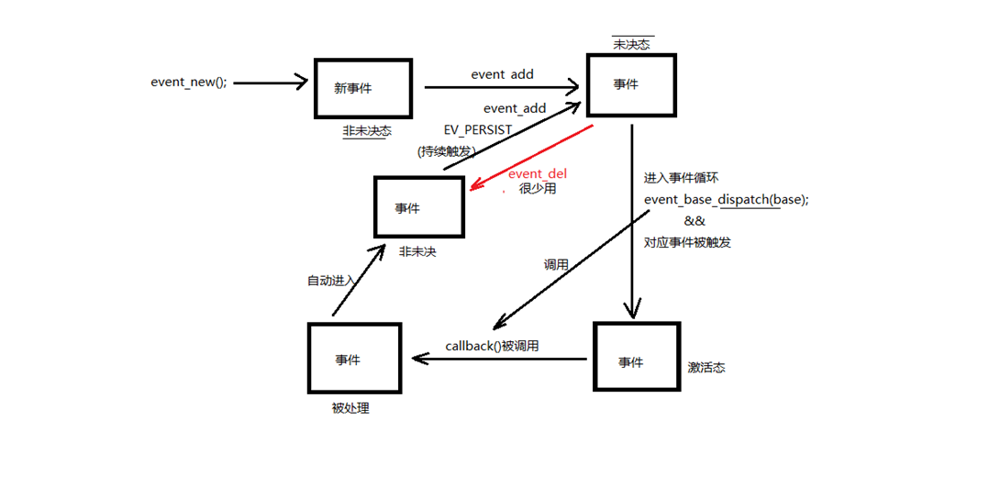
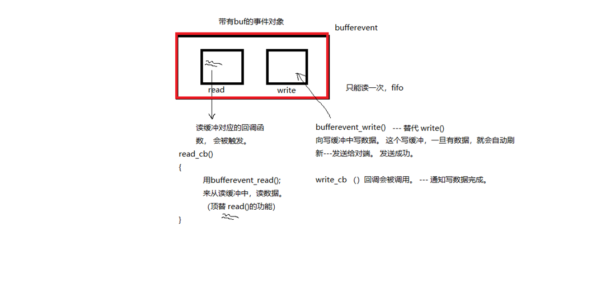
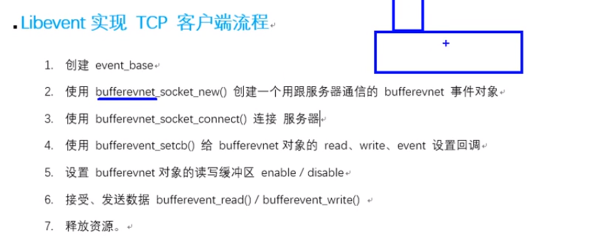

## static修饰的函数作用与意义

static修饰的函数叫做静态函数，静态函数有两种，根据其出现的地方来分类：

如果这个静态函数出现在类里，那么它是一个静态成员函数；
        静态成员函数的作用在于：调用这个函数不会访问或者修改任何对象（非static）数据成员。

​    其实很好理解，类的静态成员(变量和方法)属于类本身，在类加载的时候就会分配内存，可以通过类名直接去访问；非静态成员（变量和方法）属于类的对象，所以只有在类的对象产生（创建类的实例）时才会分配内存，然后通过类的对象（实例）去访问。

如果它不是出现在类中，那么它是一个普通的全局的静态函数。
        这样的static函数与普通函数的区别是：用static修饰的函数，限定在本源码文件中，不能被本源码文件以外的代码文件调用。而普通的函数，默认是extern的，也就是说它可以被其它代码文件调用。
　　在函数的返回类型前加上关键字static，函数就被定义成为静态函数。普通 函数的定义和声明默认情况下是extern的，但静态函数只是在声明他的文件当中可见，不能被其他文件所用。因此定义静态函数有以下好处：
　　<1> 其他文件中可以定义相同名字的函数，不会发生冲突。
　　<2> 静态函数不能被其他文件所用。

## libevent简介

libevent库

  开源。精简。跨平台（Windows、Linux、maxos、unix）。专注于网络通信。

源码包安装： 参考 README、readme

  ./configure    检查安装环境 生成 makefile

  make     生成 .o 和 可执行文件 

  sudo make install 将必要的资源cp置系统指定目录。

  进入 sample 目录，运行demo验证库安装使用情况。 

  编译使用库的 .c 时，需要加 -levent 选项。 

  库名 libevent.so --> /usr/local/lib  查看的到。

特性：

  基于“事件”异步通信模型。--- 回调。

## libevent封装的框架思想

```
libevent框架：

	1. 创建 event_base		(乐高底座)
	2. 创建 事件evnet	
	3. 将事件 添加到 base上	
	4. 循环监听事件满足
	5. 释放 event_base


1. 创建 event_base		(乐高底座)

		struct event_base *event_base_new(void);

		struct event_base *base = event_base_new();

2. 创建 事件evnet	

		常规事件 event	--> event_new(); 

		bufferevent --> bufferevent_socket_new();

3. 将事件 添加到 base上	

		int event_add(struct event *ev, const struct timeval *tv)

4. 循环监听事件满足

		int event_base_dispatch(struct event_base *base);

			event_base_dispatch(base);

5. 释放 event_base

		event_base_free(base);

```

## 一些不常用相关函数了解

查看支持哪些多路IO
`const char **event_get_supported_methods(void);`

查看当前用的多路lO
`const char * event_base_get_method(const struct event_base *base);`

查看fork 后子进程使用的event_base
`int event_reinit(struct event_base *base);`
成功︰0，失败︰ -1
使用该函数后，父创建的base才能在子进程中生效。"

`int event_base_loopexit(struct event_base *base, const struct timeval *tv);`
在指定时间后停止循环。

`int event_base_loopbreak(struct event_base *base);`
立即停止循环。

## 创建事件对象

```
创建事件event：

	struct event *ev；

	struct event *event_new(struct event_base *base，evutil_socket_t fd，short what，event_callback_fn cb;  void *arg);

		base： event_base_new()返回值。

		 fd： 绑定到 event 上的 文件描述符

		what：对应的事件（r、w、e）

			EV_READ		一次 读事件

			EV_WRTIE	一次 写事件

			EV_PERSIST	持续触发。 结合 event_base_dispatch 函数使用，生效。

		cb：一旦事件满足监听条件，回调的函数。

		typedef void (*event_callback_fn)(evutil_socket_t fd,  short,  void *)	

		arg： 回调的函数的参数。

		返回值：成功创建的 event

```

### 事件event操作

```
添加事件到 event_base

	int event_add(struct event *ev, const struct timeval *tv);

		ev: event_new() 的返回值。

		tv：NULL


销毁事件

	int event_free(struct event *ev);

		ev: event_new() 的返回值。

```

## 使用fifo的读写

读端的代码如下

```
#include <stdio.h>  
#include <unistd.h>  
#include <stdlib.h>  
#include <sys/types.h>  
#include <sys/stat.h>  
#include <string.h>  
#include <fcntl.h>  
#include <event2/event.h>  
  
// 对操作处理函数  
void read_cb(evutil_socket_t fd, short what, void *arg)  
{  
    // 读管道  
    char buf[1024] = {0};  
      
    int len = read(fd, buf, sizeof(buf));  
      
    printf("read event: %s \n", what & EV_READ ? "Yes" : "No");  
    printf("data len = %d, buf = %s\n", len, buf);  
      
    sleep(1);  
}  
  
  
// 读管道  
int main(int argc, const char* argv[])  
{  
    unlink("myfifo");  
  
    //创建有名管道  
    mkfifo("myfifo", 0664);  
  
    // open file  
    int fd = open("myfifo", O_RDONLY | O_NONBLOCK);//因为libevent是基于epoll反应堆实现的，所以是非阻塞的 
    //int fd = open("myfifo", O_RDONLY);  
    if(fd == -1)  
    {  
        perror("open error");  
        exit(1);  
    }  
  
    // 创建个event_base  
    struct event_base* base = NULL;  
    base = event_base_new();  
  
    // 创建事件  
    struct event* ev = NULL;  
    ev = event_new(base, fd, EV_READ | EV_PERSIST, read_cb, NULL);  
  
    // 添加事件  
    event_add(ev, NULL);  
  
    // 事件循环  
    event_base_dispatch(base);  // while（1） { epoll();}  
  
    // 释放资源  
    event_free(ev);  
    event_base_free(base);  
    close(fd);  
      
    return 0;  
}  

```

写管道代码如下：

```
#include <stdio.h>  
#include <unistd.h>  
#include <stdlib.h>  
#include <sys/types.h>  
#include <sys/stat.h>  
#include <string.h>  
#include <fcntl.h>  
#include <event2/event.h>  
  
// 对操作处理函数  
void write_cb(evutil_socket_t fd, short what, void *arg)  
{  
    // write管道  
    char buf[1024] = {0};  
      
    static int num = 0;  
    sprintf(buf, "hello,world-%d\n", num++);  
    write(fd, buf, strlen(buf)+1);  
      
    sleep(1);  
}  
  
  
// 写管道  
int main(int argc, const char* argv[])  
{  
    // open file  
    //int fd = open("myfifo", O_WRONLY | O_NONBLOCK);  
    int fd = open("myfifo", O_WRONLY);  
    if(fd == -1)  
    {  
        perror("open error");  
        exit(1);  
    }  
  
    // 写管道  
    struct event_base* base = NULL;  
    base = event_base_new();  
  
    // 创建事件  
    struct event* ev = NULL;  
    // 检测的写缓冲区是否有空间写  
    //ev = event_new(base, fd, EV_WRITE , write_cb, NULL);  
    ev = event_new(base, fd, EV_WRITE | EV_PERSIST, write_cb, NULL);  
  
    // 添加事件  
    event_add(ev, NULL);  
  
    // 事件循环  
    event_base_dispatch(base);  
  
    // 释放资源  
    event_free(ev);  
    event_base_free(base);  
    close(fd);  
      
    return 0;  
}  

```

这个也说明不一定只能在网络上才能用libevent库

## 未决和非未决

未决和非未决： 

  非未决: 没有资格被处理

  未决： 有资格被处理，但尚未被处理

 

  event_new --> event ---> 非未决 --> event_add --> 未决 --> dispatch() && 监听事件被触发 --> 激活态 

  --> 执行回调函数 --> 处理态 --> 非未决 event_add && EV_PERSIST --> 未决 --> event_del --> 非未决





## bufferevent特性





带缓冲区的事件 bufferevent

  `\#include <event2/bufferevent.h>`  

  `read/write 两个缓冲. 借助 队列.`

### bufferevent事件对象创建、销毁

```
创建、销毁bufferevent：

	struct bufferevent *ev；

	struct bufferevent *bufferevent_socket_new(struct event_base *base, evutil_socket_t fd, enum bufferevent_options options);

		base： event_base

		fd:	封装到bufferevent内的 fd

		options：BEV_OPT_CLOSE_ON_FREE（设置它在关闭的时候释放相应的这个套件对象）

	返回： 成功创建的 bufferevent事件对象。
void  bufferevent_socket_free(struct bufferevent *ev);
```

### 给bufferevent事件对象设置回调

```
给bufferevent设置回调：
	
	对比event：	event_new( fd, callback );  					event_add() -- 挂到 event_base 上。

	
			bufferevent_socket_new（fd）  bufferevent_setcb（ callback ）

	void bufferevent_setcb(struct bufferevent * bufev,
				bufferevent_data_cb readcb,
				bufferevent_data_cb writecb,
				bufferevent_event_cb eventcb,
				void *cbarg );

	bufev： bufferevent_socket_new() 返回值

	readcb： 设置 bufferevent 读缓冲，对应回调  read_cb{  bufferevent_read() 读数据  }

	writecb： 设置 bufferevent 写缓冲，对应回调 write_cb {  } -- 给调用者，发送写成功通知。  可以 NULL,因为它是写成功才调用，很鸡肋

	eventcb： 设置 事件回调。   也可传NULL

		typedef void (*bufferevent_event_cb)(struct bufferevent *bev,  short events, void *ctx);

		void event_cb(struct bufferevent *bev,  short events, void *ctx)
		{

			。。。。。
		}

		events： BEV_EVENT_CONNECTED


	cbarg：	上述回调函数使用的 参数。

	read 回调函数类型：

		typedef void (*bufferevent_data_cb)(struct bufferevent *bev, void*ctx);

		void read_cb(struct bufferevent *bev, void *cbarg )
		{
			.....
			bufferevent_read();   --- read();
		}

	bufferevent_read()函数的原型：

		size_t bufferevent_read(struct bufferevent *bev, void *buf, size_t bufsize);

	
	write 回调函数类型：

		int bufferevent_write(struct bufferevent *bufev, const void *data,  size_t size);


```

### 缓冲区开启和关闭

```
启动、关闭 bufferevent的 缓冲区：

	void bufferevent_enable(struct bufferevent *bufev, short events);   启动	

		events： EV_READ、EV_WRITE、EV_READ|EV_WRITE

		默认write 缓冲是 enable、read 缓冲是 disable

			bufferevent_enable(evev, EV_READ);		-- 开启读缓冲。

```

### 客户端和服务器连接和监听

```
连接客户端：

	socket();connect();

	int bufferevent_socket_connect(struct bufferevent *bev, struct sockaddr *address, int addrlen);

		bev: bufferevent 事件对象（封装了fd）

		address、len：等同于 connect() 参2/3


创建监听服务器：

	------ socket();bind();listen();accept();

	struct evconnlistener * listner

	struct evconnlistener *evconnlistener_new_bind (	
		struct event_base *base,
		evconnlistener_cb cb, 
		void *ptr, 
		unsigned flags,
		int backlog,
		const struct sockaddr *sa,
		int socklen);

	base： event_base

	cb: 回调函数。 一旦被回调，说明在其内部应该与客户端完成， 数据读写操作，进行通信。

	ptr： 回调函数的参数

	flags： LEV_OPT_CLOSE_ON_FREE | LEV_OPT_REUSEABLE

	backlog： listen() 2参。 -1 表最大值

	sa：服务器自己的地址结构体

	socklen：服务器自己的地址结构体大小。

	返回值：成功创建的监听器。
释放监听服务器:

	void evconnlistener_free(struct evconnlistener *lev);

```

## libevent实现TCP服务器流程

服务器端 libevent 创建TCP连接：

1. 创建event_base
2. 创建bufferevent事件对象。bufferevent_socket_new();
3. 使用bufferevent_setcb() 函数给 bufferevent的 read、write、event 设置回调函数。
4. 当监听的 事件满足时，read_cb会被调用， 在其内部 bufferevent_read();读
5. 使用 evconnlistener_new_bind 创建监听服务器， 设置其回调函数，当有客户端成功连接时，这个回调函数会被调用。
6. 封装 listner_cb() 在函数内部。完成与客户端通信。 
7. 设置读缓冲、写缓冲的 使能状态 enable、disable
8. 启动循环 event_base_dispath();
9. 释放连接。

服务器源码如下：

```
#include <stdio.h>  
#include <unistd.h>  
#include <stdlib.h>  
#include <sys/types.h>  
#include <sys/stat.h>  
#include <string.h>  
#include <event2/event.h>  
#include <event2/listener.h>  
#include <event2/bufferevent.h>  
  
// 读缓冲区回调  
void read_cb(struct bufferevent *bev, void *arg)  
{  
    char buf[1024] = {0};     
    bufferevent_read(bev, buf, sizeof(buf));  
    printf("client say: %s\n", buf);  
  
    char *p = "我是服务器, 已经成功收到你发送的数据!";  
    // 发数据给客户端  
    bufferevent_write(bev, p, strlen(p)+1);  
    sleep(1);  
}  
  
// 写缓冲区回调  
void write_cb(struct bufferevent *bev, void *arg)  
{  
    printf("I'm服务器, 成功写数据给客户端,写缓冲区回调函数被回调...\n");   
}  
  
// 事件  
void event_cb(struct bufferevent *bev, short events, void *arg)  
{  
    if (events & BEV_EVENT_EOF)  
    {  
        printf("connection closed\n");    
    }  
    else if(events & BEV_EVENT_ERROR)     
    {  
        printf("some other error\n");  
    }  
      
    bufferevent_free(bev);      
    printf("buffevent 资源已经被释放...\n");   
}  
  
 // 被回调，说明有客户端成功连接， cfd已经传入该参数内部。 创建bufferevent事件对象 
 // 与客户端完成读写操作。  
void cb_listener(  
        struct evconnlistener *listener,   
        evutil_socket_t fd,   
        struct sockaddr *addr,   
        int len, void *ptr)  
{  
   printf("connect new client\n");  
  
   struct event_base* base = (struct event_base*)ptr;  
   // 通信操作  
   // 添加新事件  
   struct bufferevent *bev;  
   bev = bufferevent_socket_new(base, fd, BEV_OPT_CLOSE_ON_FREE);  //将fd封装进去bev
  
   // 给bufferevent缓冲区设置回调  
   bufferevent_setcb(bev, read_cb, write_cb, event_cb, NULL);  //write_cb和event_cb甚至可以传NULL
   // 启动 read 缓冲区的 使能状态
   bufferevent_enable(bev, EV_READ);  
}  
  
  
int main(int argc, const char* argv[])  
{  
  
    // init server   
    struct sockaddr_in serv;  
  
    memset(&serv, 0, sizeof(serv));  
    serv.sin_family = AF_INET;  
    serv.sin_port = htons(9876);  
    serv.sin_addr.s_addr = htonl(INADDR_ANY);  
  
    struct event_base* base;  
    base = event_base_new();  
    // 创建套接字  
    // 绑定  
    // 接收连接请求  
    struct evconnlistener* listener;  
    listener = evconnlistener_new_bind(base, cb_listener, base,   
                                  LEV_OPT_CLOSE_ON_FREE | LEV_OPT_REUSEABLE,   
                                  36, (struct sockaddr*)&serv, sizeof(serv));  
  
    event_base_dispatch(base);  
  
    evconnlistener_free(listener);  
    event_base_free(base);  
  
    return 0;  
}  

```

### 客户端流程简析和回顾





```
#include <stdio.h>  
#include <unistd.h>  
#include <stdlib.h>  
#include <sys/types.h>  
#include <sys/stat.h>  
#include <string.h>  
#include <event2/bufferevent.h>  
#include <event2/event.h>  
#include <arpa/inet.h>  
  
void read_cb(struct bufferevent *bev, void *arg)  
{  
    char buf[1024] = {0};   
    bufferevent_read(bev, buf, sizeof(buf));  
  
    printf("fwq say:%s\n", buf);  
  
    bufferevent_write(bev, buf, strlen(buf)+1);  
    sleep(1);  
}  
  
void write_cb(struct bufferevent *bev, void *arg)  
{  
    printf("----------我是客户端的写回调函数,没卵用\n");   
}  
  
void event_cb(struct bufferevent *bev, short events, void *arg)  
{  
    if (events & BEV_EVENT_EOF)  
    {  
        printf("connection closed\n");    
    }  
    else if(events & BEV_EVENT_ERROR)     
    {  
        printf("some other error\n");  
    }  
    else if(events & BEV_EVENT_CONNECTED)  
    {  
        printf("已经连接服务器...\\(^o^)/...\n");  
        return;  
    }  
      
    // 释放资源  
    bufferevent_free(bev);  
}  
  
// 客户端与用户交互，从终端读取数据写给服务器  
void read_terminal(evutil_socket_t fd, short what, void *arg)  
{  
    // 读数据  
    char buf[1024] = {0};  
    int len = read(fd, buf, sizeof(buf));  
  
    struct bufferevent* bev = (struct bufferevent*)arg;  
    // 发送数据  
    bufferevent_write(bev, buf, len+1);  //将len增加1，确保缓冲区中包含字符串的终止符，这在处理字符串时非常重要。

//如果不包括终止符，接收方可能会在读取数据时出现问题，因为它们可能没有办法确定何时停止读取字符串。因此，确保缓冲区的末尾有一个终止符可以提供字符串的正确性和完整性。

//总之，使用len+1而不是简单的len确保了传输的字符串在缓冲区中正确终止，避免了潜在的错误和问题。
}  
  
int main(int argc, const char* argv[])  
{  
    struct event_base* base = NULL;  
    base = event_base_new();  
  
    int fd = socket(AF_INET, SOCK_STREAM, 0);  //没有服务器那边监听器，所以需要创建fd
  
    // 通信的fd放到bufferevent中  
    struct bufferevent* bev = NULL;  
    bev = bufferevent_socket_new(base, fd, BEV_OPT_CLOSE_ON_FREE);  //将fd封装进bev
  
    // init server info  
    struct sockaddr_in serv;  
    memset(&serv, 0, sizeof(serv));  
    serv.sin_family = AF_INET;  
    serv.sin_port = htons(9876);  
    inet_pton(AF_INET, "127.0.0.1", &serv.sin_addr.s_addr);  
  
    // 连接服务器  
    bufferevent_socket_connect(bev, (struct sockaddr*)&serv, sizeof(serv));  
  
    // 设置回调  
    bufferevent_setcb(bev, read_cb, write_cb, event_cb, NULL);  
  
    // 设置读回调生效  
    // bufferevent_enable(bev, EV_READ);  
  
    // 创建事件  
    struct event* ev = event_new(base, STDIN_FILENO, EV_READ | EV_PERSIST,  
                                 read_terminal, bev);  
    // 添加事件                       
    event_add(ev, NULL);  
  
    event_base_dispatch(base);  
  
    event_free(ev);  
      
    event_base_free(base);  
  
    return 0;  
}  

```

