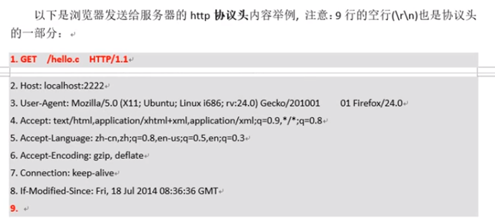
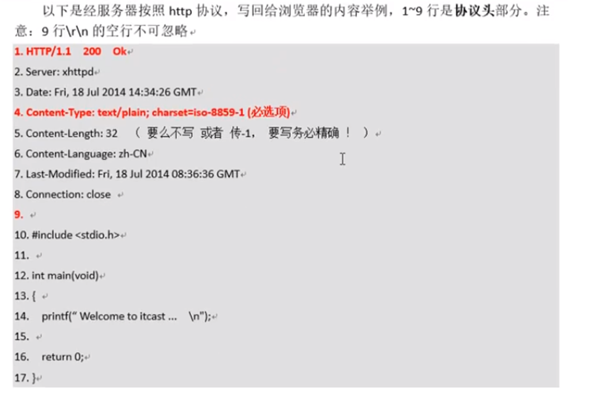
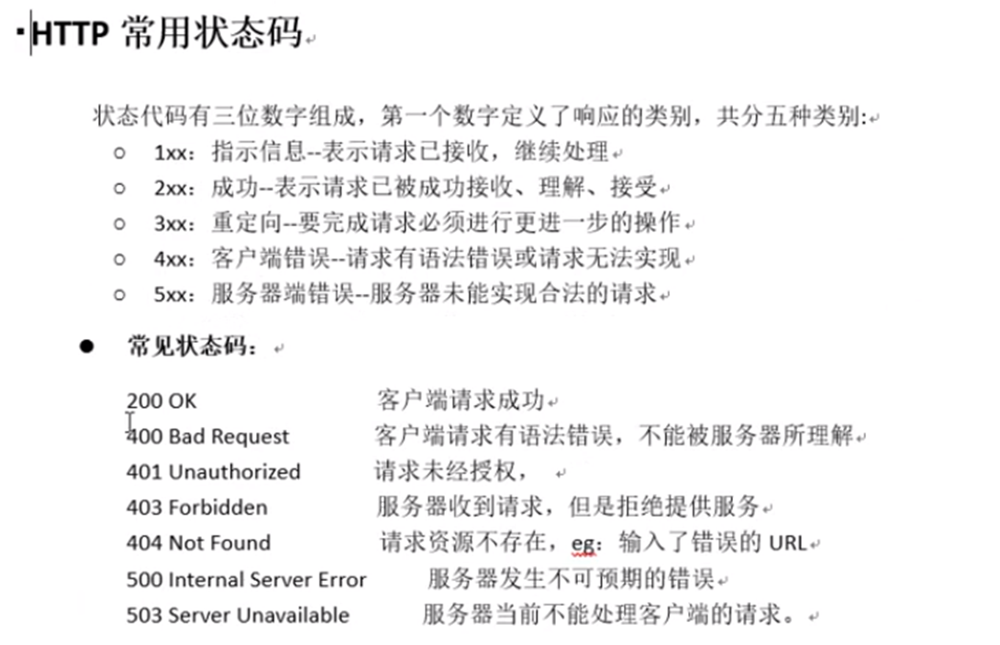
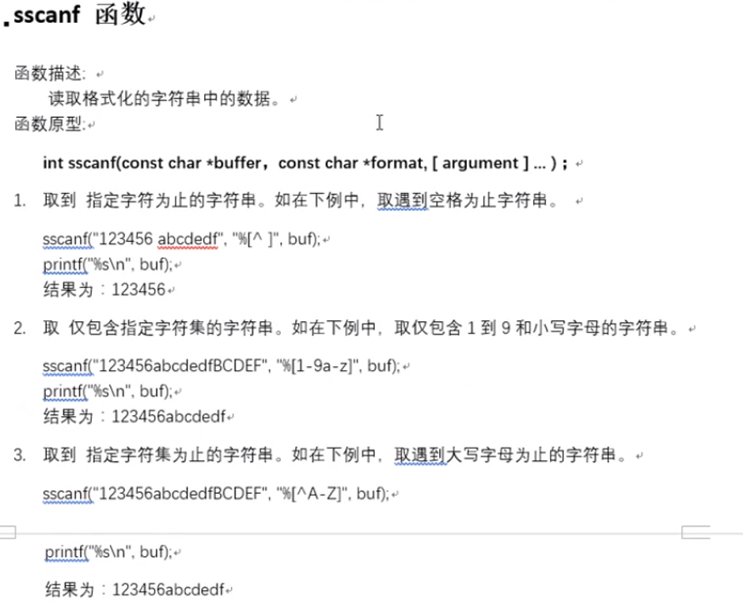

## http协议请求、应答协议基础格式

### HITP协议基础

HTTP，超文本传输协议（ HyperText Transfer Protocol )。互联网应用最为广泛的一种网络应用层协议。它可以减少网络传输，使浏览器更加高效。

通常HTTP消息包括客户机向服务器的请求消息和服务器向客户机的响应消息。

### 请求消息(Request)

浏览器—>发给—>服务器。主旨内容包含4部分: 

- 请求行:说明请求类型，要访问的资源，以及使用的http版本。                                                                                                                                         
- 请求头:说明服务器要使用的附加信息
- 空行:必须!，即使没有请求数据
- 请求数据:也叫主体，可以添加任意的其他数据





### 响应消息(Response)

服务器―>发给―>浏览器。主旨内容包含4部分: 

- 状态行:包括http协议版本号，状态码，状态信息
- 消息报头:说明客户端要使用的一些附加信息
- 空行:必须!
- 响应正文:服务器返回给客户端的文本信息









## 服务器框架复习和getline函数

```
#include <stdio.h>  
#include <string.h>  
#include <stdlib.h>  
#include <netinet/in.h>  
#include <arpa/inet.h>  
#include <sys/wait.h>  
#include <sys/types.h>  
#include <sys/epoll.h>  
#include <unistd.h>  
#include <fcntl.h>  
  
#define MAXSIZE 2048  
  
  
  
int init_listen_fd(int port, int epfd)  
{  
    //　创建监听的套接字 lfd  
    int lfd = socket(AF_INET, SOCK_STREAM, 0);  
    if (lfd == -1) {      
        perror("socket error");  
        exit(1);  
    }  
    // 创建服务器地址结构 IP+port  
    struct sockaddr_in srv_addr;  
      
    bzero(&srv_addr, sizeof(srv_addr));  
    srv_addr.sin_family = AF_INET;  
    srv_addr.sin_port = htons(port);  
    srv_addr.sin_addr.s_addr = htonl(INADDR_ANY);  
  
    // 端口复用  
    int opt = 1;  
    setsockopt(lfd, SOL_SOCKET, SO_REUSEADDR, &opt, sizeof(opt));  
      
    // 给 lfd 绑定地址结构  
    int ret = bind(lfd, (struct sockaddr*)&srv_addr, sizeof(srv_addr));  
    if (ret == -1) {     
        perror("bind error");  
        exit(1);  
    }  
    // 设置监听上限  
    ret = listen(lfd, 128);  
    if (ret == -1) {   
        perror("listen error");  
        exit(1);  
    }  
      
    // lfd 添加到 epoll 树上  
    struct epoll_event ev;  
    ev.events = EPOLLIN;  
    ev.data.fd = lfd;  
      
    ret = epoll_ctl(epfd, EPOLL_CTL_ADD, lfd, &ev);  
    if (ret == -1) {   
        perror("epoll_ctl add lfd error");  
        exit(1);  
    }  
  
    return lfd;  
}  
  
void do_accept(int lfd, int epfd)  
{  
    struct sockaddr_in clt_addr;  
    socklen_t clt_addr_len = sizeof(clt_addr);  
      
    int cfd = accept(lfd, (struct sockaddr*)&clt_addr, &clt_addr_len);  
    if (cfd == -1) {     
        perror("accept error");  
        exit(1);  
    }  
  
    // 打印客户端IP+port  
    char client_ip[64] = {0};  
    printf("New Client IP: %s, Port: %d, cfd = %d\n",  
           inet_ntop(AF_INET, &clt_addr.sin_addr.s_addr, client_ip, sizeof(client_ip)),  
           ntohs(clt_addr.sin_port), cfd);  
  
    // 设置 cfd 非阻塞  
    int flag = fcntl(cfd, F_GETFL);  
    flag |= O_NONBLOCK;  
    fcntl(cfd, F_SETFL, flag);  
  
    // 将新节点cfd 挂到 epoll 监听树上  
    struct epoll_event ev;  
    ev.data.fd = cfd;  
      
    // 边沿非阻塞模式  
    ev.events = EPOLLIN | EPOLLET;  
      
    int ret = epoll_ctl(epfd, EPOLL_CTL_ADD, cfd, &ev);  
    if (ret == -1)  {  
        perror("epoll_ctl add cfd error");  
        exit(1);  
    }  
}  
  
void do_read(int cfd, int epfd)  
{  
    // read cfd 小 -- 大 write 回  
    // 读取一行http协议， 拆分， 获取 get 文件名 协议号  
}  
  
void epoll_run(int port)  
{  
    int i = 0;  
    struct epoll_event all_events[MAXSIZE];  
  
    // 创建一个epoll监听树根  
    int epfd = epoll_create(MAXSIZE);  
    if (epfd == -1) {   
        perror("epoll_create error");  
        exit(1);  
    }  
      
    // 创建lfd，并添加至监听树  
    int lfd = init_listen_fd(port, epfd);  
     
    while (1) {  
        // 监听节点对应事件  
        int ret = epoll_wait(epfd, all_events, MAXSIZE, -1);  
        if (ret == -1) {        
            perror("epoll_wait error");  
            exit(1);  
        }  
  
        for (i=0; i<ret; ++i) {  
                  
            // 只处理读事件, 其他事件默认不处理  
            struct epoll_event *pev = &all_events[i];  
              
            // 不是读事件  
            if (!(pev->events & EPOLLIN)) {                       
                continue;  
            }  
            if (pev->data.fd == lfd) {       // 接受连接请求     
                  
                do_accept(lfd, epfd);  
                  
            } else {                        // 读数据  
                  
                do_read(pev->data.fd, epfd);  
            }  
        }  
    }  
}  
  
  
int main(int argc, char *argv[])  
{   
    // 命令行参数获取 端口 和 server提供的目录  
    if (argc < 3)   
    {  
        printf("./server port path\n");   
    }  
      
    // 获取用户输入的端口   
    int port = atoi(argv[1]);  
      
    // 改变进程工作目录  
    int ret = chdir(argv[2]);  
    if (ret != 0) {  
        perror("chdir error");    
        exit(1);  
    }  
  
    // 启动 epoll监听  
    epoll_run(port);  
  
    return 0;  
}  

```

## 单文件通信流程分析

1. getline() 获取 http协议的第一行。

2. 从首行中拆分  GET、文件名、协议版本。 获取用户请求的文件名。

3. 判断文件是否存在。 stat()

4. 判断是文件还是目录。

5. 是文件-- open -- read -- 写回给浏览器

6. 先写 http 应答协议头 ： 	http/1.1 200 ok
			
				Content-Type：text/plain; charset=iso-8859-1

### 正则表达式获取文件名

```
void do_read(int cfd, int epfd)  
{  
    // 读取一行http协议， 拆分， 获取 get 文件名 协议号     
    char line[1024] = {0};  
    char method[16], path[256], protocol[16];   
      
    int len = get_line(cfd, line, sizeof(line)); //读 http请求协议首行 GET /hello.c HTTP/1.1  
    if (len == 0) {  
        printf("服务器，检查到客户端关闭....\n");     
        disconnect(cfd, epfd);  
    } else {  
                  
        sscanf(line, "%[^ ] %[^ ] %[^ ]", method, path, protocol);    //%[^ ]取遇到空格为止的字符串
        printf("method=%s, path=%s, protocol=%s\n", method, path, protocol);  
          
        while (1) {  
            char buf[1024] = {0};  
            len = get_line(cfd, buf, sizeof(buf));    
            if (buf[0] == '\n') {  
                break;    
            } else if (len == -1)  
                break;  
        }     
          
    }  
      
    if (strncasecmp(method, "GET", 3) == 0)  
    {  
        char *file = path+1;   // 取出 客户端要访问的文件名  
          
        http_request(cfd, file);  
          
        disconnect(cfd, epfd);  
    }  
}  

```





### 判断文件是否存在

```
// 处理http请求， 判断文件是否存在， 回发  
void http_request(int cfd, const char *file)  
{  
    struct stat sbuf;  
      
    // 判断文件是否存在  
    int ret = stat(file, &sbuf);  
    if (ret != 0) {  
        // 回发浏览器 404 错误页面  
        perror("stat");  
        exit(1);      
    }  
      
    if(S_ISREG(sbuf.st_mode)) {     // 是一个普通文件  
          
        // 回发 http协议应答  
        //send_respond(cfd, 200, "OK", " Content-Type: text/plain; charset=iso-8859-1", sbuf.st_size);     
        send_respond(cfd, 200, "OK", "Content-Type:image/jpeg", -1);  
        //send_respond(cfd, 200, "OK", "audio/mpeg", -1);  
          
        // 回发 给客户端请求数据内容。  
        send_file(cfd, file);  
    }     
}  

```

### 写出http应答协议头

```
	// 客户端端的fd, 错误号，错误描述，回发文件类型， 文件长度   
void send_respond(int cfd, int no, char *disp, char *type, int len)  
{  
    char buf[4096] = {0};  
      
    sprintf(buf, "HTTP/1.1 %d %s\r\n", no, disp);  
    send(cfd, buf, strlen(buf), 0);  
      
    sprintf(buf, "Content-Type: %s\r\n", type);  
    sprintf(buf+strlen(buf), "Content-Length:%d\r\n", len);  
    send(cfd, buf, strlen(buf), 0);  
      
    send(cfd, "\r\n", 2, 0);  
}  

```

### 写数据给浏览器

```
// 发送服务器本地文件 给浏览器  
void send_file(int cfd, const char *file)  
{  
    int n = 0, ret;  
    char buf[4096] = {0};  
      
    // 打开的服务器本地文件。  --- cfd 能访问客户端的 socket  
    int fd = open(file, O_RDONLY);  
    if (fd == -1) {  
        // 404 错误页面  
        perror("open error");  
        exit(1);  
    }  
      
    while ((n = read(fd, buf, sizeof(buf))) > 0) {         
        ret = send(cfd, buf, n, 0);  
        if (ret == -1) {  
            perror("send error");     
            exit(1);  
        }  
        if (ret < 4096)        
            printf("-----send ret: %d\n", ret);  
    }  
      
    close(fd);        
}  

```

```
favicon.ico 图标用于收藏夹图标和浏览器标签上的显示，如果不设置，浏览器会请求网站根目录的这个图标，如果网站根目录也没有这图标会产生 404。出于优化的考虑，要么就有这个图标，要么就禁止产生这个请求。
在做 H5 混合应用的时候，不希望产生 favicon.ico 的请求。
可以在页面的 <head> 区域，加上如下代码实现屏蔽：
<link rel="icon" href="data:;base64,=">，或者详细一点<link rel="icon" href="data:image/ico;base64,aWNv">，当然，既然是 dataURL 方式，IE < 8 等 old brower 就别想了
```

