## 进程和程序以及 CPU 相关 

进程：
		程序：死的。只占用磁盘空间。 ——剧本。
		进程；活的。运行起来的程序。占用内存、cpu 等系统资源。 ——戏。
并发和并行：并行是宏观上并发，微观上串行

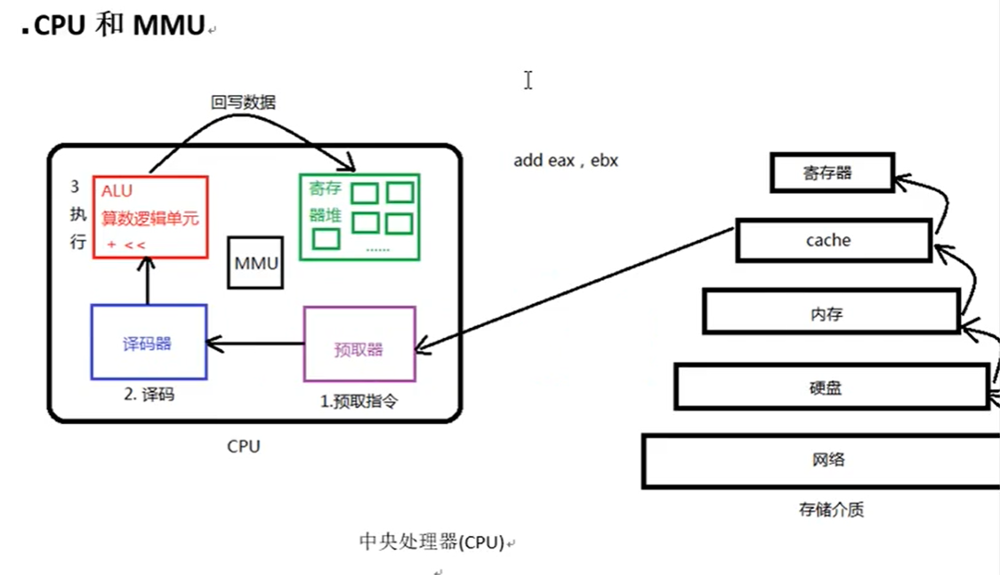



## 虚拟内存和物理内存映射关系

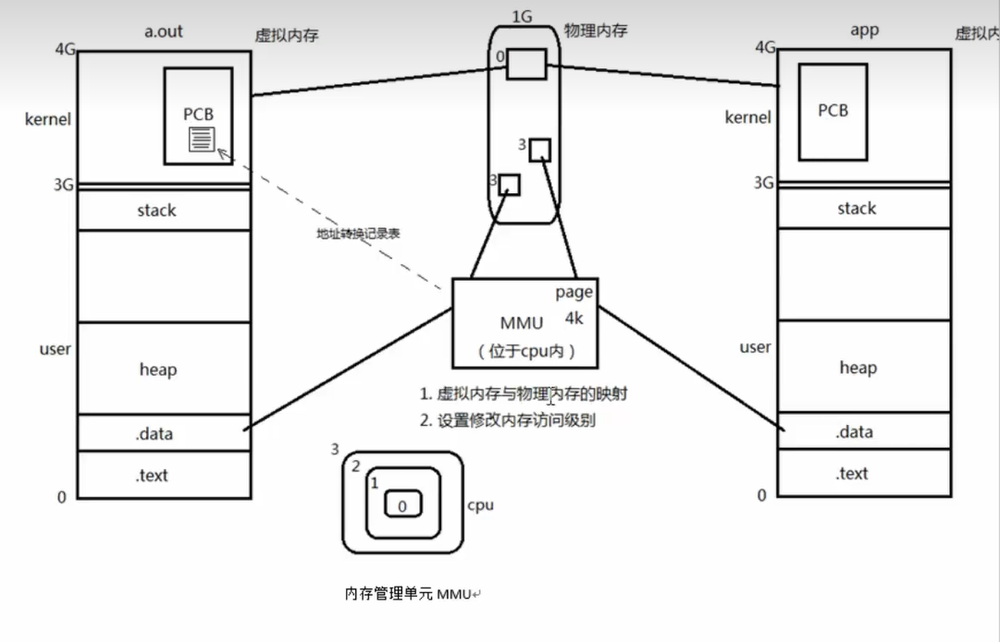



Linux下只有两级。从用户空间到内核空间进的时候，需要借助mmu，帮助完成全级切换。

## pcb 进程控制块

PCB 进程控制块：进程 id
文件描述符表
进程状态： 初始态、就绪态、运行态、挂起态、终止态。
进程工作目录位置
*umask 掩码 （进程的概念）
信号相关信息资源。
用户 id 和组 id
ps aux 返回结果里，第二列是进程 id

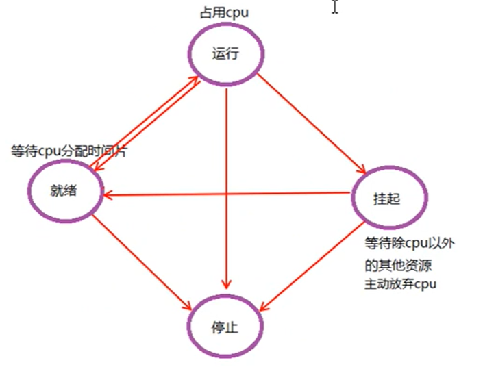



## 环境变量

```
echo $PATH 查看环境变量
path 环境变量里记录了一系列的值，当运行一个可执行文件时，系统会去环境变量记录的位置里查
找这个文件并执行。
echo $TERM 查看终端
echo $LANG 查看语言
env 查看所有环境变量

```

## fork 函数原理

fork 函数：

```
pid_t fork(void)
创建子进程。父子进程各自返回。父进程返回子进程 pid。 子进程返回 0.
getpid();getppid();
循环创建 N 个子进程模型。 每个子进程标识自己的身份。
```

父子进程相同： 刚 fork 后。 data 段、text 段、堆、栈、环境变量、全局变量、宿主目录位置、进程工作目录位 置、信号处理方式

父子进程不同： 进程 id、返回值、各自的父进程、进程创建时间、闹钟、未决信号集

父子进程共享： 读时共享、写时复制。———————— 全局变量。 1. 文件描述符 2. mmap 映射区

## fork 创建子进程

下面是一个 fork 函数的例子，代码如下：

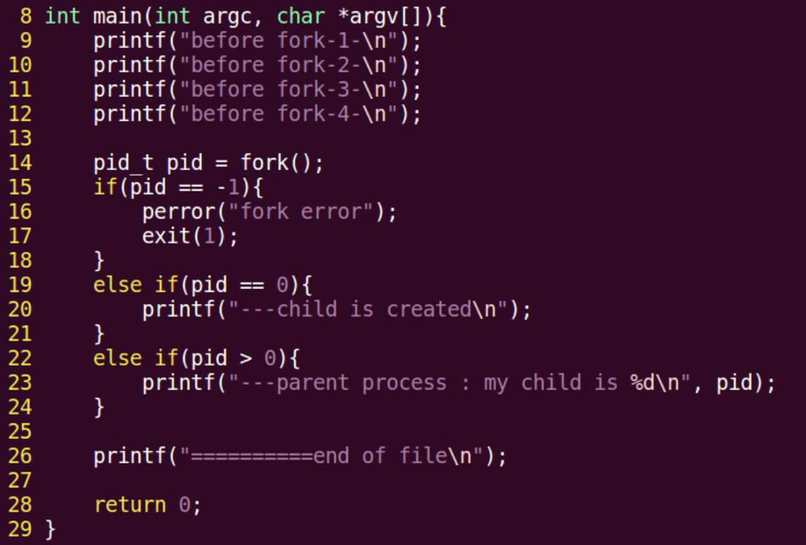



fork 之前的代码，父子进程都有，但是只有父进程执行了，子进程没有执行，fork 之后的代码，父子进程都有机会执行。

```
两个函数：
pid_t getpid() 获取当前进程 id
pid_t getppid() 获取当前进程的父进程 id

```

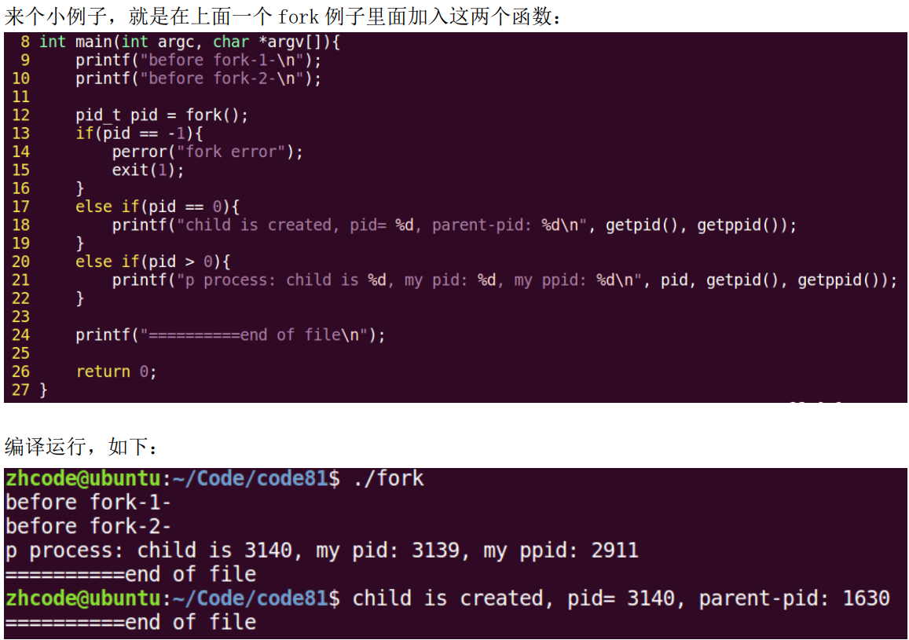



## 循环创建多个子进程

所以，直接用个 for 循环是要出事情的，因为子进程也会 fork 新的进程 这里，对调用 fork 的进程进行判定，只让父进程 fork 新的进程就行，代码如下：

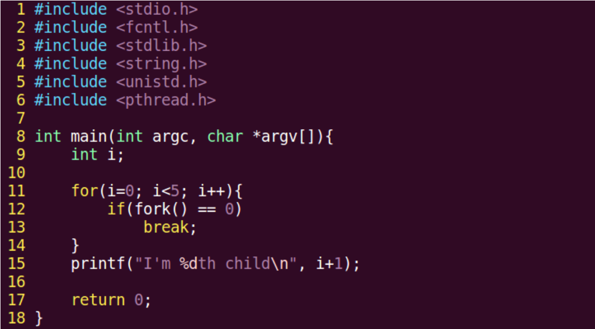



出现了问题：进程多了一个，而且不是按顺序来的。这里多出的一个，是父进程，因为父进程才有 i=5 跳出循环这一步。所以，对父进程进行判定并处理

```
if(i=5)
{
	printf("parent");
}
else
	printf("..",i+1);
```

现在还有两个问题，
	一个就是包括父进程在内的所有进程不是按顺序出现，多运行几次，发现是随机序列出现的。这
是要因为，对操作系统而言，这几个子进程几乎是同时出现的，它们和父进程一起争夺 cpu，谁抢到，
谁打印，所以出现顺序是随机的。
	第二问题就是终端提示符混在了输出里，这个是因为，loop_fork 是终端的子进程，一旦
loop_fork 执行完，终端就会打印提示符。就像之前没有子进程的程序，一旦执行完，就出现了终端
提示符。这里也就是这个道理，loop_fork 执行完了，终端提示符出现，然而 loop_fork 的子进程还
没执行完，所以输出就混在一起了。

通过 sleep 延时来解决父进程先结束这个问题

```
if(i=5)
{
	printf("parent");
	sleep(1);
}
else
	printf("..",i+1);
```

最后来解决子进程乱序输出的问题，解决方法很简单，让第 1 个子进程少等，第二个子进程多等， 后面子进程等待时间依次增加，这样就能实现有序输出。

## 父子进程共享哪些内容

父子进程相同： 刚 fork 后。 data 段、text 段、堆、栈、环境变量、全局变量、宿主目录位置、进程工作目录位 置、信号处理方式

父子进程不同： 进程 id、返回值、各自的父进程、进程创建时间、闹钟、未决信号集

父子进程共享： 读时共享、写时复制。———————— 全局变量。如果只是读，则公用一个地址，写，则复制一份，不一起。

 1. 文件描述符 2. mmap 映射区

## 父子进程 gdb 调试

gdb 调试：
设置父进程调试路径：set follow-fork-mode parent (默认)
设置子进程调试路径：set follow-fork-mode child
注意，一定要在 fork 函数调用之前设置才有效。

## exec 函数族 

```
exec 函数族：
使进程执行某一程序。成功无返回值，失败返回 -1
int execlp(const char *file, const char *arg, ...); 借助 PATH 环境变量找寻待执
行程序
参 1： 程序名
参 2： argv0
参 3： argv1
...： argvN
哨兵：NULL
int execl(const char *path, const char *arg, ...); 自己指定待执行程序路径。
int execvp();
ps ajx --> pid ppid gid sid

```

fork创建子进程后执行的是和父进程相同的程序（但有可能执行不同的代码分支)，子进程往往要调用一种 exec函数以执行另一个程序。当进程调用一种exec函数时，该进程的用户空间代码和数据完全被新程序替换，从新程序的启动例程开始执行。调用exec并不创建新进程，所以调用exec前后该进程的id并未改变。
将当前进程的.text、.data替换为所要加载的程序的.text、.data，然后让进程从新的.text第一条指令开始执行，但进程ID不变，换核不换壳。即exec后面的子进程代码不执行了，因为进入了新的程序。

### execlp 和 ececl 函数

```
int execlp(const char *file, const char *arg, …)
成功，无返回，失败返回-1
参数 1：要加载的程序名字，该函数需要配合 PATH 环境变量来使用，当 PATH 所有目录搜素后没
有参数 1 则返回出错。
该函数通常用来调用系统程序。如 ls、date、cp、cat 命令。
execlp 这里面的 p，表示要借助环境变量来加载可执行文件
```

示例代码，通过 execlp 让子进程去执行 ls 命令：

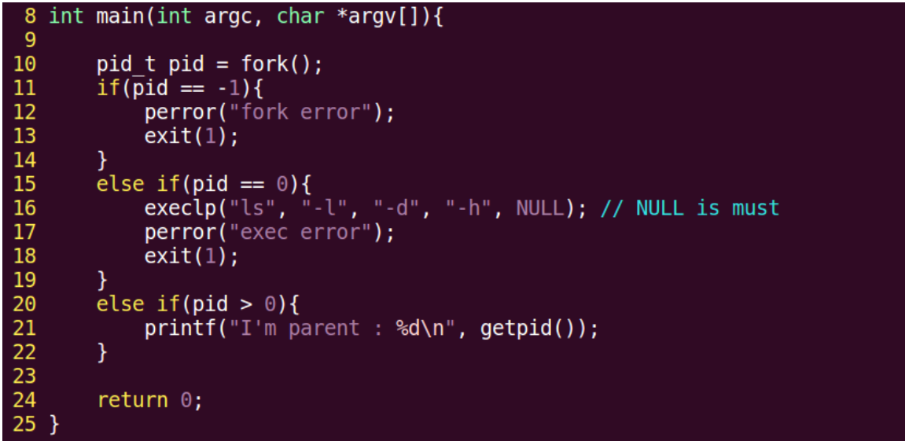



只有父进程正确执行并输出了，子进程的 ls 输出有问题。 问题出在参数上，可变参数那里，是从 argv[0]开始计算的。 修改代码，就是将缺失的 argv[0]补上，然后让父进程延时 1 秒，保证终端提示符不和输出干扰。如 下：

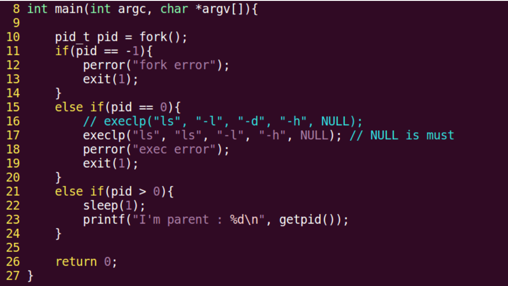



下面使用 execl 来让子程序调用自定义的程序。 int execl(const char *path, const char *arg, …) 这里要注意，和 execlp 不同的是，第一个参数是路径，不是文件名。 这个路径用相对路径和绝对路径都行。

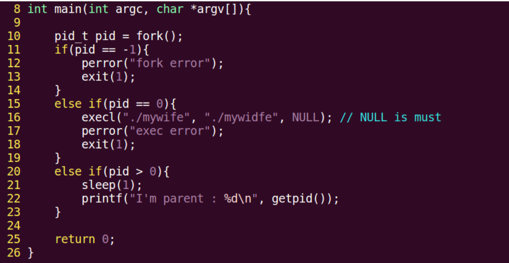



用 execl 也能执行 ls 这些，把路径给出来就行，但是这样麻烦，所以对于系统指令一般还是用 execlp

## exec 函数族特性 

写一个程序，使用 execlp 执行进程查看，并将结果输出到文件里。 要用到 open, execlp, dup2

```
#include <stdio.h>
#include <fcntl.h>
#include <stdlib.h>
#include <string.h>
#include <unistd.h>
#include <pthread.h>
int main(){
        int fd;
        fd = open( "ps.out", O_WRONLY|O_CREAT|O_TRUNC,0644);
        if(fd < 0){
                perror("open ps.out error");
                exit(1);
        }
        dup2(fd,STDOUT_FILENO);
        execlp("ps","ps","aux",NULL);
        close(fd); //have no need to
        return 0;
}
```

exec 函数族一般规律： 

exec 函数一旦调用成功，即执行新的程序，不返回。只有失败才返回，错误值-1，所以通常我们直接在 exec 函数调用后直接调用 perror()，和 exit()，无需 if 判断。

事实上，只有 execve 是真正的系统调用，其他 5 个函数最终都调用 execve，是库函数，所以 execve 在 man 手册第二节，其它函数在 man 手册第 3 节。

## 孤儿进程和僵尸进程

孤儿进程：
父进程先于子进终止，子进程沦为“孤儿进程”，会被 init 进程领养。
僵尸进程：
子进程终止，父进程尚未对子进程进行回收，在此期间，子进程为“僵尸进程”。 kill 对其
无效。这里要注意，每个进程结束后都必然会经历僵尸态，时间长短的差别而已。
子进程终止时，子进程残留资源 PCB 存放于内核中，PCB 记录了进程结束原因，进程回收就是回
收 PCB。回收僵尸进程，得 kill 它的父进程，让孤儿院去回收它。

## wait 回收子进程

```
wait 函数： 回收子进程退出资源， 阻塞回收任意一个。
pid_t wait(int *status)
参数：（传出） 回收进程的状态。
返回值：成功： 回收进程的 pid
失败： -1， errno
函数作用 1： 阻塞等待子进程退出
函数作用 2： 清理子进程残留在内核的 pcb 资源
函数作用 3： 通过传出参数，得到子进程结束状态
获取子进程正常终止值：
WIFEXITED(status) --》 为真 --》调用 WEXITSTATUS(status) --》 得到 子进程 退出值。
获取导致子进程异常终止信号：
WIFSIGNALED(status) --》 为真 --》调用 WTERMSIG(status) --》 得到 导致子进程异常
终止的信号编号。
一个进程终止时会关闭所有文件描述符，释放在用户空间分配的内存，但它的 PCB 还保留着，内
核在其中保存了一些信息：如果是正常终止则保存着退出状态，如果是异常终止则保存着导致该进程
终止的信号是哪个。这个进程的父进程可以调用 wait 或者 waitpid 获取这些信息，然后彻底清除掉
这个进程。我们知道一个进程的退出状态可以在 shell 中用特殊变量$？查看，因为 shell 是它的父
进程，当它终止时，shell 调用 wait 或者 waitpid 得到它的退出状态，同时彻底清除掉这个进程。
pid_t wait(int *status)
其中 status 是传出参数
```

下面这个例子，使用 wait 来阻塞回收子进程

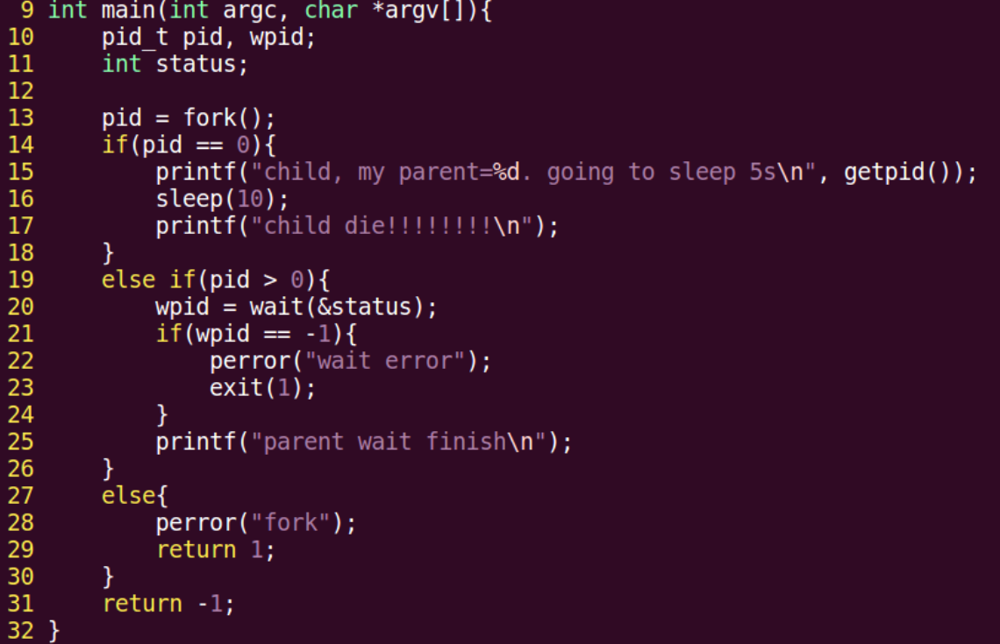



## 获取子进程退出值和异常终止信号

获取子进程正常终止值：
WIFEXITED(status) --》 为真 --》调用 WEXITSTATUS(status) --》 得到 子进程 退出值。
获取导致子进程异常终止信号：
WIFSIGNALED(status) --》 为真 --》调用 WTERMSIG(status) --》 得到 导致子进程异常
终止的信号编号。

下面这个代码捕获程序异常终止的信号并打印：

```
1. #include <stdio.h>
2. #include <stdlib.h>
3. #include <unistd.h>
4. #include <sys/wait.h>
5.
6. int main(void)
7. {
8. pid_t pid, wpid;
9. int status;
10.
11. pid = fork();
12. if (pid == 0) {
13. printf("---child, my id= %d, going to sleep 10s\n", getpid());
14. sleep(10);
15. printf("-------------child die--------------\n");
16. return 73;
17. } else if (pid > 0) {
18. //wpid = wait(NULL); // 不关心子进程结束原因
19. wpid = wait(&status); // 如果子进程未终止,父进程阻塞在这个函数上
20. if (wpid == -1) {
21. perror("wait error");
22. exit(1);
23. }
24. if (WIFEXITED(status)) { //为真,说明子进程正常终止.
25. printf("child exit with %d\n", WEXITSTATUS(status));
26.
27. }
28. if (WIFSIGNALED(status)) { //为真,说明子进程是被信号终止.
29.
30. printf("child kill with signal %d\n", WTERMSIG(status));
31. }
32.
33. printf("------------parent wait finish: %d\n", wpid);
34. } else {
35. perror("fork");
36. return 1;
37. }
38.
39. return 0;
40. }
```

下面发送信号使得子进程异常退出。

```
kill -9 id
```

## waitpid 回收子进程

```
waitpid 函数： 指定某一个进程进行回收。可以设置非阻塞。
waitpid(-1, &status, 0) == wait(&status);
	pid_t waitpid(pid_t pid, int *status, int options)
	参数：
		pid：指定回收某一个子进程 pid
		> 0: 待回收的子进程 pid
		-1：任意子进程
		0：同组的子进程。
		status：（传出） 回收进程的状态。
		options：WNOHANG 指定回收方式为，非阻塞。
	返回值：
		> 0 : 表成功回收的子进程 pid
		0 : 函数调用时， 参 3 指定了 WNOHANG， 并且，没有子进程结束。
		-1: 失败。errno
	一次 wait/waitpid 函数调用，只能回收一个子进程。上一个例子，父进程产生了 5 个子进程，wait 会随机回收一个，捡到哪个算哪个。

```

ps ajx --> pid ppid gid sid

在演示回收指定子进程的代码时出了问题，这里问题原因在于指定子进程的 pid 传递。父进程里 的 pid 变量和子进程 pid 变量并不是同一个。子进程结束时，父进程的 pid 还是原来的 0。 

原来的代码没有使用 fork 的返回值，导致父进程没有得到指定回收子进程的 pid。

默认情况下，父进程 fork 出来的子进程都属于同一个组。

错误代码如下图所示，它不能回收指定的第 3 个子进程

```
1. //指定回收一个子进程错误示例
2. #include <stdio.h>
3. #include <stdlib.h>
4. #include <string.h>
5. #include <unistd.h>
6. #include <sys/wait.h>
7. #include <pthread.h>
8.
9. int main(int argc, char *argv[])
10. {
11. int i;
12. pid_t pid, wpid;
13.
14. for (i = 0; i < 5; i++) {
15. if (fork() == 0) { // 循环期间, 子进程不 fork
16. if (i == 2) {
17. pid = getpid();
18. printf("------pid = %d\n", pid);
19. }
20. break;
21. }
22. }
23.
24. if (5 == i) { // 父进程, 从 表达式 2 跳出
25. sleep(5);
26.
27. //wait(NULL); // 一次 wait/waitpid 函数调用,只能回收一个子进程.
28. //wpid = waitpid(-1, NULL, WNOHANG); //回收任意子进程,没有结束的子进程,父进程直接返回 0
29. //wpid = waitpid(pid, NULL, WNOHANG); //指定一个进程回收
30.
31. printf("------in parent , before waitpid, pid= %d\n", pid);
32. wpid = waitpid(pid, NULL, 0); //指定一个进程回收，这里因为是进的父进程，没有pid的值
33. if (wpid == -1) {
34. perror("waitpid error");
35. exit(1);
36. }
37. printf("I'm parent, wait a child finish : %d \n", wpid);
38.
39. } else { // 子进程, 从 break 跳出
40. sleep(i);
41. printf("I'm %dth child, pid= %d\n", i+1, getpid());
42. }
43.
44. return 0;
45. }
```

这个代码错误如之前所述，父进程里的 pid 还是 0，因为父进程里没有获取指定子进程的 pid， 于是父进程里的 pid 还保持默认值。

下面是正确的示例，循环 fork 出 5 个子进程，并回收指定的子进程：

```
1. #include <stdio.h>
2. #include <stdlib.h>
3. #include <string.h>
4. #include <unistd.h>
5. #include <sys/wait.h>
6. #include <pthread.h>
7.
8.
9. int main(int argc, char *argv[])
10. {
11. int i;
12. pid_t pid, wpid, tmpid;
13.
14. for (i = 0; i < 5; i++) {
15. pid = fork();
16. if (pid == 0) { // 循环期间, 子进程不 fork
17. break;
18. }
19. if (i == 2) {//这里是父进程
20. tmpid = pid;
21. printf("--------pid = %d\n", tmpid);
22. }
23. }
24.
25. if (5 == i) { // 父进程, 从 表达式 2 跳出
26. // sleep(5);
27.
28. //wait(NULL); // 一次 wait/waitpid 函数调用,只能回收一个子进程.
29. //wpid = waitpid(-1, NULL, WNOHANG); //回收任意子进程,没有结束的子进程,父进程直接返回 0
30. //wpid = waitpid(tmpid, NULL, 0); //指定一个进程回收, 阻塞等待
31. printf("i am parent , before waitpid, pid = %d\n", tmpid);
32.
33. //wpid = waitpid(tmpid, NULL, WNOHANG); //指定一个进程回收, 不阻塞
34. wpid = waitpid(tmpid, NULL, 0); //指定一个进程回收, 阻塞回收
35. if (wpid == -1) {
36. perror("waitpid error");
37. exit(1);
38. }
39. printf("I'm parent, wait a child finish : %d \n", wpid);
40.
41. } else { // 子进程, 从 break 跳出
42. sleep(i);
43. printf("I'm %dth child, pid= %d\n", i+1, getpid());
44. }
45.
46. return 0;
47. }

```

指定回收的第三个进程，就回收的第三个。这里实现由两种，一个是阻塞等待回收指定 进程，一个是非阻塞，但是用 sleep 延时父进程，以保证待回收的指定子进程已经执行结束。上面这 个代码使用的阻塞回收，这个方案的问题在于终端提示符会和输出混杂在一起。使用非阻塞回收 +延时的方法，这样终端提示符就不会混在输出里。

## waitpid 回收多个子进程

一次 wait/waitpid 函数调用，只能回收一个子进程。上一个例子，父进程产生了 5 个子进程， wait 会随机回收一个，捡到哪个算哪个

总结： wait、waitpid 一次调用，回收一个子进程。 想回收多个。while

```
if (5 == i) { // 父进程, 从 表达式 2 跳出
 	/* 
 	while ((wpid = waitpid(-1, NULL, 0))) { // 使用阻塞方式回收子进程
		printf("wait child %d \n", wpid);
	}
	*/
	while ((wpid = waitpid(-1, NULL, WNOHANG)) != -1) { //使用非阻塞方式,回收子进程.
		if (wpid > 0) {
			printf("wait child %d \n", wpid);
		} else if (wpid == 0) {
			sleep(1);
			continue;
		}
}
```

## 进程间通信常见方式 

IPC(InterProcess Communication)进程间通信

进程间通信的常用方式，特征： 

管道：简单 

信号：开销小 

mmap 映射：非血缘关系进程间 

socket（本地套接字）：稳定

## 管道的特质

管道：
实现原理： 内核借助环形队列机制，使用内核缓冲区实现。
特质； 

​	1. 伪文件

2. 管道中的数据只能一次读取。
3. 数据在管道中，只能单向流动。

局限性：

1. 自己写，不能自己读。
2. 数据不可以反复读。
3. 半双工通信。
4. 血缘关系进程间可用。

## 管道的基本用法

pipe 函数： 创建，并打开管道。
	int pipe(int fd[2]);
		参数： fd[0]: 读端。
					fd[1]: 写端。
		返回值： 成功： 0
						失败： -1 errno

一个管道通信的示例，父进程往管道里写，子进程从管道读，然后打印读取的内容

```
1. #include <stdio.h>
2. #include <stdlib.h>
3. #include <string.h>
4. #include <unistd.h>
5. #include <errno.h>
6. #include <pthread.h>
7.
8. void sys_err(const char *str)
9. {
10. perror(str);
11. exit(1);
12. }
13.
14. int main(int argc, char *argv[])
15. {
16. int ret;
17. int fd[2];
18. pid_t pid;
19.
20. char *str = "hello pipe\n";
21. char buf[1024];
22.
23. ret = pipe(fd);
24. if (ret == -1)
25. sys_err("pipe error");
26.
27. pid = fork();
28. if (pid > 0) {
29. close(fd[0]); // 父进程关闭读段
30. //sleep(3);
31. write(fd[1], str, strlen(str));
32. close(fd[1]);
33. } else if (pid == 0) {
34. close(fd[1]); // 子进程关闭写段
35. ret = read(fd[0], buf, sizeof(buf));
36. printf("child read ret = %d\n", ret);
37. write(STDOUT_FILENO, buf, ret);
38.
39. close(fd[0]);
40. }
41.
42. return 0;
43. }
```

## 管道读写行为

管道的读写行为：
读管道：
1. 管道有数据，read 返回实际读到的字节数。
2. 管道无数据： 1）无写端，read 返回 0 （类似读到文件尾）
    2）有写端，read 阻塞等待。

写管道：

1. 无读端， 异常终止。 （SIGPIPE 导致的）
2. 有读端： 1） 管道已满， 阻塞等待
    2） 管道未满， 返回写出的字节个数。

普通文件，目录，软链接，这三个要占磁盘空间 

管道，套接字，字符设备，块设备，不占磁盘空间，伪文件

磁盘访问需要open和read,内存访问用地址，即使用指针访问。

## 父子进程 lswc-l

练习：使用管道实现父子进程间通信，完成：ls | wc -l 假定父进程实现 ls，子进程实现 wc
ls 命令正常会将结果集写到 stdout，但现在会写入管道写端
wc -l 命令正常应该从 stdin 读取数据，但此时会从管道的读端读。
要用到 pipe dup2 exec
代码如下

```
1. #include <stdio.h>
2. #include <stdlib.h>
3. #include <string.h>
4. #include <unistd.h>
5. #include <errno.h>
6. #include <pthread.h>
7.
8. void sys_err(const char *str)
9. {
10. perror(str);
11. exit(1);
12. }
13. int main(int argc, char *argv[])
14. {
15. int fd[2];
16. int ret;
17. pid_t pid;
18.
19. ret = pipe(fd); // 父进程先创建一个管道,持有管道的读端和写端
20. if (ret == -1) {
21. sys_err("pipe error");
22. }
23.
24. pid = fork(); // 子进程同样持有管道的读和写端
25. if (pid == -1) {
26. sys_err("fork error");
27. }
28. else if (pid > 0) { // 父进程 读, 关闭写端
29. close(fd[1]);
30. dup2(fd[0], STDIN_FILENO); // 重定向 stdin 到 管道的 读端
31. execlp("wc", "wc", "-l", NULL); // 执行 wc -l 程序
32. sys_err("exclp wc error");
33. }
34. else if (pid == 0) {
35. close(fd[0]);
36. dup2(fd[1], STDOUT_FILENO); // 重定向 stdout 到 管道写端
37. execlp("ls", "ls", NULL); // 子进程执行 ls 命令
38. sys_err("exclp ls error");
39. }
40.
41. return 0;
42. }
```

## 兄弟进程间通信 

练习题：兄弟进程间通信
兄：ls
弟：wc -l
父：等待回收子进程
要求，使用循环创建 N 个子进程模型创建兄弟进程，使用循环因子 i 标识，注意管道读写行为
测试：
是否允许，一个 pipe 有一个写端多个读端 可
是否允许，一个 pipe 有多个写端一个读端 可

```
1. #include <stdio.h>
2. #include <stdlib.h>
3. #include <string.h>
4. #include <sys/wait.h>
5. #include <unistd.h>
6. #include <errno.h>
7. #include <pthread.h>
8.
9. void sys_err(const char *str)
10. {
11. perror(str);
12. exit(1);
13. }
14. int main(int argc, char *argv[])
15. {
16. int fd[2];
17. int ret, i;
18. pid_t pid;
19.
20. ret = pipe(fd);
21. if (ret == -1) {
22. sys_err("pipe error");
23. }
24.
25. for(i = 0; i < 2; i++) { // 表达式 2 出口,仅限父进程使用
26. pid = fork();
27. if (pid == -1) {
28. sys_err("fork error");
29. }
30. if (pid == 0) // 子进程,出口
31. break;
32. }
33.
34. if (i == 2) { // 父进程 . 不参与管道使用.
35. close(fd[0]); // 关闭管道的 读端/写端.
36. close(fd[1]);
37.
38. wait(NULL); // 回收子进程
39. wait(NULL);
40. } else if (i == 0) { // 哥哥
41. close(fd[0]);
42. dup2(fd[1], STDOUT_FILENO); // 重定向 stdout
43. execlp("ls", "ls", NULL);
44. sys_err("exclp ls error");
45. } else if (i == 1) { //弟弟
46. close(fd[1]);
47. dup2(fd[0], STDIN_FILENO); // 重定向 stdin
48. execlp("wc", "wc", "-l", NULL);
49. sys_err("exclp wc error");
50. }
51.
52. return 0;
53. }
```

这个代码需要注意一点，父进程不使用管道，所以一定要关闭父进程的管道，保证数据单向流动。

## 多个读写端操作管道和管道缓冲区大小

下面是一个父进程读，俩子进程写的例子，也就是一个读端多个写端。需要调控写入顺序才行。

```
1. #include <stdio.h>
2. #include <unistd.h>
3. #include <sys/wait.h>
4. #include <string.h>
5. #include <stdlib.h>
6.
7. int main(void)
8. {
9. pid_t pid;
10. int fd[2], i, n;
11. char buf[1024];
12.
13. int ret = pipe(fd);
14. if(ret == -1){
15. perror("pipe error");
16. exit(1);
17. }
18.
19. for(i = 0; i < 2; i++){
20. if((pid = fork()) == 0)
21. break;
22. else if(pid == -1){
23. perror("pipe error");
24. exit(1);
25. }
26. }
27.
28. if (i == 0) {
29. close(fd[0]);
30. write(fd[1], "1.hello\n", strlen("1.hello\n"));
31. } else if(i == 1) {
32. close(fd[0]);
33. write(fd[1], "2.world\n", strlen("2.world\n"));
34. } else {
35. close(fd[1]); //父进程关闭写端,留读端读取数据
36. sleep(1);
37. n = read(fd[0], buf, 1024); //从管道中读数据
38. write(STDOUT_FILENO, buf, n);
39.
40. for(i = 0; i < 2; i++) //两个儿子 wait 两次
41. wait(NULL);
42. }
43.
44. return 0;
45. }

```

这个例子需要注意，父进程必须等一下，不然可能俩子进程只写了一个，父进程就读完跑路了。 

管道大小，默认 4096

## 命名管道 fifo 的创建和原理图

管道的优劣：
优点：简单，相比信号，套接字实现进程通信，简单很多
缺点：1.只能单向通信，双向通信需建立两个管道
 2.只能用于有血缘关系的进程间通信。该问题后来使用 fifo 命名管道解决。

fifo 管道：可以用于无血缘关系的进程间通信。
命名管道： mkfifo 
无血缘关系进程间通信：
读端，open fifo O_RDONLY
写端，open fifo O_WRONLY
fifo 操作起来像文件
下面的代码创建一个 fifo：

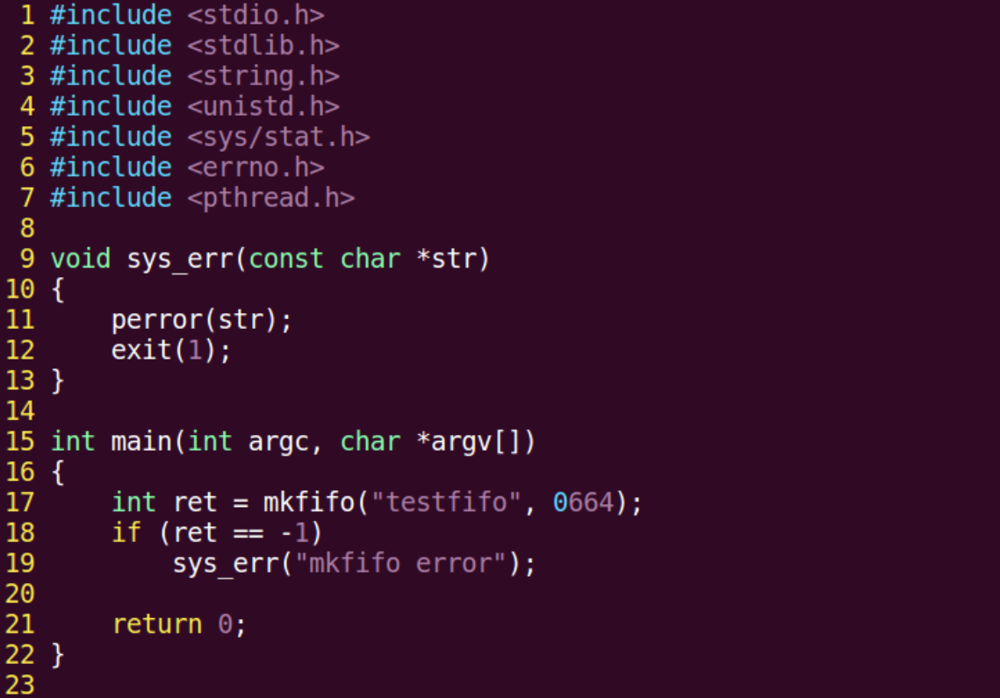



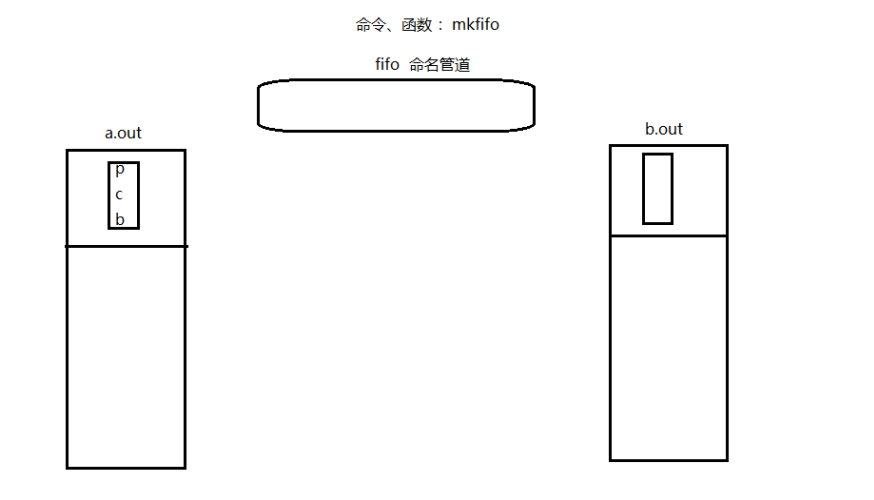



## fifo 实现非血缘关系进程间通信

下面这个例子，一个写 fifo，一个读 fifo，操作起来就像文件一样的：

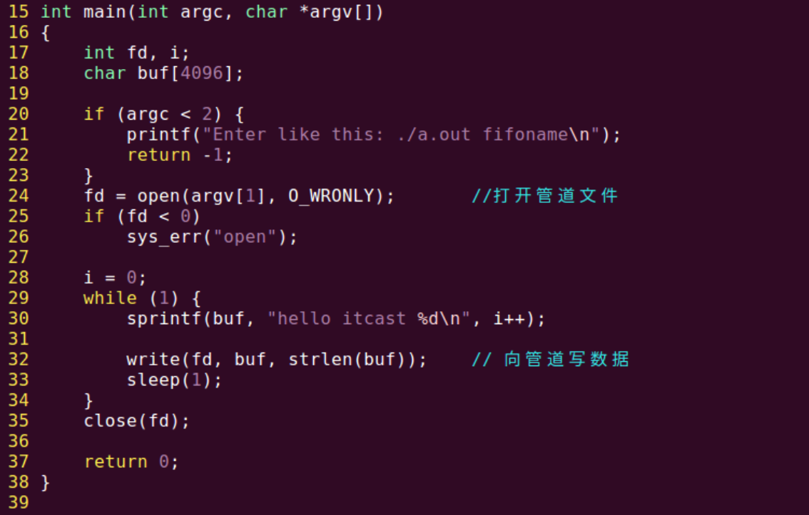



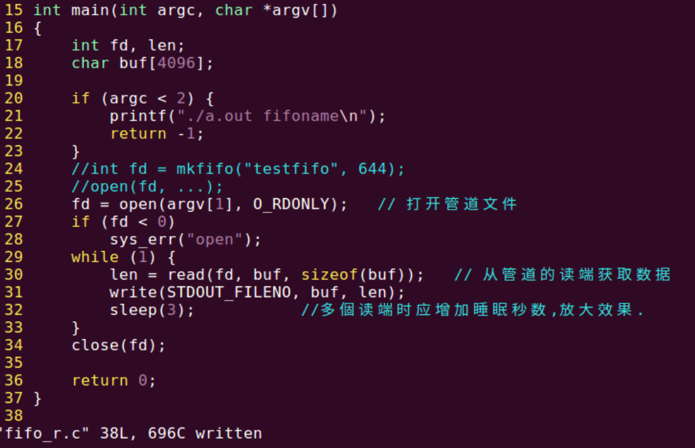



编译执行，如图：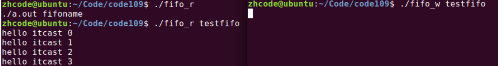



测试一个写端多个读端的时候，由于数据一旦被读走就没了，所以多个读端的并集才是写端的写 入数据。

## 文件用于进程间通信

文件实现进程间通信： 打开的文件是内核中的一块缓冲区。多个无血缘关系的进程，可以同时访问该文件。

**socket套接字也是一种文件格式，和管道文件一样，它是一种伪文件**，存在于内核的缓冲区中，大小不变，一直是0。

## mmap 函数原型

磁盘访问需要open和read,内存访问用地址，即使用指针访问。

内核缓冲区是位于内核空间的一块特定内存区域，用于临时存储和处理数据。在 Linux 内核中，访问内核缓冲区通常需要使用相应的系统调用或函数。一种常见的方式是使用 I/O 操作函数来读取或写入内核缓冲区的内容。例如，在文件 I/O 中，我们可以使用系统调用 `read()` 和 `write()` 来分别从内核缓冲区读取数据到用户空间或将数据从用户空间写入到内核缓冲区。

存储映射 I/O(Memory-mapped I/O) 使一个磁盘文件与存储空间中的一个缓冲区相映射。于是从缓冲区中取数据，就相当于读文件中的相应字节。与此类似，将数据存入缓冲区，则相应的字节就自动写入文件。这样，就可在不使用 read 和 write 函数的情况下，使地址指针完成 I/O 操作。
使用这种方法，首先应该通知内核，将一个指定文件映射到存储区域中。这个映射工作可以通过mmap 函数来实现。

```
void *mmap(void *addr, size_t length, int prot, int flags, int fd, off_t offset);
创建共享内存映射
参数：
    addr： 指定映射区的首地址。通常传 NULL，表示让系统自动分配
    length：共享内存映射区的大小。（<= 文件的实际大小）
    prot： 共享内存映射区的读写属性。PROT_READ、PROT_WRITE、PROT_READ|PROT_WRITE
    flags： 标注共享内存的共享属性。MAP_SHARED、MAP_PRIVATE
    fd: 用于创建共享内存映射区的那个文件的 文件描述符。
    offset：默认 0，表示映射文件全部。偏移位置。需是 4k 的整数倍。
返回值：
    成功：映射区的首地址。
    失败：MAP_FAILED (void*(-1))， errno
   flags 里面的 shared 意思是修改会反映到磁盘上
     private 表示修改不反映到磁盘上
 int munmap(void *addr, size_t length); 释放映射区。
    addr：mmap 的返回值
    length：大小

```

出现段错误，gdb然后run停止的地方就是段错误。

## mmap 建立映射区

下面这个示例代码，使用 mmap 创建一个映射区（共享内存），并往映射区里写入内容：

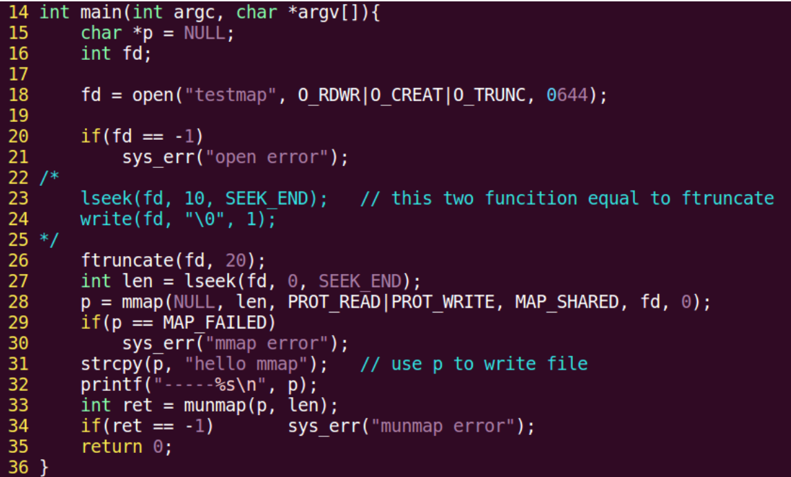



## mmap 使用注意事项

使用注意事项：
1. 用于创建映射区的文件大小为 0，实际指定非 0 大小创建映射区，出 “总线错误”。
2. 用于创建映射区的文件大小为 0，实际制定 0 大小创建映射区， 出 “无效参数”。
3. 用于创建映射区的文件读写属性为，只读。映射区属性为 读、写。 出 “无效参数”。
4. 创建映射区，需要 read 权限。当访问权限指定为 “共享”MAP_SHARED 时， mmap 的读写权限，应该 <=文件的 open 权限。 只写不行。
5. 文件描述符 fd，在 mmap 创建映射区完成即可关闭。后续访问文件，用 地址访问。
6. offset 必须是 4096 的整数倍。（MMU 映射的最小单位 4k ）
7. 对申请的映射区内存，不能越界访问。
8. munmap 用于释放的 地址，必须是 mmap 申请返回的地址。
9. 映射区访问权限为 “私有”MAP_PRIVATE, 对内存所做的所有修改，只在内存有效，不会反应到物理磁盘上。
10. 映射区访问权限为 “私有”MAP_PRIVATE, 只需要 open 文件时，有读权限，用于创建映射区即可。

```
mmap 函数的保险调用方式：
1. fd = open（"文件名"， O_RDWR）;
2. mmap(NULL, 有效文件大小， PROT_READ|PROT_WRITE, MAP_SHARED, fd, 0);
```

mmap 总结 

1. 创建映射区的过程中，隐含着一次对映射文件的读操作
2. 当 MAP_SHARED 时，要求：映射区的权限应该<=文件打开的权限（出于对映射区的保护）。而MAP_PRIVATE 则无所谓，因为 mmap 中的权限是对内存的限制
3. 映射区的释放与文件关闭无关。只要映射建立成功，文件可以立即关闭
4. 特别注意，当映射文件大小为 0 时，不能创建映射区。所以：用于映射的文件必须要有实际大小！！mmap 使用时常常会出现总线错误，通常是由于共享文件存储空间大小引起的。如，400 字节大小的文件，在简历映射区时，offset4096 字节，则会报出总线错误
5. munmap 传入的地址一定是 mmap 返回的地址。坚决杜绝指针++操作,会改变地址，在指针本身上操作
6. 文件偏移量必须为 4K 的整数倍
7. mmap 创建映射区出错概率非常高，一定要检查返回值，确保映射区建立成功再进行后续操作。

## 父子进程间 mmap 通信 

父子进程使用 mmap 进程间通信：
父进程 先 创建映射区。 `open（ O_RDWR） mmap( MAP_SHARED );`
指定 MAP_SHARED 权限
fork() 创建子进程。
一个进程读， 另外一个进程写

下面这段代码，父子进程 mmap 通信，共享内存是一个 int 变量：

```
1. #include <stdio.h>
2. #include <stdlib.h>
3. #include <unistd.h>
4. #include <fcntl.h>
5. #include <sys/mman.h>
6. #include <sys/wait.h>
7.
8. int var = 100;
9.
10. int main(void)
11. {
12. int *p;
13. pid_t pid;
14.
15. int fd;
16. fd = open("temp", O_RDWR|O_CREAT|O_TRUNC, 0644);
17. if(fd < 0){
18. perror("open error");
19. exit(1);
20. }
21. ftruncate(fd, 4);
22.
23. p = (int *)mmap(NULL, 4, PROT_READ|PROT_WRITE, MAP_SHARED, fd, 0);
24. //p = (int *)mmap(NULL, 4, PROT_READ|PROT_WRITE, MAP_PRIVATE, fd, 0);
25. if(p == MAP_FAILED){ //注意:不是 p == NULL
26. perror("mmap error");
27. exit(1);
28. }
29. close(fd); //映射区建立完毕,即可关闭文件
30.
31. pid = fork(); //创建子进程
32. if(pid == 0){
33. *p = 7000; // 写共享内存
34. var = 1000;
35. printf("child, *p = %d, var = %d\n", *p, var);
36. } else {
37. sleep(1);
38. printf("parent, *p = %d, var = %d\n", *p, var); // 读共享内存
39. wait(NULL);
40.
41. int ret = munmap(p, 4); //释放映射区
42. if (ret == -1) {
43. perror("munmap error");
44. exit(1);
45. }
46. }
47.
48. return 0;
49. }
```

## 无血缘关系进程间 mmap 通信 

无血缘关系进程间 mmap 通信： 
两个进程 打开同一个文件，创建映射区。
指定 flags 为 MAP_SHARED。
一个进程写入，另外一个进程读出。
【注意】：无血缘关系进程间通信。mmap：数据可以重复读取。
fifo：数据只能一次读取。

下面是两个无血缘关系的通信代码，先是写进程：

```
1. #include <stdio.h>
2. #include <sys/stat.h>
3. #include <sys/types.h>
4. #include <fcntl.h>
5. #include <unistd.h>
6. #include <stdlib.h>
7. #include <sys/mman.h>
8. #include <string.h>
9.
10. struct STU {
11. int id;
12. char name[20];
13. char sex;
14. };
15.
16. void sys_err(char *str)
17. {
18. perror(str);
19. exit(1);
20. }
21.
22. int main(int argc, char *argv[])
23. {
24. int fd;
25. struct STU student = {10, "xiaoming", 'm'};
26. char *mm;
27.
28. if (argc < 2) {
29. printf("./a.out file_shared\n");
30. exit(-1);
31. }
32.
33. fd = open(argv[1], O_RDWR | O_CREAT, 0664);
34. ftruncate(fd, sizeof(student));
35.
36. mm = mmap(NULL, sizeof(student), PROT_READ|PROT_WRITE, MAP_SHARED, fd, 0);
37. if (mm == MAP_FAILED)
38. sys_err("mmap");
39.
40. close(fd);
41.
42. while (1) {
43. memcpy(mm, &student, sizeof(student));
44. student.id++;
45. sleep(1);
46. }
47.
48. munmap(mm, sizeof(student));
49.
50. return 0;
51. }
```

然后是读进程：

```
1. #include <stdio.h>
2. #include <sys/stat.h>
3. #include <fcntl.h>
4. #include <unistd.h>
5. #include <stdlib.h>
6. #include <sys/mman.h>
7. #include <string.h>
8.
9. struct STU {
10. int id;
11. char name[20];
12. char sex;
13. };
14.
15. void sys_err(char *str)
16. {
17. perror(str);
18. exit(-1);
19. }
20.
21. int main(int argc, char *argv[])
22. {
23. int fd;
24. struct STU student;
25. struct STU *mm;
26.
27. if (argc < 2) {
28. printf("./a.out file_shared\n");
29. exit(-1);
30. }
31.
32. fd = open(argv[1], O_RDONLY);
33. if (fd == -1)
34. sys_err("open error");
35.
36. mm = mmap(NULL, sizeof(student), PROT_READ, MAP_SHARED, fd, 0);
37. if (mm == MAP_FAILED)
38. sys_err("mmap error");
39.
40. close(fd);
41.
42. while (1) {
43. printf("id=%d\tname=%s\t%c\n", mm->id, mm->name, mm->sex);
44. sleep(2);
45. }
46. munmap(mm, sizeof(student));
47.
48. return 0;
49. }
```

如图，一读一写，问题不大。 多个写端一个读端也没问题，打开多个写进程即可，完事儿读进程会读到所有写进程写入的内容。 这里要注意一个，内容被读走之后不会消失，所以如果读进程的读取时间间隔短，它会读到很多重复内容，就是因为写进程没来得及写入新内容。

## mmap 匿名映射区

匿名映射：只能用于 血缘关系进程间通信。 

`p = (int *)mmap(NULL, 40, PROT_READ|PROT_WRITE, MAP_SHARED|MAP_ANONYMOUS, -1, 0);`

