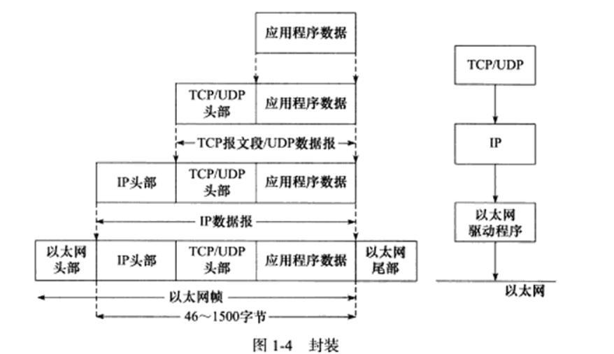
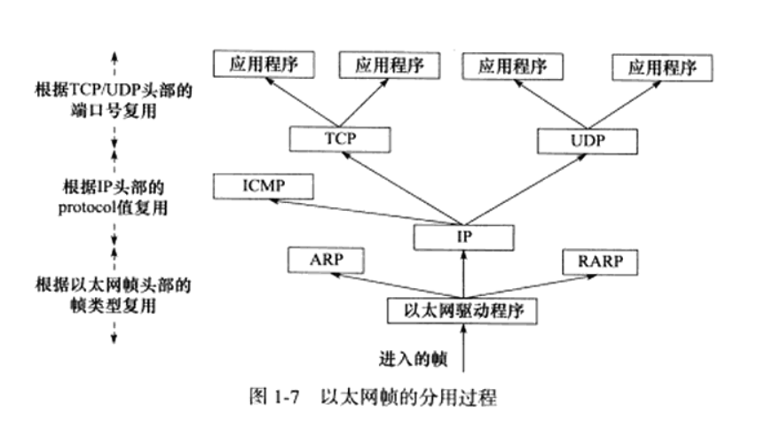
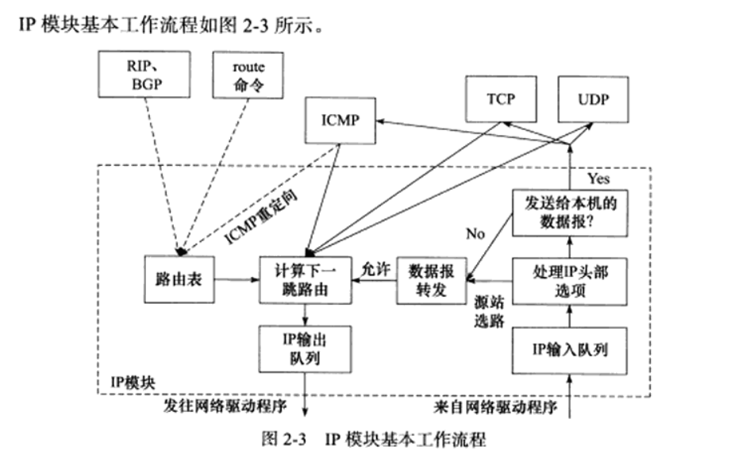
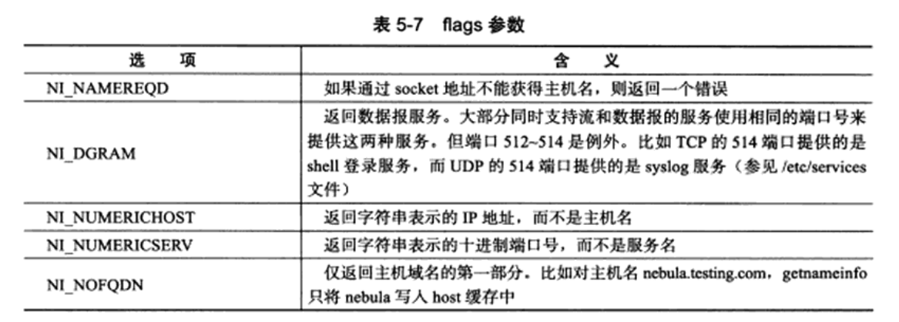
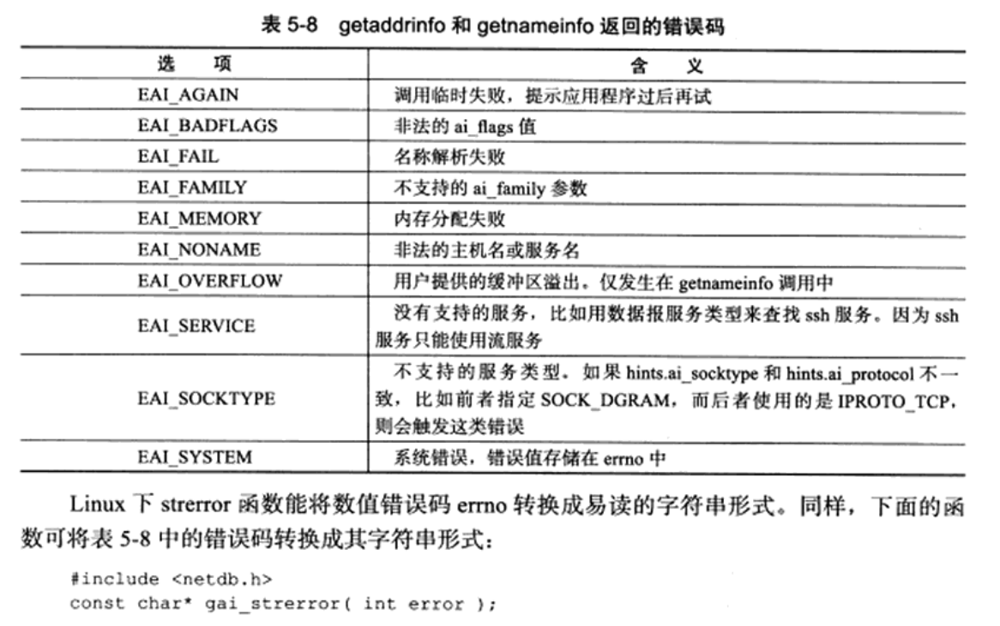

# 第1章	TCP/IP协议族

TCP/IP协议族是一个四层协议系统，自底而上分别是数据链路层、网络层、传输层和应用层。每一层完成不同的功能，且通过若干协议来实现，上层协议使用下层协议提供的服务，如图1-1所示。




## 数据链路层

数据链路层两个常用的协议是ARP协议(Address Resolve Protocol，地址解析协议）和RARP协议(Reverse Address Resolve Protocol，逆地址解析协议)。它们实现了IP地址和机器物理地址（通常是MAC地址，以太网、令牌环和802.11无线网络都使用MAC地址）之间的相互转换。

网络层使用IP地址寻址一台机器，而数据链路层使用物理地址寻址一台机器，因此网络层必须先将目标机器的IP地址转化成其物理地址，才能使用数据链路层提供的服务，这就是ARP协议的用途。RARP协议仅用于网络上的某些无盘工作站。因为缺乏存储设备，无盘工作站无法记住自己的IP地址，但它们可以利用网卡上的物理地址来向网络管理者（服务器或网络管理软件）查询自身的IP地址。运行RARP服务的网络管理者通常存有该网络上所有机器的物理地址到IP地址的映射。

## 网络层

网络层实现数据包的选路和转发。WAN (Wide Area Network，广域网）通常使用众多分级的路由器来连接分散的主机或LAN (Local Area Network，局域网)，因此，通信的两台主机一般不是直接相连的，而是通过多个中间节点（路由器）连接的。网络层的任务就是选择这些中间节点，以确定两台主机之间的通信路径。同时，网络层对上层协议隐藏了网络拓扑连接的细节，使得在传输层和网络应用程序看来，通信的双方是直接相连的。

网络层最核心的协议是IP协议（Internet Protocol，因特网协议)。IP协议根据数据包的目的IP地址来决定如何投递它。如果数据包不能直接发送给目标主机，那么IP协议就为它寻找一个合适的下一跳(next hop）路由器，并将数据包交付给该路由器来转发。多次重复这一过程，数据包最终到达目标主机，或者由于发送失败而被丢弃。可见，IP协议使用逐跳( hop by hop）的方式确定通信路径。

网络层另外一个重要的协议是ICMP协议(Internet Control Message Protocol，因特网控制报文协议)。它是IP协议的重要补充，主要用于检测网络连接。

需要指出的是，ICMP协议并非严格意义上的网络层协议，因为它使用处于同一层的IP协议提供的服务（一般来说，上层协议使用下层协议提供的服务)。

## 传输层

传输层为两台主机上的应用程序提供端到端(end to end）的通信。与网络层使用的逐跳通信方式不同，传输层只关心通信的起始端和目的端，而不在乎数据包的中转过程。图1-3展示了传输层和网络层的这种区别。




图1-3中，垂直的实线箭头表示TCP/IP协议族各层之间的实体通信（数据包确实是沿着这些线路传递的)，而水平的虚线箭头表示逻辑通信线路。该图中还附带描述了不同物理网络的连接方法。可见，数据链路层（驱动程序）封装了物理网络的电气细节；网络层封装了网络连接的细节；传输层则为应用程序封装了一条端到端的逻辑通信链路，它负责数据的收发、链路的超时重连等。

传输层协议主要有三个:TCP协议、UDP协议和SCTP协议。

TCP协议（Transmission Control Protocol，传输控制协议）为应用层提供可靠的、面向连接的和基于流〈 stream）的服务。TCP协议使用超时重传、数据确认等方式来确保数据包被正确地发送至目的端，因此TCP服务是可靠的。使用TCP协议通信的双方必须先建立TCP连接，并在内核中为该连接维持一些必要的数据结构，比如连接的状态、读写缓冲区,以及诸多定时器等。当通信结束时，双方必须关闭连接以释放这些内核数据。TCP服务是基于流的。基于流的数据没有边界（长度）限制，它源源不断地从通信的一端流入另一端。发送端可以逐个字节地向数据流中写人数据，接收端也可以逐个字节地将它们读出。

UDP协议(User Datagram Protocol，用户数据报协议）则与TCP协议完全相反，它为应用层提供不可靠、无连接和基于数据报的服务。“不可靠”意味着UDP协议无法保证数据从发送端正确地传送到目的端。如果数据在中途丢失，或者目的端通过数据校验发现数据错误而将其丢弃，则UDP协议只是简单地通知应用程序发送失败。因此，使用UDP协议的应用程序通常要自己处理数据确认、超时重传等逻辑。UDP协议是无连接的，即通信双方不保持一个长久的联系，因此应用程序每次发送数据都要明确指定接收端的地址（IP地址等信息)。基于数据报的服务，是相对基于流的服务而言的。每个UDP数据报都有一个长度，接收端必须以该长度为最小单位将其所有内容一次性读出，否则数据将被截断。

## 应用层

应用层负责处理应用程序的逻辑。数据链路层、网络层和传输层负责处理网络通信细节，这部分必须既稳定又高效，因此它们都在内核空间中实现，如图1-1所示。而应用层则在用户空间实现，因为它负责处理众多逻辑，比如文件传输、名称查询和网络管理等。如果应用层也在内核中实现，则会使内核变得非常庞大。当然，也有少数服务器程序是在内核中实现的，这样代码就无须在用户空间和内核空间来回切换（主要是数据的复制)，极大地提高了工作效率。不过这种代码实现起来较复杂，不够灵活，且不便于移植。

## 封装

上层协议是如何使用下层协议提供的服务的呢?其实这是通过封装（encapsulation）实现的。应用程序数据在发送到物理网络上之前，将沿着协议栈从上往下依次传递。每层协议都将在上层数据的基础上加上自己的头部信息（有时还包括尾部信息)，以实现该层的功能,这个过程就称为封装，如图1-4所示。





帧才是最终在物理网络上传送的字节序列。

## 分用

当帧到达目的主机时，将沿着协议栈自底向上依次传递。各层协议依次处理帧中本层负责的头部数据，以获取所需的信息，并最终将处理后的帧交给目标应用程序。这个过程称为分用(demultiplexing)。分用是依靠头部信息中的类型字段实现的。标准文档RFC 1700定义了所有标识上层协议的类型字段以及每个上层协议对应的数值。图1-7显示了以太网帧的分用过程。





因为IP协议、ARP协议和RARP协议都使用帧传输数据，所以帧的头部需要提供某个字段（具体情况取决于帧的类型）来区分它们。以以太网帧为例，它使用2字节的类型字段来标识上层协议（见图1-6)。如果主机接收到的以太网帧类型字段的值为0x800，则帧的数据部分为IP数据报（见图1-4)，以太网驱动程序就将帧交付给IP模块﹔若类型字段的值为0x806，则帧的数据部分为ARP请求或应答报文，以太网驱动程序就将帧交付给ARP模块;若类型字段的值为0x835，则帧的数据部分为RARP请求或应答报文，以太网驱动程序就将帧交付给RARP模块。

同样，因为ICMP 协议、TCP协议和UDP协议都使用IP协议，所以IP数据报的头部采用16位的协议（protocol）字段来区分它们。

TCP报文段和UDP数据报则通过其头部中的16位的端口号(port number）字段来区分上层应用程序。比如 DNS协议对应的端口号是53，HTTP协议（Hyper-Text TransferProtocol，超文本传送协议）对应的端口号是80。所有知名应用层协议使用的端口号都可在letcl/services 文件中找到。

帧通过上述分用步骤后，最终将封装前的原始数据送至目标服务（图1-7中的ARP服务、RARP服务、ICMP服务或者应用程序)。这样，在顶层目标服务看来，封装和分用似乎没有发生过。

## Linux下访问DNS服务

我们要访问DNS服务，就必须先知道DNS服务器的IP地址。Linux使用/etc/reso1conf文件来存放DNS服务器的IP地址。机器ernest-laptop上，该文件的内容如下:
`#Generated by Network Manager`
`nameserver 219.239.26.42`
`narmeserver 124.207.160.106`
其中的两个IP地址分别是首选 DNS服务器地址和备选DNS服务器地址。文件中的注释语句“Generated by Network Manager”告诉我们，这两个DNS服务器地址是由网络管理程序写入的。
Linux 下一个常用的访问DNS服务器的客户端程序是host，比如下面的命令是向首选DNS服务器219.239.26.42查询机器`www.baidu.com`的IP地址:

```
xiaohuilin@Ubuntu:~$ host -t A www.baidu.com
www.baidu.com is an alias for www.a.shifen.com.
www.a.shifen.com has address 14.119.104.254
www.a.shifen.com has address 14.119.104.189
```

host命令的输出告诉我们，机器名`www.baidu.com`是`www.a.shifen.com`的别名，并且该机器名对应两个IP地址。host命令使用DNS协议和DNS服务器通信，其-t选项告诉DNS 协议使用哪种查询类型。我们这里使用的是A类型，即通过机器的域名获得其IP地址(但实际上返回的资源记录中还包含机器的别名)。关于host命令的详细使用方法，请参考其man手册。

# 第2章 IP协议详解

## IP服务特点

IP协议是TCP/IP协议族的动力，它为上层协议提供无状态、无连接、不可靠的服务。

无状态（ stateless）是指IP通信双方不同步传输数据的状态信息，因此所有IP数据报的发送、传输和接收都是相互独立、没有上下文关系的。这种服务最大的缺点是无法处理乱序和重复的IP数据报。比如发送端发送出的第N个IP数据报可能比第N+1个IP数据报后到达接收端，而同一个IP数据报也可能经过不同的路径多次到达接收端。在这两种情况下，接收端的IP模块无法检测到乱序和重复，因为这些IP数据报之间没有任何上下文关系。接收端的P模块只要收到了完整的IP数据报（如果是IP分片的话，IP模块将先执行重组)，就将其数据部分（TCP报文段、UDP数据报或者ICMP报文）上交给上层协议。那么从上层协议来看，这些数据就可能是乱序的、重复的。面向连接的协议，比如TCP协议，则能够自己处理乱序的、重复的报文段，它递交给上层协议的内容绝对是有序的、正确的。

虽然IP数据报头部提供了一个标识字段（见后文）用以唯一标识一个IP数据报，但它是被用来处理IP分片和重组的，而不是用来指示接收顺序的。

无状态服务的优点也很明显:简单、高效。我们无须为保持通信的状态而分配一些内核资源，也无须每次传输数据时都携带状态信息。在网络协议中，无状态是很常见的，比如UDP协议和HTTP协议都是无状态协议。以HTTP协议为例，一个浏览器的连续两次网页请求之间没有任何关联，它们将被Web 服务器独立地处理。

无连接(connectionless）是指IP通信双方都不长久地维持对方的任何信息。这样，上层协议每次发送数据的时候，都必须明确指定对方的IP地址。

不可靠是指IP协议不能保证IP数据报准确地到达接收端，它只是承诺尽最大努力(best effort)。很多种情况都能导致IP数据报发送失败。比如，某个中转路由器发现IP数据报在网络上存活的时间太长（根据IP数据报头部字段TTL判断，见后文)，那么它将丢弃之，并返回一个ICMP错误消息（超时错误）给发送端。又比如，接收端发现收到的IP数据报不正确（通过校验机制)，它也将丢弃之，并返回一个ICMP错误消息（IP头部参数错误)给发送端。无论哪种情况，发送端的IP模块一旦检测到IP数据报发送失败，就通知上层协议发送失败，而不会试图重传。因此，使用IP服务的上层协议（比如TCP协议）需要自己实现数据确认、超时重传等机制以达到可靠传输的目的。

## IP路由





我们从右往左来分析图2-3。当IP模块接收到来自数据链路层的IP数据报时，它首先对该数据报的头部做CRC校验，确认无误之后就分析其头部的具体信息。

如果该IP数据报的头部设置了源站选路选项（松散源路由选择或严格源路由选择)，则IP模块调用数据报转发子模块来处理该数据报。如果该IP数据报的头部中目标IP地址是本机的某个IP地址，或者是广播地址，即该数据报是发送给本机的，则IP模块就根据数据报头部中的协议字段来决定将它派发给哪个上层应用（分用)。如果IP模块发现这个数据报不是发送给本机的，则也调用数据报转发子模块来处理该数据报。

数据报转发子模块将首先检测系统是否允许转发，如果不允许,IP模块就将数据报丢弃。如果允许，数据报转发子模块将对该数据报执行一些操作，然后将它交给IP数据报输出子模块。我们将在后面讨论数据报转发的具体过程。

IP数据报应该发送至哪个下一跳路由（或者目标机器)，以及经过哪个网卡来发送，就是P路由过程，即图2-3中“计算下一跳路由”子模块。IP模块实现数据报路由的核心数据结构是路由表。这个表按照数据报的目标IP地址分类，同一类型的IP数据报将被发往相同的下一跳路由器（或者目标机器)。我们将在后面讨论IP路由过程。

IP输出队列中存放的是所有等待发送的IP数据报，其中除了需要转发的IP数据报外，还包括封装了本机上层数据（ICMP报文、TCP报文段和UDP数据报）的IP数据报。

图2-3中的虚线箭头显示了路由表更新的过程。这一过程是指通过路由协议或者route命令调整路由表，使之更适应最新的网络拓扑结构，称为IP路由策略。

## IP转发

对于允许IP数据报转发的系统（主机或路由器)，数据报转发子模块将对期望转发的数据报执行如下操作:
1）检查数据报头部的TTL值。如果 TTL值已经是0，则丢弃该数据报。
2〉查看数据报头部的严格源路由选择选项。如果该选项被设置，则检测数据报的目标IP地址是否是本机的某个IP地址。如果不是，则发送一个ICMP源站选路失败报文给发送端。
3）如果有必要，则给源端发送一个ICMP重定向报文，以告诉它一个更合理的下一跳路由器。
4）将TTL值减1。

5）处理IP头部选项。
6）如果有必要，则执行IP分片操作。

## 重定向




## IPv6

IPv6协议是网络层技术发展的必然趋势。它不仅解决了IPv4地址不够用的问题，还做了很大的改进。比如，增加了多播和流的功能，为网络上多媒体内容的质量提供精细的控制;引入自动配置功能，使得局域网管理更方便﹔增加了专门的网络安全功能等。

注意:IPv6协议并不是IPv4协议的简单扩展，而是完全独立的协议。用以太网帧封装的IPv6数据报和IPv4数据报具有不同的类型值。第1章提到，IPv4数据报的以太网帧封装类型值是0x800，而IPv6数据报的以太网帧封装类型值是0x86dd (见RFC2464)。

# 第5章

## 带外标记

在实际应用中，我们通常无法预期带外数据何时到来。好在 Linux内核检测到TCP紧急标志时，将通知应用程序有带外数据需要接收。内核通知应用程序带外数据到达的两种常见方式是:IO复用产生的异常事件和SIGURG信号。但是，即使应用程序得到了有带外数据需要接收的通知，还需要知道带外数据在数据流中的具体位置，才能准确接收带外数据。这一点可通过如下系统调用实现:
`#include <sys / socket.h>`
`int sockatmark (int sockfd ) ;`
sockatmark 判断sockfd是否处于带外标记，即下一个被读取到的数据是否是带外数据。如果是，sockatmark返回1，此时我们就可以利用带MSG_OOB标志的recv调用来接收带外数据。如果不是，则sockatmark返回0。

## 地址信息函数

在某些情况下，我们想知道一个连接socket的本端socket地址，以及远端的socket地址。下面这两个函数正是用于解决这个问题:

```
#include <sysl/socket.h>
int getsockname( int sockfd，struct sockaddr* address，socklen_t* address_len );
int getpeername( int sockfd，struct sockaddr* address，socklen_t* address_len );
```

getsockname获取sockfd对应的本端socket地址，并将其存储于address参数指定的内存中，该socket地址的长度则存储于address_len参数指向的变量中。如果实际socket地址的长度大于address所指内存区的大小，那么该socket地址将被截断。getsockname成功时返回0，失败返回-1并设置errno。

getpeername获取sockfd对应的远端socket地址，其参数及返回值的含义与getsockname的参数及返回值相同。

## socket选项

如果说fcntl系统调用是控制文件描述符属性的通用POSIX方法，那么下面两个系统调用则是专门用来读取和设置socket文件描述符属性的方法:

```
include <sys/ socket.h>
int getsockopt ( int sockfd，int level， int option_name，void* option_value,socklen_t* restrict option_len ) ;
int setsockopt ( int sockfd， int level, int option_name，const void* option_value, socklen_t option_len ) ;
```

sockfd参数指定被操作的目标 socket。level参数指定要操作哪个协议的选项（即属性),比如IPv4、IPv6、TCP等。option_name参数则指定选项的名字。




getsockopt和 setsockopt这两个函数成功时返回0，失败时返回-1并设置errno.

值得指出的是，对服务器而言，有部分socket选项只能在调用listen系统调用前针对监听socket（确切地说，socket在执行listen调用前是不能称为监听socket的，此处是指将执行listen调用的sockete）设置才有效。这是因为连接socket只能由accept调用返回，而accept 从 listen监听队列中接受的连接至少已经完成了TC三次握手的前两个步骤（因为listen监听队列中的连接至少已进入SYN_RCVD状态)，这说明服务器已经往被接受连接上发送出了TCP同步报文段。但有的socket选项却应该在TCP同步报文段中设置，比如TCP最大报文段选项。对这种情况，Linux给开发人员提供的解决方案是:对监听socket设置这些socket选项那么accept返回的连接socket将自动继承这些选项。

## 网络信息API

### gethostbyname和gethostbyaddr

gethostbyname函数根据主机名称获取主机的完整信息，gethostbyaddr 函数根据IP地址获取主机的完整信息。gethostbyname函数通常先在本地的/etc/hosts 配置文件中食找主机，如果没有找到，再去访问 DNS服务器。这些在前面章节中都讨论过。这两个函数的定义如下:

```
#include <netdb.h>
struct hostent* gethostbyname ( const char* name ) ;
struct hostent* gethostbyaddr( const void* addr，size_t len，int type );
```

name参数指定目标主机的主机名，addr参数指定目标主机的IP地址，len参数指定addr所指IP地址的长度，type参数指定addr所指IP地址的类型，其合法取值包括AF_INET（用于IPv4地址）和AF_INET6（用于IPv6地址)。
这两个函数返回的都是hostent结构体类型的指针，hostent结构体的定义如下:

```
include <netdb.h>
struct hostent
{
    char* h_name;			 /*主机名*/
    char** h_aliases;		 /*主机别名列表，可能有多个* /
    int h_addrtype;			 / *地址类型（地址族)*/
    int h_length;			 /*地址长度*/
    char** h_addr_list    	 /*按网络字节序列出的主机IР地址列表* /
) ;
```

### getservbyname和getservbyport

getservbyname函数根据名称获取某个服务的完整信息，getservbyport函数根据端口号获取某个服务的完整信息。它们实际上都是通过读取letc/services文件来获取服务的信息的。这两个函数的定义如下:

```
#include <netdb.h>
struct servent* getservbyname ( const char* name，const char* proto );
struct servent* getservbyport( int port,const char* proto );
```

name参数指定目标服务的名字，port参数指定目标服务对应的端口号。proto参数指定服务类型，给它传递“tcp”表示获取流服务，给它传递“udp”表示获取数据报服务，给它传递NULL则表示获取所有类型的服务。
这两个函数返回的都是servent结构体类型的指针，结构体servent的定义如下:

```
#include <netdb.h>
struct servent
{
    char* s_name;	/*服务名称*/
    char** s_aliases;/*服务的别名列表，可能有多个*/
    int s_port;		 /*端口号*/
    char* s_proto;   /*服务类型，通常是tcp或者udp * /
} ;
```

需要指出的是，上面讨论的4个函数都是不可重入的，即非线程安全的。不过netdb.h头文件给出了它们的可重入版本。正如Linux下所有其他函数的可重入版本的命名规则那样，这些函数的函数名是在原函数名尾部加上_r (re-entrant)。

可重入函数是设计用于多线程环境的函数，它们通过使用线程本地存储（Thread Local Storage，TLS）等技术来确保在并发执行的情况下保持数据的一致性和线程安全性。与非可重入函数相比，可重入函数在多线程环境下更加安全，因为它们不会共享全局变量或静态变量。

### getaddrinfo

gctaddrinfo函数既能通过主机名获得IP地址（内部使用的是gethostbyname
也能通过服务名获得端口号（内部使用的是getservbyname函数)。它是否可重入取决于其内部调用的 gethostbyname和 getservbyname 函数是否是它们的可重入版本。该函数的定义如下:

```
include <netdb.h>
int getaddrinfo( const char* hostname，const char* service,const struct addrinfo* hints, struct addrinfo** result ) ;
```

hostname参数可以接受主机名，也可以接受字符串表示的IP地址（IPv4采用点分十进制字符串，IPv6采用十六进制字符串）。同样,service参数可以接收服务名，也可以接受字符串表示的十进制端口号。hints参数是应用程序给getaddrinfo的一个提示，以对getaddrinfo的输出进行更精确的控制。hints参数可以被设置为NULL，表示允许getaddrinfo反馈任何可用的结果。result参数指向一个链表，该链表用于存储getaddrinfo反馈的结果。
getaddrinfo反馈的每一条结果都是addrinfo结构体类型的对象，结构体addrinfo的定义如下:

```
struct addrinfo
{
    int ai_flags;/*见后文*/
    
    int ai_family; /*地址族*/
   
    int ai_socktype; /*服务类型，socK_STREAM或SOCK_DGRAM* /
   
    int ai_protocol; /*见后文*/
   
    socklen_tai_addrlen;/*socket地址ai_addr的长度*/
    
    char* ai_canonname;/*主机的别名*/
    
    struct sockaddr* ai_addr; /* 指向socket地址*/
   
    struct addrinfo* ai_next;/* 指向下一个sockinfo结构的对象*/
    
};
```

该结构体中，ai protocol成员是指具体的网络协议，其含义和socket系统调用的第三个参数相同，它通常被设置为0。

当我们使用hints参数的时候，可以设置其ai_flags，ai_family，ai_socktype和ai_protocol四个字段，其他字段则必须被设置为NULL。




从代码清单5-13中我们能分析出，getaddrinfo将隐式地分配堆内存（可以通过valgrind等工具查看)，因为res指针原本是没有指向一块合法内存的，所以，getaddrinfo调用结束后，我们必须使用如下配对函数来释放这块内存:
`#include <netdb.h>`
`void freeaddrinfo ( struct addrinfo*res ) ;`

### getnameinfo

getnameinfo函数能通过socket地址同时获得以字符串表示的主机名（内部使用的是gethostbyaddr函数）和服务名（内部使用的是getservbyport函数)。它是否可重入取决于其内部调用的gethostbyaddr和 getservbyport函数是否是它们的可重入版本。该函数的定义如下:
`#include <netdb.h>`
`int getnameinfo( const struct sockaddr* sockaddr，socklen_t addrlen，char*`
`host,socklen_t hostlen，char* serv,socklen_t servlen，int flags );`
getnameinfo将返回的主机名存储在host参数指向的缓存中，将服务名存储在serv参数指向的缓存中，hostlen和 servlen参数分别指定这两块缓存的长度。flags参数控制getnameinfo的行为，它可以接收表5-7中的选项。





getaddrinfo和 getnameinfo函数成功时返回0，失败则返回错误码，可能的错误码如表5-8所示。




