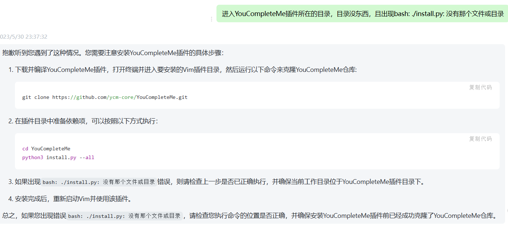
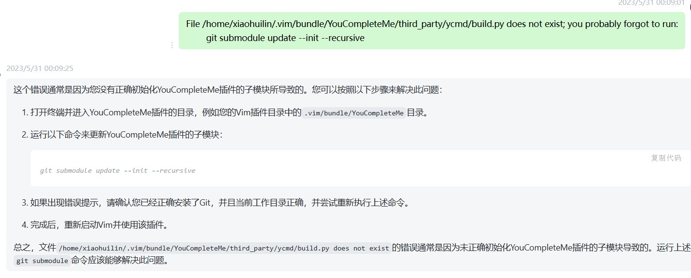
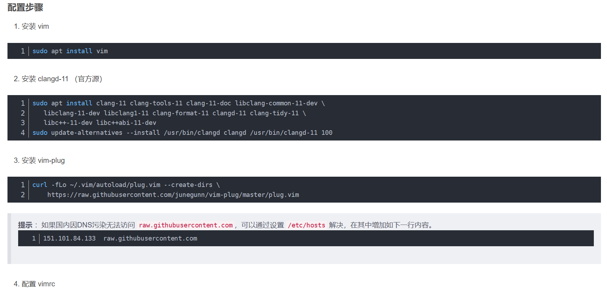







总之语法补全我用的是YouCompleteMe，通过插件管理器Vundle来进行安装，需要先git,再正确初始化YouCompleteMe插件的子模块

安装 YouCompleteMe（ycm）插件需要使用 Clang 编译器及其相关组件，因为 ycm 的自动补全和语义分析功能都是基于 Clang 提供的编译器前端实现的。具体来说，ycm 依赖以下的软件/库：

- Python 解释器和开发工具包
- Clang 编译器和其相关组件：Libclang、Clangd 等
- CMake 构建工具
- LLVM 代码生成框架

因此，在安装 YouCompleteMe 插件之前，您需要先安装上述软件/库，并确保它们能够正常工作。此外，YouCompleteMe 更支持直接使用系统自带的 Clang，不需要单独安装。





如果你需要配置vim，只需在Home目录创建一个**~/.vimrc**文件即可以配置vim了，如需安装插件，在~/.vim目录下创建一个bundle文件夹，插件装在里面。我通过Vundle管理插件，这里YouCompleteMe插件需要前面的git，无法直接安装。

```
YouCompleteMe是一个基于Python编写的Vim自动补全插件，它需要使用C++编译器和Python 3.x运行时才能正常工作。这是因为插件的代码本身是使用C++编写的，但是它需要使用Python来启动和管理插件进程，并在后台执行代码分析等任务。

具体来说，ycm 依赖以下的软件/库：

Python 解释器和开发工具包
Clang 编译器和其相关组件：Libclang、Clangd 等
CMake 构建工具
LLVM 代码生成框架
因此，在安装 YouCompleteMe 插件之前，您需要先安装上述软件/库，并确保它们能够正常工作。此外，YouCompleteMe 更支持直接使用系统自带的 Clang，不需要单独安装。
```

```
CMake 是一款独立的构建工具，并不是一个命令行工具，因此您需要在 CMakeLists.txt 文件中定义项目的配置、编译规则和安装步骤等。一般情况下，在终端中运行 cmake 命令来生成对应平台的 Makefile 或 IDE 项目文件，然后使用 make 或者 Visual Studio 等工具来实际编译执行。

以下是你可以在终端中使用的常用 CMake 命令：

cmake: 根据当前目录下的 CMakeLists.txt 文件生成 makefiles 或 IDE 项目文件；
cmake-gui: 使用 GUI 界面进行配置和生成构建系统（Windows 和 macOS）；
cmake --build: 调用底层构建系统（如 make 或 Visual Studio）来编译项目；
cmake --install: 安装构建好的程序或库到指定的位置；
ctest: 运行测试套件并输出测试结果；
cpack: 将已构建好的项目打包成单个、可移植的二进制发行版。
需要注意的是，上述命令中的参数和具体用法可能会因不同的项目而有所区别，请根据具体文档来参考使用。
```

```
这个错误提示意味着您的电脑没有安装CMake或者CMake可执行文件的路径没有加入到系统环境变量中。请按照以下步骤来解决此问题：

如果您没有安装CMake，请先安装最新版的CMake。您可以在Linux上使用包管理器，在终端输入以下命令：

sudo apt-get update
sudo apt-get install cmake
如果您使用的是其他操作系统，请参考相关文档安装CMake。

确认CMake是否已经添加到系统环境变量中。如果没有，请将CMake的可执行文件路径添加到环境变量中，方法如下：

在终端中运行以下命令打开.bashrc或.zshrc文件编辑器：

vim ~/.bashrc # 或者vim ~/.zshrc（取决于您使用的shell）
将以下内容添加到文件末尾，并保存退出：

export PATH="$PATH:/path/to/cmake/bin"
运行以下命令使更改生效：

source ~/.bashrc # 或者source ~/.zshrc
注意替换/path/to/cmake/bin为您自己的CMake可执行文件路径。

再次执行构建YouCompleteMe插件的命令，并添加--verbose参数以获取更详细的错误信息：

/usr/bin/python3 /home/xiaohuilin/.vim/bundle/YouCompleteMe/third_party/ycmd/build.py --clang-completer --verbose
总之，以上步骤可以帮助您解决在Linux上构建YouCompleteMe插件时遇到的CMake可执行文件未找到问题。
```

**总之问题注意有些插件需要去git仓库**

```
NoExtraConfDetected:No.ycm_extra_conf.py file detected,so no compile flags are available.Thus no semantic support for c/c++/objcc++.GoREAD THE DOCS *NOW*,DON'T file a bug report


这是 YouCompleteMe 编辑器插件在寻找编译器标志文件时的一种提示。YouCompleteMe 是一个为多种编辑器准备的自动补全和语义补充工具，其中包含对 C/C++/Objective-C 等语言的支持，并可以通过指定编译标志来提供更高级别的语法分析和代码补全功能。

上述错误信息表明 YouCompleteMe 没有找到名为 ycm_extra_conf.py 的配置文件，因而无法获得程序的编译标志等元数据信息，从而无法提供 C/C++/Objective-C 的地道补全、跳转等方面的支持。

要解决这个问题，你需要按照 YouCompleteMe 的文档说明中所讲述的，在当前项目根目录下建立名为 ycm_extra_conf.py 的文件，并进行适当的配置修改或编写，以便可以向 YouCompleteMe 提供关于项目代码及编译环境的相关信息。如果还有问题，请参考官方文档或联系相关技术支持。
```

```
没有这个就无法判断头文件吗


并非如此。即使没有 ycm_extra_conf.py 文件，YouCompleteMe 也能大概率猜测出头文件的位置。不过在这种情况下，YouCompleteMe 无法准确知道要使用哪些编译选项和库依赖关系，这可能会导致代码补全、错误提示等功能出现误报或不生效。

如果您不想手动编写 ycm_extra_conf.py 文件，也可以尝试通过其它方式来提供项目信息。比如使用 CMake 来生成 Makefile 或者 IDEA 项目文件，并配置好编译选项；或者按照 YouCompleteMe 的文档指导，手动在配置文件中为每个文件类型设置编译器标志和头文件搜索路径等信息。这取决于具体的开发环境和工具链。
```

```
是的，按照 YouCompleteMe 的要求，在当前项目根目录下创建名为 ycm_extra_conf.py 的文件，并根据实际需要进行配置。

以 C++ 项目为例，可以在 ycm_extra_conf.py 文件中添加如下代码来提供编译器标志。这里假设编译器为 GCC 或 Clang，并且项目包含了多个源码文件和框架库：


import os

# 编译器路径（可选）
# 如果没有安装系统默认编译器，则需要手动指定路径
# os.environ['CC'] = '/usr/bin/clang'
# os.environ['CXX'] = '/usr/bin/clang++'

# 全局通用编译器标志
flags = [
    '-Wall',
    '-Wextra',
    # 更多需要的标志
]

# 针对不同文件类型设置不同的编译器标志和头文件搜索路径
def Settings(**kwargs):
  if kwargs['language'] == 'cfamily':
    filename = kwargs['filename']
    ext = os.path.splitext(filename)[1]

    # 源码文件
    if ext in ['.c', '.cpp', '.cxx']:
        return {
            'flags': flags + [
                '-std=c++17',   # 或其它版本
                # 可针对特定文件设置标志
            ],
            'include_paths_relative_to_dir': './',
        }
        
    # 框架库头文件
    elif ext in ['.h', '.hpp']:
        return {
            'flags': flags,
            'include_paths_relative_to_dir': './',
        }

  return {}
在配置好 ycm_extra_conf.py 文件后，重新加载编辑器插件或重新打开文件即可。YouCompleteMe 将会根据该文件中的设置来提供适当的代码补全和提示等功能。需要注意的是不同插件有可能采用不同的标志格式和语法。上述代码仅为示例，并不代表全部情况。具体语法和参数请参看相应插件的文档。
```

