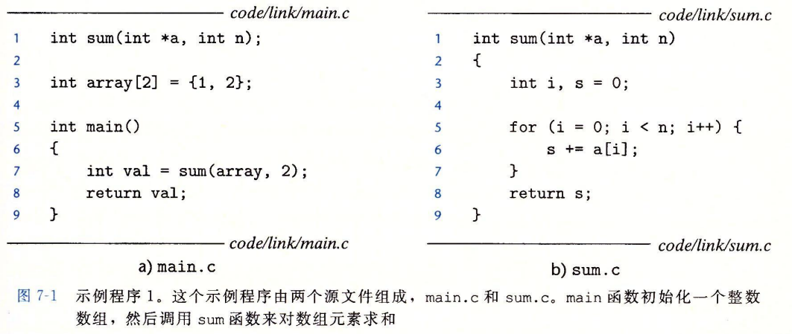
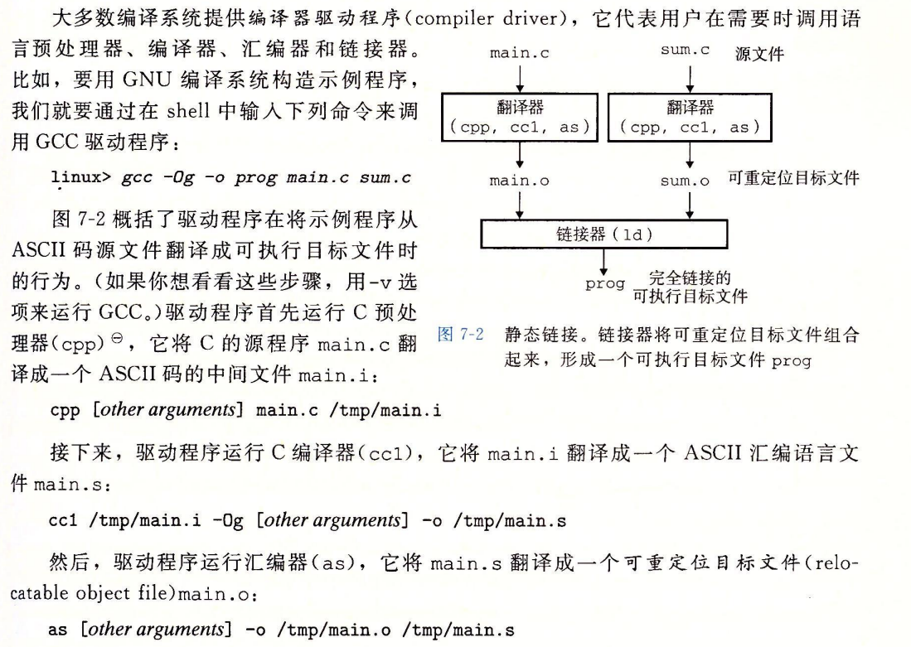

## 编译器驱动程序

考虑图7-1中的C语言程序。它将作为贯穿本章的一个小的运行示例，帮助我们说明关于链接是如何工作的一些重要知识点。





驱动程序经过相同的过程生成sum.o。最后，它运行链接器程序ld，将main.o和sum.o以及一些必要的系统目标文件组合起来，创建一个可执行目标文件(executable ob-ject file)prog:
`ld -o prog [system object files and args]  /tmp/main.o /tmp/sum.o`
要运行可执行文件 prog，我们在Linux shell的命令行上输入它的名字:

linux> ./prog

shell调用操作系统中一个叫做加载器(loader)的函数，它将可执行文件prog中的代码和数据复制到内存，然后将控制转移到这个程序的开头。

## 静态链接

像Linux LD程序这样的静态链接器(static linker)以一组可重定位目标文件和命令行参数作为输入，生成一个完全链接的、可以加载和运行的可执行目标文件作为输出。输入的可重定位目标文件由各种不同的代码和数据节(section)组成，每一节都是一个连续的字节序列。指令在一节中，初始化了的全局变量在另一节中，而未初始化的变量又在另外一节中。

为了构造可执行文件，链接器必须完成两个主要任务:

- 符号解析(symbol resolution)。目标文件定义和引用符号，每个符号对应于一个函数、一个全局变量或一个静态变量(即C语言中任何以static属性声明的变量)。符号解析的目的是将每个符号引用正好和一个符号定义关联起来。
- 重定位(relocation)。编译器和汇编器生成从地址0开始的代码和数据节。链接器通过把每个符号定义与一个内存位置关联起来，从而重定位这些节，然后修改所有对这些符号的引用，使得它们指向这个内存位置。链接器使用汇编器产生的重定位条目(relocation entry)的详细指令，不加甄别地执行这样的重定位。

## 目标文件

目标文件有三种形式:

- 可重定位目标文件。包含二进制代码和数据，其形式可以在编译时与其他可重定位目标文件合并起来，创建一个可执行目标文件。
- 可执行目标文件。包含二进制代码和数据，其形式可以被直接复制到内存并执行。
- 共享目标文件。一种特殊类型的可重定位目标文件，可以在加载或者运行时被动态地加载进内存并链接。

编译器和汇编器生成可重定位目标文件(包括共享目标文件)。链接器生成可执行目标文件。从技术上来说，一个目标模块(object module)就是一个字节序列，而一个目标文件(ob-ject file)就是一个以文件形式存放在磁盘中的目标模块。不过，我们会互换地使用这些术语。

目标文件是按照特定的目标文件格式来组织的，各个系统的目标文件格式都不相同。

从贝尔实验室诞生的第一个Unix系统使用的是 a.out格式(直到今天，可执行文件仍然称为a.out 文件)。Windows使用可移植可执行(Portable Executable，PE)格式。MacOS-X使用Mach-O格式。现代x86-64 Linux和Unix系统使用可执行可链接格式(Execut-able and Linkable Format，ELF)。尽管我们的讨论集中在ELF上，但是不管是哪种格式，基本的概念是相似的。


