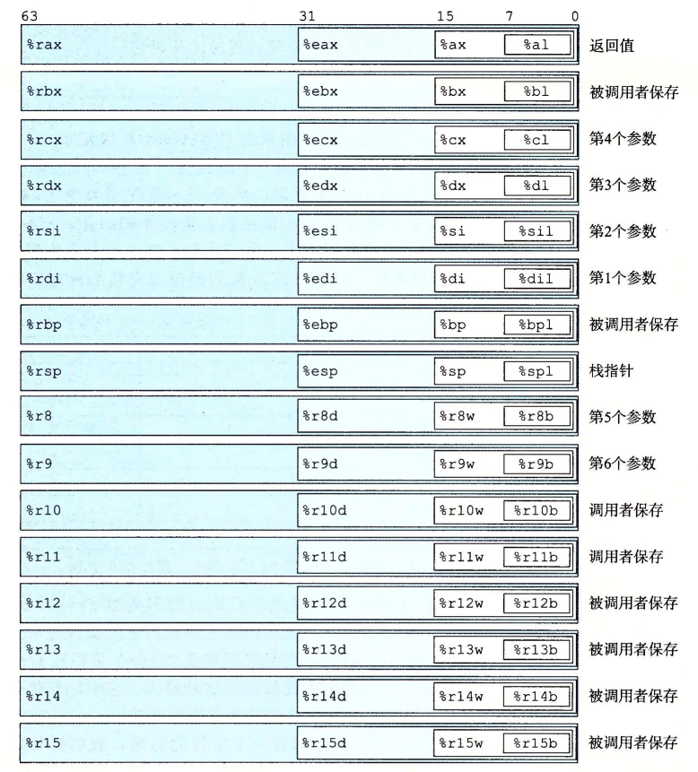
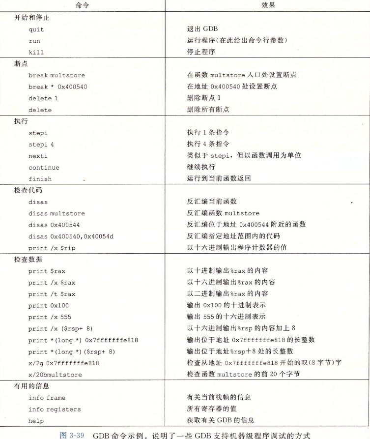
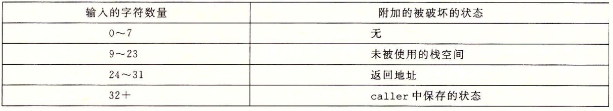
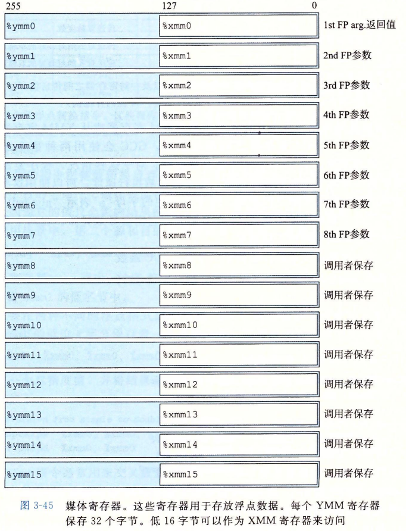

# 第3章程序的机器级表示

## 程序编码

其中一些关于机器代码和它的反汇编表示的特性值得注意:

- x86-64的指令长度从1到15个字节不等。常用的指令以及操作数较少的指令所需的字节数少，而那些不太常用或操作数较多的指令所需字节数较多。
- 设计指令格式的方式是，从某个给定位置开始，可以将字节唯一地解码成机器指令。例如，只有指令pushq %rbx是以字节值53开头的。
- 反汇编器只是基于机器代码文件中的字节序列来确定汇编代码。它不需要访问该程序的源代码或汇编代码。
- 反汇编器使用的指令命名规则与GCC生成的汇编代码使用的有些细微的差别。在我们的示例中，它省略了很多指令结尾的‘q’。这些后缀是大小指示符，在大多数情况中可以省略。相反，反汇编器给call和ret 指令添加了‘q'后缀，同样，省略这些后缀也没有问题。

虽然C编译器在把程序中表达的计算转换到机器代码方面表现出色，但是仍然有一些机器特性是C程序访问不到的。例如，每次 x86-64处理器执行算术或逻辑运算时，如果得到的运算结果的低8位中有偶数个1，那么就会把一个名为PF的1位条件码(condition code)标志设置为1，否则就设置为0。这里的PF表示“parity flag(奇偶标志)”。在C语言中计算这个信息需要至少7次移位、掩码和异或运算。即使作为每次算术或逻辑运算的一部分，硬件都完成了这项计算，而C程序却无法知道PF条件码标志的值。在程序中插入几条汇编代码指令就能很容易地完成这项任务。

在C程序中插入汇编代码有两种方法。第一种是，我们可以编写完整的函数，放进一个独立的汇编代码文件中，让汇编器和链接器把它和用C语言书写的代码合并起来。第二种方法是，我们可以使用GCC的内联汇编(inline assembly)特性，用asm伪指令可以在C程序中包含简短的汇编代码。这种方法的好处是减少了与机器相关的代码量。

当然，在C程序中包含汇编代码使得这些代码与某类特殊的机器相关(例如x86-64)，所以只应该在想要的特性只能以此种方式才能访问到时才使用它。

## 数据格式

由于是从16位体系结构扩展成32位的，Intel用术语“字(word)”表示16位数据类型。因此，称32位数为“双字(double words)”，称64位数为“四字(quad words)”。C语言基本数据类型对应的x86-64表示。标准int值存储为双字(32位)。指针(在此用char *表示)存储为8字节的四字，64位机器本来就预期如此。

| C声明  | Intel数据类型 | 汇编代码后缀 | 大小(字节) |
| ------ | ------------- | ------------ | ---------- |
| char   | 字节          | b            | 1          |
| short  | 字            | w            | 2          |
| int    | 双字          | l            | 4          |
| long   | 四字          | q            | 8          |
| char*  | 四字          | q            | 8          |
| float  | 单精度        | s            | 4          |
| double | 双精度        | l            | 8          |


## 访问信息






### 数据传送指令

MOV指令源和目的类型的组合。记住，**第一个是源操作数，第二个是目的操作数。**

源操作数指定的值是一个立即数，存储在寄存器中或者内存中。目的操作数指定一个位置，要么是一个寄存器或者，要么是一个内存地址。

寄存器部分的大小必须与指令最后一个字符(‘b'，‘w'，‘1'或‘q')指定的大小匹配。大多数情况中，MOV指令只会更新目的操作数指定的那些寄存器字节或内存位置。唯一的例外是movl指令以寄存器作为目的时，它会把该寄存器的高位4字节设置为0。造成这个例外的原因是x86-64采用的惯例，即任何为寄存器生成32位值的指令都会把该寄存器的高位部分置成0。

常规的movq指令只能以表示为32位补码数字的立即数作为源操作数，然后把这个值符号扩展得到64位的值，放到目的位置。movabsq指令能够以任意64位立即数值作为源操作数，并且只能以寄存器作为目的。

所有这些指令都把数据从源(在寄存器或内存中)复制到目的寄存器。MOVZ类中的指令把目的中剩余的字节填充为0，而MOVS类中的指令通过符号扩展来填充，把源操作的最高位进行复制。可以观察到，每条指令名字的最后两个字符都是大小指示符:第一个字符指定源的大小，而第二个指明目的的大小。

**局部变量通常是保存在寄存器中**，而不是内存中。访问寄存器比访问内存要快得多。

## 算术和逻辑操作

### 加载有效地址

加载有效地址(load effective address)指令leaq实际上是movq指令的变形。它的指令形式是从内存读数据到寄存器，但实际上它根本就没有引用内存。它的第一个操作数看上去是一个内存引用，但该指令并不是从指定的位置读人数据，而是将有效地址写入到目的操作数。

### 二元操作

二元操作，其中，第二个操作数既是源又是目的。这种语法让人想起C语言中的赋值运算符，例如x-=y。不过，要注意，源操作数是第一-个，目的操作数是第二个,对于不可交换操作来说，这看上去很奇特。例如，指令`subq %rax,%rdx`使寄存器%rdx的值减去%rax中的值。(将指令解读成“从%rdx中减去%rax”会有所帮助。)第一个操作数可以是立即数、寄存器或是内存位置。第二个操作数可以是**寄存器或是内存位置**。注意,当第二个操作数为内存地址(如果是寄存器地址加操作数格式则表示内存位置)时，处理器必须从内存读出值，执行操作，再把结果写回内存。

通常，编译器产生的代码中，会用一个寄存器存放多个程序值，还会在寄存器之间传送程序值。

```
xorq %rdx, %rdx
```

但是在产生这段汇编代码的 C 代码中，并没有出现 EXCLUSIVE-OR 操作。

A. 解释这条特殊的 EXCLUSIVE-OR 指令的效果，它实现了什么有用的操作。

B. 更直接地表达这个操作的汇编代码是什么？

C. 比较同样一个操作的两种不同实现的编码字节长度。

> A. 这个指令用来将寄存器 % rdx 设置为 0，运用了对任意 x，x^x=0 这一属性。它对应于 C 语句 x=0 。
>
> B. 将寄存器 % rdx 设置为 0 的更直接的方法是用指令 movq $0, % rdx 。
>
> C. 汇编和反汇编这段代码，我们发现使用 xorq 的版本只需要 3 个字节，而使用 movq 的版本需要 7 个字节。其他将 % rdx 设置为 0 的方法都依赖于这样一个属性，即任何更新低位 4 字节的指令都会把高位字节设置为 0 。因此，我们可以使用 xorl % edx, % edx（2 字节）或 movl $0, % edx（5 字节）。

### 特殊的算术操作

此外，x86-64 指令集还提供了两条不同的“单操作数”乘法指令，以计算两个64位值的全128位乘积——一个是无符号数乘法(mulq)，而另一个是补码乘法(imulq)。这两条指令都要求一个参数必须在寄存器%rax中，而另一个作为指令的源操作数给出。然后乘积存放在寄存器%rdx(高64位)和%rax(低64位)中。虽然imulq这个名字可以用于两个不同的乘法操作，但是汇编器能够通过计算操作数的数目，分辨出想用哪条指令。

有符号除法指令idivl将寄存器%rdx(高64位)和%rax(低64位)中的128位数作为被除数，而除数作为指令的操作数给出。指令将商存储在寄存器%rax中，将余数存储在寄存器%rdx中。

对于大多数64位除法应用来说，除数也常常是一个64位的值。这个值应该存放在%rax中，%rdx的位应该设置为全0(无符号运算)或者%rax的符号位(有符号运算)。后面这个操作可以用指令cqto来完成。这条指令不需要操作数---它隐含读出%rax的符号位，并将它复制到%rdx的所有位。即汇编代码中除法前一行就是cqto.

## 过程

为了提高空间和时间效率，x86-64过程只分配自己所需要的栈帧部分。例如，许多过程有6个或者更少的参数，那么所有的参数都可以通过寄存器传递。因此，某些栈帧部分可以省略。实际上，许多函数甚至根本不需要栈帧。当所有的局部变量都可以保存在寄存器中，而且该函数不会调用任何其他函数(有时称之为叶子过程，此时把过程调用看做树结构)时，就可以这样处理。

x86-64 中，可以通过寄存器最多传递6个整型(例如整数和指针)参数。寄存器的使用是有特殊顺序的，寄存器使用的名字取决于要传递的数据类型的大小，如果一个函数有大于6个整型参数，超出6个的部分就要通过栈来传递。

T2（callq）是子程序调用指令，这条指令会：

1. 调整栈寄存器 (%rsp-8 -> %rsp）
2. 把下一条指令的地址放到栈里（0x40054e->*%rsp)
3. 以上两步简单来说就是把下一条指令的地址入栈（push）
4. 然后子程序的地址（0x400540）加载至rip

然后子程序开始执行。子程序以retq结束会执行出栈（pop）操作：

1. 当前的栈内容放入%rip
2. 调整栈寄存器（%rsp+8 -> %rsp）

程序从0x40054e继续执行（之前入栈的地址）**栈区的地址分配是从内存的高地址开始向低地址分配；**

###  栈上的局部存储

到目前为止我们看到的大多数过程示例都不需要超出寄存器大小的本地存储区域。不过有些时候，局部数据必须存放在内存中，常见的情况包括:

- 寄存器不足够存放所有的本地数据。
- 对一个局部变量使用地址运算符‘&'，因此必须能够为它产生一个地址（用leaq指令生成到这些位置的指针）。
- 某些局部变量是数组或结构，因此必须能够通过数组或结构引用被访问到。在描述数组和结构分配时，我们会讨论这个问题。

一般来说，过程通过减小栈指针在栈上分配空间。分配的结果作为栈帧的一部分，标号为“局部变量”。

### 寄存器的局部存储空间

根据惯例，寄存器rbx、%rbp和%r12～%r15被划分为被调用者保存寄存器。当过程P调用过程Q时，Q必须保存这些寄存器的值，保证它们的值在Q返回到P时与Q被调用时是一样的。过程Q保存一个寄存器的值不变，要么就是根本不去改变它，要么就是把原始值压入栈中，改变寄存器的值，然后在返回前从栈中弹出旧值。压人寄存器的值会在栈帧中创建标号为“保存的寄存器”的一部分。有了这条惯例，P的代码就能安全地把值存在被调用者保存寄存器中(当然，要先把之前的值保存到栈上)，调用Q,然后继续使用寄存器中的值,不用担心值被破坏。

## 异数的数据结构

### 联合

还可以观察到，一个联合的总的大小等于它最大字段的大小。
在一些下上文中，联合十分有用。但是，它也能引起一些讨厌的错误，因为它们绕过了C语言类型系统提供的安全措施。一种应用情况是，我们事先知道对一个数据结构中的两个不同字段的使用是互斥的，那么将这两个字段声明为联合的一部分，而不是结构的一部分，会减小分配空间的总量。

开始的跳转表的汇编代码声明在第2行包含下面这样的命令:
.align 8
这就保证了它后面的数据(在此，是跳转表的开始)的起始地址是8的倍数。因为每个表项长8个字节，后面的元素都会遵守8字节对齐的限制。

## 在机器级程序中将控制与数据结合起来

### 理解指针

leaq指令是设计用来计算内存引用的地址的，&运算符的机器代码实现常常用这条指令来计算表达式的值。

### GDB命令





GDB的命令语法有点晦涩，但是在线帮助信息(用GDB的 help命令调用)能克服这些毛病。相对于使用命令行接口来访问GDB，许多程序员更愿意使用DDD，它是 GDB的一个扩展，提供了图形用户界面。

### 内存越界引用和缓冲区溢出

更好一点的版本是使用fgets函数，它包括一个参数，限制**待读入的最大字节数**。通常，使用gets或其他任何能导致存储溢出的函数，都是不好的编程习惯。不幸的是，很多常用的库函数，包括strcpy、strcat和 sprintf都有一个属性——不需要告诉它们目标缓冲区的大小，就产生一个字节序列[97]。超过待读入最大字节数就可能发生错误，这样的情况就会导致缓冲区溢出漏洞。

如在栈上分配了24个字节，待读入最大字节为8

echo执行时栈的组织。该程序把栈指针减去了24，在栈上分配了24个字节。字符数组buf位于栈顶，可以看到,%rsp被复制到%rdi作为调用gets和puts 的参数。这个调用的参数和存储的返回指针之间的16字节是未被使用的。只要用户输人不超过7个字符，gets返回的字符串(包括结尾的null)就能够放进为buf分配的空间里。不过，长一些的字符串就会导致gets覆盖栈上存储的某些信息。随着字符串变长，下面的信息会被破坏:





## 浮点代码





在x86-64 中，XMM寄存器用来向函数传递浮点参数，以及从函数返回浮点值。如图3-45所示，可以看到如下规则:

- XMM寄存器%xmm0～%xmm7最多可以传递8个浮点参数。按照参数列出的顺序使用这些寄存器。可以通过栈传递额外的浮点参数。
- 函数使用寄存器%xmm0来返回浮点值。
- 所有的XMM寄存器都是调用者保存的。被调用者可以不用保存就覆盖这些寄存器中任意一个。

当函数包含指针、整数和浮点数混合的参数时，指针和整数通过通用寄存器传递，而浮点值通过XMM寄存器传递。也就是说，参数到寄存器的映射取决于它们的类型和排列的顺序。下面是一些例子:
`double f1(int x,double y, long z);`
这个函数会把x存放在% edi中，y放在%xmm0中，而z放在%rsi中。
`double f2(double y, int x，long z);`
这个函数的寄存器分配与函数f1相同。
`double f1(float x, double *y，long*z);`
这个函数会将x放在%xmm0中，y放在%rdi中，而z放在%rsi中。

### 定义和使用浮点常数

和整数运算操作不同，AVX浮点操作不能以立即数值作为操作数。相反，编译器必须为所有的常量值分配和初始化存储空间。然后代码在把这些值从内存读人。
