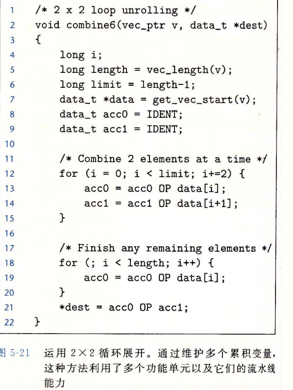
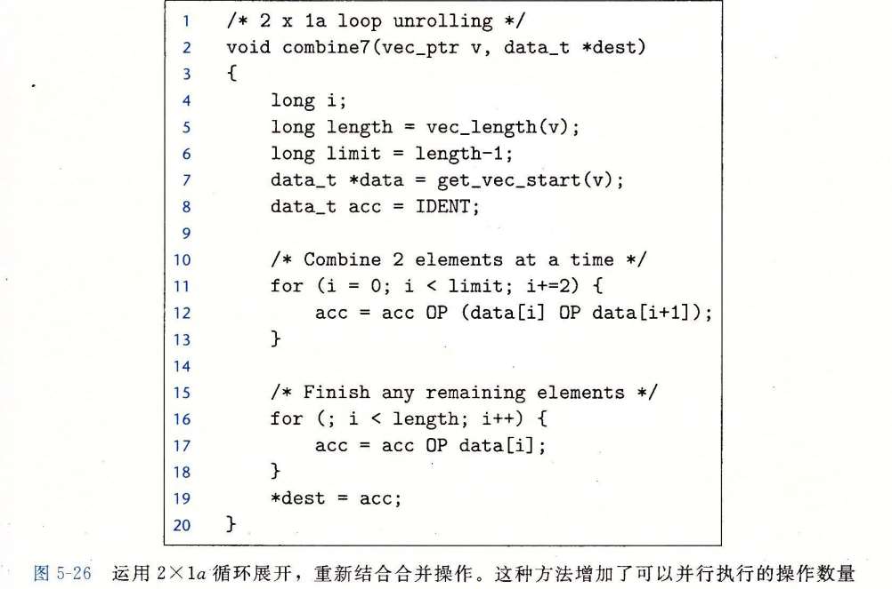
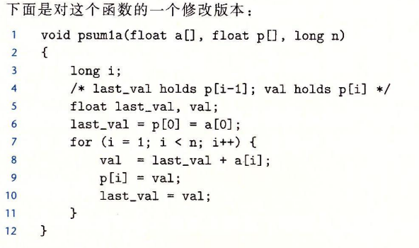
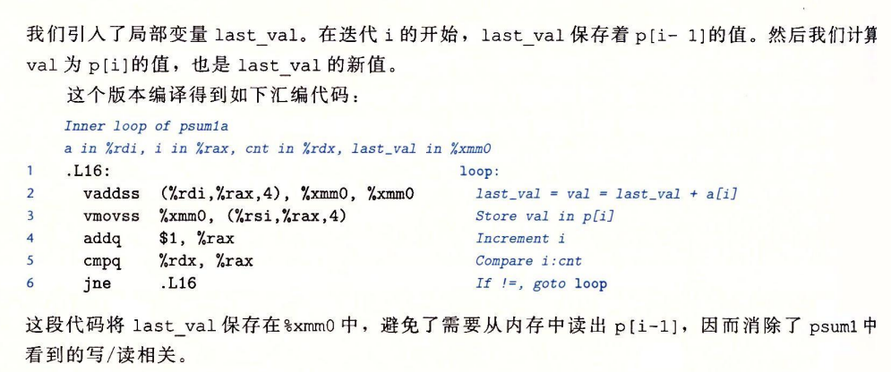
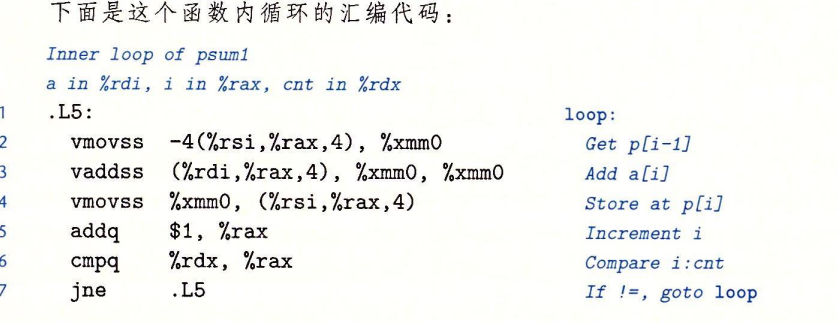

# 第五章优化程序性能

研究程序的汇编代码表示是理解编译器以及产生的代码会如何运行的最有效手段之一。仔细研究内循环的代码是一个很好的开端，识别出降低性能的属性，例如过多的内存引用和对寄存器使用不当。从汇编代码开始，我们还可以预测什么操作会并行执行，以及它们会如何使用处理器资源。正如我们会看到的，常常通过确认关键路径(critical path)来决定执行一个循环所需要的时间(或者说，至少是一个时间下界)。所谓**关键路径**是在循环的反复执行过程中形成的数据相关链。然后，我们会回过头来修改源代码，试着控制编译器使之产生更有效率的实现。

大多数编译器，包括GCC，一直都在更新和改进，特别是在优化能力方面。一个有用的策略是只重写程序到编译器由此就能产生有效代码所需要的程度就好了。这样，能尽量避免损害代码的可读性、模块性和可移植性，就好像我们使用的是具有最低能力的编译器。同样，通过测量值和检查生成的汇编代码，反复修改源代码和分析它的性能是很有帮助的。

对于新手程序员来说，不断修改源代码，试图欺骗编译器产生有效的代码，看起来很奇怪，但这确实是编写很多高性能程序的方式。比较于另一种方法—用汇编语言写代码，这种间接的方法具有的优点是:虽然性能不一定是最好的，但得到的代码仍然能够在其他机器上运行。

## 优化编译器的能力和局限性

现代编译器运用复杂精细的算法来确定一个程序中计算的是什么值，以及它们是被如何使用的。然后会利用一些机会来简化表达式，在几个不同的地方使用同一个计算，以及降低一个给定的计算必须被执行的次数。大多数编译器，包括GCC，向用户提供了一些对它们所使用的优化的控制。就像在第3章中讨论过的，最简单的控制就是指定优化级别。例如，以命令行选项“-Og”调用GCC是让GCC使用一组基本的优化。以选项“-O1”或更高(如“-O2”或“-O3”)调用GCC会让它使用更大量的优化。这样做可以进一步提高程序的性能，但是也可能增加程序的规模，也可能使标准的调试工具更难对程序进行调试。我们的表述，虽然对于大多数使用GCC的软件项目来说，优化级别-O2已经成为了被接受的标准，但是还是主要考虑以优化级别-O1编译出的代码。我们特意限制了优化级别，以展示写C语言函数的不同方法如何影响编译器产生代码的效率。我们会发现可以写出的C代码，即使用-O1选项编译得到的性能，也比用可能的最高的优化等级编译一个更原始的版本得到的性能好。

未经优化的代码是从C语言代码到机器代码的直接翻译，通常效率明显较低。简单地使用命令行选项“-O1”，就会进行一些基本的优化。正如可以看到的，程序员不需要做什么，就会显著地提高程序性能--—超过两个数量级。通常，养成至少使用这个级别优化的习惯是很好的。(使用-Og优化级别能得到相似的性能结果。)

### 用内联函数替换优化函数调用

包含函数调用的代码可以用一个称为内联函数替换(inline substitution，或者简称“内联(inlining)”)的过程进行优化，此时，将函数调用替换为函数体。

GCC的最近版本会尝试进行这种形式的优化，要么是被用命令行选项“-finline"指示时，要么是使用优化等级-O1或者更高的等级时。遗憾的是，GCC只尝试在单个文件中定义的函数的内联。这就意味着它将无法应用于常见的情况，即一组库函数在一个文件中被定义，却被其他文件内的函数所调用。

在某些情况下，最好能阻止编译器执行内联替换。一种情况是用符号调试器来评估代码，比如GDB。如果一个函数调用已经用内联替换优化过了，那么任何对这个调用进行追踪或设置断点的尝试都会失败。还有一种情况是用代码剖析的方式来评估程序性能。用内联替换消除的函数调用是无法被正确剖析的。

## 理解现代处理器

我们会发现两种下界描述了程序的最大性能。当一系列操作必须按照严格顺序执行时，就会遇到**延迟界限**(latencybound)，因为在下一条指令开始之前，这条指令必须结束。当代码中的数据相关限制了处理器利用指令级并行的能力时，延迟界限能够限制程序性能。**吞吐量界限**(throughpubound)刻画了处理器功能单元的原始计算能力。这个界限是程序性能的终极限制。

### 整体操作

ICU从指令高速缓存(instruction cache)中读取指令，指令高速缓存是一个特殊的高速存储器，它包含最近访问的指令。通常，ICU会在当前正在执行的指令很早之前取指，这样它才有足够的时间对指令译码，并把操作发送到EU。不过，一个问题是当程序遇到分支时，程序有两个可能的前进方向。一种可能会选择分支，控制被传递到分支目标。另一种可能是，不选择分支，控制被传递到指令序列的下一条指令。现代处理器采用了一种称为**分支预测**(branch prediction)的技术，处理器会猜测是否会选择分支，同时还预测分支的目标地址。使用**投机执行**(speculative execution)的技术，处理器会开始取出位于它预测的分支会跳到的地方的指令，并对指令译码，甚至在它确定分支预测是否正确之前就开始执行这些操作。如果过后确定分支预测错误，会将状态重新设置到分支点的状态，并开始取出和执行另一个方向上的指令。标记为取指控制的块包括分支预测，以完成确定取哪些指令的任务。

使用**投机执行**技术对操作求值，但是最终结果不会存放在程序寄存器或数据内存中，直到处理器能确定应该实际执行这些指令。分支操作被送到EU，不是确定分支该往哪里去，而是确定分支预测是否正确。如果预测错误，EU会丢弃分支点之后计算出来的结果。它还会发信号给分支单元，说预测是错误的，并指出正确的分支目的。在这种情况中，分支单元开始在新的位置取指。这样的预测错误会导致很大的性能开销。在可以取出新指令、译码和发送到执行单元之前，要花费一点时间。

控制操作数在执行单元间传送的最常见的机制称为**寄存器重命名**(register renaming)。当一条更新寄存器r的指令译码时，产生标记t，得到一个指向该操作结果的唯一的标识符。条目(r，t)被加入到一张表中，该表维护着每个程序寄存器r与会更新该寄存器的操作的标记t之间的关联。当随后以寄存器r作为操作数的指令译码时，发送到执行单元的操作会包含t作为操作数源的值。当某个执行单元完成第一个操作时，会生成-一个结果(v，t)，指明标记为t的操作产生值v。所有等待t作为源的操作都能使用v作为源值，这就是一种形式的数据转发。通过这种机制，值可以从一个操作直接转发到另一个操作，而不是写到寄存器文件再读出来，使得第二个操作能够在第一个操作完成后尽快开始。重命名表只包含关于有未进行写操作的寄存器条目。当一条被译码的指令需要寄存器r，而又没有标记与这个寄存器相关联，那么可以直接从寄存器文件中获取这个操作数。**有了寄存器重命名，即使只有在处理器确定了分支结果之后才能更新寄存器，也可以预测着执行操作的整个序列。**

最小化一个计算中的操作数量不一定会提高它的性能。

CPE即是需要的时钟周期。




延迟界限给出了任何必须按照严格顺序完成合并运算的函数所需要的最小CPE值。根据功能单元产生结果的最大速率，吞吐量界限给出了CPE的最小界限。例如，因为只有一个整数乘法器，它的发射时间为1个时钟周期，处理器不可能支持每个时钟周期大于1条乘法的速度。另-一方面，四个功能单元都可以执行整数加法，处理器就有可能持续每个周期执行4个操作的速率。不幸的是，因为需要从内存读数据，这造成了另一个吞吐量界限。两个加载单元限制了处理器每个时钟周期最多只能读取两个数据值，从而使得吞吐量界限为0.50。

## 让编译器展开循环

编译器可以很容易地执行循环展开。只要优化级别设置得足够高，许多编译器都能例行公事地做到这一点。用优化等级3或更高等级调用GCC，它就会执行循环展开。

循环展开，英文中称Loop unwinding或loop unrolling，是一种牺牲程序的尺寸来加快程序的执行速度的优化方法。可以由程序员完成，也可由编译器自动优化完成。循环展开最常用来降低循环开销，为具有多个功能单元的处理器提供指令级并行。也有利于指令流水线的调度。

### 循环展开对程序性能的影响

我们直接以实际代码向大家展示循环展开的作用，首先看未经过循环展开优化的代码：

```
#include <iostream>
#include <chrono>

int main(){
    auto start = std::chrono::system_clock::now();
    int sum = 0;
    int count = 10000;
    //循环10000次累加
    for(int i = 0;i < count;i++){  
        sum += i;
    }
    auto end = std::chrono::system_clock::now();
    std::chrono::duration<double> dura = end - start;
    std::cout <<"共耗时："<< dura.count() << "s" << std::endl;
    return 0;
}
```

下面我们将循环展开一次，即把上述代码中的循环改为如下代码：

```cpp
for(int i = 0;i < count;i += 2){
    sum += i;
    sum += i+1;
}
```

即每次循环将i和i+1一起累加到sum变量上，这样可以把循环次数从10000次降低到5000次，由于CPU的高度流水线化，连续两个加法指令增加耗时很低，所以此版本代码可以一定程度上提高程序运行速度

代码运行耗时0.0000159秒，相较于未优化代码速度快了将近一倍。

当然，我们可以继续增加循环展开次数以进一步提高程序运行速度，但是这个增加循环展开次数也是有限度的，*当达到了CPU的最高吞吐量之后，继续增加循环展开次数是没有意义的*。

上述循环展开后的代码依然有进一步优化的空间，那就是消除连续指令的相关性，以达到指令级并行，我们可以看到循环展开后的代码，循环体中有两条语句：sum += i 和 sum += i+1，第二条语句sum += i+1依赖于第一条命来sum += i的执行结果，所以这两条语句只能依次执行，限制了CPU进一步提高性能的可能。如果我们将循环体改为如下代码：

```cpp
int sum1=0,sum2=0;
for(int i=0;i < count;i+=2){
    sum1 += i;
    sum2 += i+1;
}
sum = sum1 + sum2;
```

我们新建了两个变量sum1和sum2用于存储循环展开时两个累加语句的累加结果，最后在循环体外将两部分结果相加得到最终结果。该代码中两个累加语句之间是互不相关的，所以CPU可以并行执行这两条指令，以达到性能的进一步提高。相较于只进行循环展开的代码速度又快了将近一倍。

### 总结

由上面三段代码的运行速度对比可以看出，循环展开对程序性能有着很重要的影响，可以减少分支预测错误次数，增加取消数据相关进一步利用并行执行提高速度的机会。但是，**并不建议大家进行手动的循环展开**，在代码中进行循环展开会导致程序的可读性下降，代码膨胀。为了直观感受循环展开对性能的影响，上述代码运行结果均是在不开编译器优化的情况下进行的测试，其实在我们**开启了编译器优化**的时候，编译器会自动对我们的循环代码进行循环展开，让我们可以在保持了代码可读性的同时，又能享受到循环展开对我们程序性能的提高。
















## SIMD:用向量指令达到更高的并行度

*Single Instruction Multiple Data*，单指令多数据流，可以使用一条指令同时完成多个数据的运算操作。传统的指令架构是SISD就是单指令单数据流，每条指令只能对一个数据执行操作。

单纯使用SIMD指令并没有什么技术含量，一般程序员也不太会使用 Intrinsics 函数来优化 SIMD，基本上都是靠编译器帮我们进行自动矢量化。想要代码能尽量的自动矢量化，以下几点需要多注意：

- 避免使用全局指针和全局变量以帮助编译器生成 SIMD 代码。
- 合理安排循环的嵌套，以便最内层的嵌套没有迭代间的依赖关系。尤其要避免在较早的迭代中存储数据，而在往后的迭代中加载该数据。
- 避免在循环内使用条件分支。
- 保持循环变量表达式简单。

现代编译器已经能为我们自动做很多优化工作，不过这不代表我们学习手写SIMD代码就没有意义了。在向量、矩阵运算等基础库函数中，每个函数通常代码量不大，复杂度不高，但编译器并不能保证会给你优化好，手撸SIMD还是很有必要的。更重要的是，我们能在学习的过程中去接触更底层的一些东西（指令集，内存架构，汇编等），进而提升对整体的编程实力。

## 一些限制因素

```
for (i = 0; i < n; i++){
    if (a[i] > b[i]) {
    	long t = a[i];a[i] = b[i];b[i] = t;
    }
}
```

在随机数据上测试这个函数，得到的CPE大约为13.50，而对于可预测的数据，CPE为2.5～3.5，其预测错误惩罚约为20个周期。

用功能式的风格实现这个函数是计算每个位置i的最大值和最小值，然后将这些值分别赋给a[i]和 b[i]:

```
for (i = 0; i < n; i++){
    long min = a[i] < b[i] ? a[i] : b[i];
    long max = a[i] <b[i] ? b[i] : a[i];
    a[i] = min;
    b[i] = max;
}
```

对这个函数的测试表明无论数据是任意的，还是可预测的，CPE都大约为4.0。(我们还检查了产生的汇编代码，确认它确实使用了条件传送。)

讨论过，不是所有的条件行为都能用条件数据传送来实现，所以无可避免地在某些情况中，程序员不能避免写出会导致条件分支的代码，而对于这些条件分支，处理器用分支预测可能会处理得很糟糕。但是，正如我们讲过的，程序员方面用一点点聪明，有时就能使代码更容易被翻译成条件数据传送。这需要一些试验，写出函数的不同版本，然后检查产生的汇编代码，并测试性能。

分支预测只对有规律的模式可行。程序中的许多测试是完全不可预测的，依赖于数据的任意特性，例如一个数是负数还是正数。对于这些测试，分支预测逻辑会处理得很糟糕。对于本质上无法预测的情况，如果编译器能够产生使用条件数据传送而不是使用条件控制转移的代码，可以极大地提高程序的性能。这不是C语言程序员可以直接控制的，但是有些表达条件行为的方法能够更直接地被翻译成条件传送，而不是其他操作。

## 理解内存性能









原代码



后者vmovss有内存读取，即有了写读相关，导致数据相关。每次需要pi就得先写再读取，导致CPE高，如果是上面就没有。







## 确认和消除性能瓶颈

至此，我们只考虑了优化小的程序，在这样的小程序中有一些很明显限制性能的地方，因此应该是集中注意力对它们进行优化。在处理大程序时，连知道应该优化什么地方都是很难的。本节会描述如何使用代码剖析程序(code profiler)，这是在程序执行时收集性能数据的分析工具。我们还展示了一个系统优化的通用原则，称为Amdahl定律。

### 程序剖析

程序剖析(profiling)运行程序的一个版本，其中插人了工具代码，以确定程序的各个部分需要多少时间。这对于确认程序中我们需要集中注意力优化的部分是很有用的。剖析的一个有力之处在于可以在现实的基准数据(benchmark data)上运行实际程序的同时，进行剖析。

Unix系统提供了一个剖析程序GPROF。这个程序产生两种形式的信息。首先，它确定程序中每个函数花费了多少CPU时间。其次，它计算每个函数被调用的次数，以执行调用的函数来分类。这两种形式的信息都非常有用。这些计时给出了不同函数在确定整体运行时间中的相对重要性。调用信息使得我们能理解程序的动态行为。

用GPROF进行剖析需要3个步骤，就像C程序prog.c所示，它运行时命令行参数为file.txt:

1）程序必须为剖析而编译和链接。使用GCC(以及其他C编译器)，就是在命令行上简单地包括运行时标志“-pg”。确保编译器不通过内联替换来尝试执行任何优化是很重要的，否则就可能无法正确刻画函数调用。我们使用优化标志-Og，以保证能正确跟踪函数调用
`linux> gcc -Og -pg prog.c -o prog`

2）然后程序像往常一样执行:

`linux> ./prog file.txt`
它运行得会比正常时稍微慢一点(大约慢2倍)，不过除此之外唯一的区别就是它产生了一个文件 gmon.out。
3）调用GPROF来分析gmon. out中的数据。

`linux> gprof prog`

剖析报告的第一部分列出了执行各个函数花费的时间，按照降序排列。作为一个示例，下面列出了报告的一部分，是关于程序中最耗费时间的三个函数的:




每一行代表对某个函数的所有调用所花费的时间。第一列表明花费在这个函数上的时间占整个时间的百分比。第二列显示的是直到这一行并包括这一行的函数所花费的累计时间。第三列显示的是花费在这个函数上的时间，而第四列显示的是它被调用的次数(递归调用不计算在内)。在例子中，函数sort_words只被调用了一次，但就是这一次调用需要203.66秒，而函数find ele_rec被调用了965 027次(递归调用不计算在内)，总共需要4.85秒。函数 strlen通过调用库函数strlen来计算字符串的长度。GPROF的结果中通常不显示库函数调用。库函数耗费的时间通常计算在调用它们的函数内。通过创建这个“包装函数( wrapper function)”strlen，我们可以可靠地跟踪对strlen的调用，表明它被调用了12511 031次，但是一共只需要0.30秒。

剖析报告的第二部分是函数的调用历史。下面是一个递归函数find ele rec的历史:




这个历史既显示了调用find_ele_rec的函数，也显示了它调用的函数。头两行显示的是对这个函数的调用:被它自身递归地调用了158655725次，被函数insert_string调用了965 027次(它本身被调用了965027次)。函数find_ele_rec也调用了另外两个函数save_string和 new_ele，每个函数总共被调用了363039次。
根据这个调用信息，我们通常可以推断出关于程序行为的有用信息。例如，函数find_ele_rec是一个递归过程，它扫描一个哈希桶(hash bucket)的链表，查找一个特殊的字符串。对于这个函数，比较递归调用的数量和顶层调用的数量，提供了关于遍历这些链表的长度的统计信息。这里递归与顶层调用的比率是164.4，我们可以推断出程序每次平均大约扫描164个元素。

## 使用剖析程序来指导优化

迭代和递归是两种常见的函数调用方式，它们在实现方式和执行过程上有一些区别。

迭代（Iteration）是通过循环结构来重复执行一段代码，达到需要的结果。迭代通常使用循环变量作为计数器或条件判断，每次循环都更新循环变量，并基于该变量进行操作。迭代函数通常使用较少的系统资源，对于处理大规模数据集和性能要求较高的场景，迭代通常是更有效的选择。

递归（Recursion）是一种函数自身调用自身的方法。递归函数包含两部分：基准情况（Base Case）和递归调用（Recursive Call）。基准情况定义了递归结束的条件，当满足基准情况时，递归停止并开始回溯。递归调用是函数在自身调用期间的执行过程，每次递归调用会解决一个更小或更简单的子问题。递归函数通常比较简洁，但可能会占用较多的系统资源，并且在处理大规模数据集时可能导致堆栈溢出的问题。

总结区别：

- 迭代是通过循环来完成重复执行，而递归是函数自身调用自身的方式。
- 迭代函数使用循环变量进行迭代和操作，而递归函数通过不断调用自身来解决子问题。
- 迭代通常使用较少的系统资源，适用于处理大规模数据集和性能要求较高的场景；递归通常较简洁但可能会占用较多系统资源，并且在处理大规模数据时有堆栈溢出的风险。

在选择使用迭代还是递归时，需要考虑问题的特点、性能需求、代码可读性等因素。有些问题更适合使用迭代，而有些问题则可以利用递归的特性更好地表达和解决。
